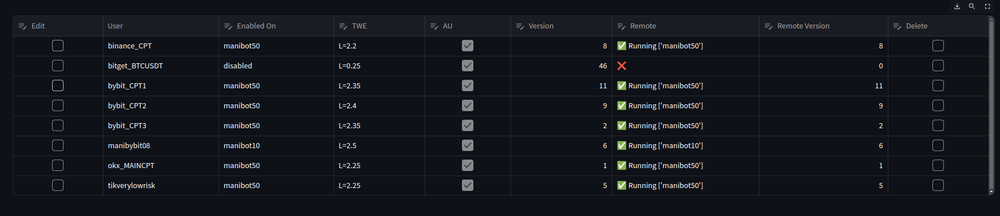
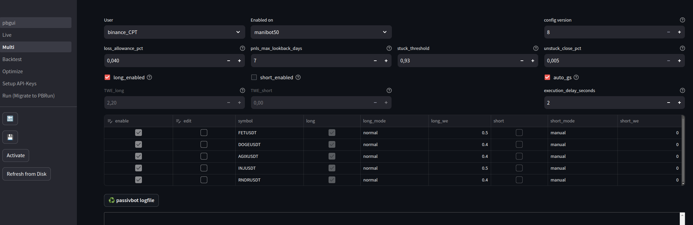
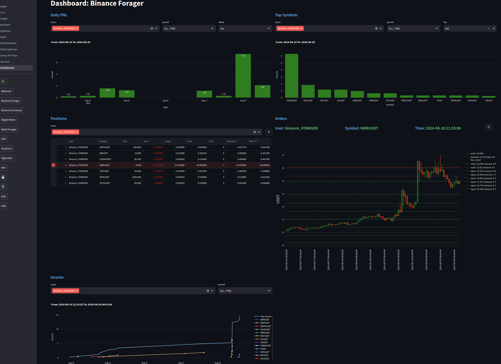
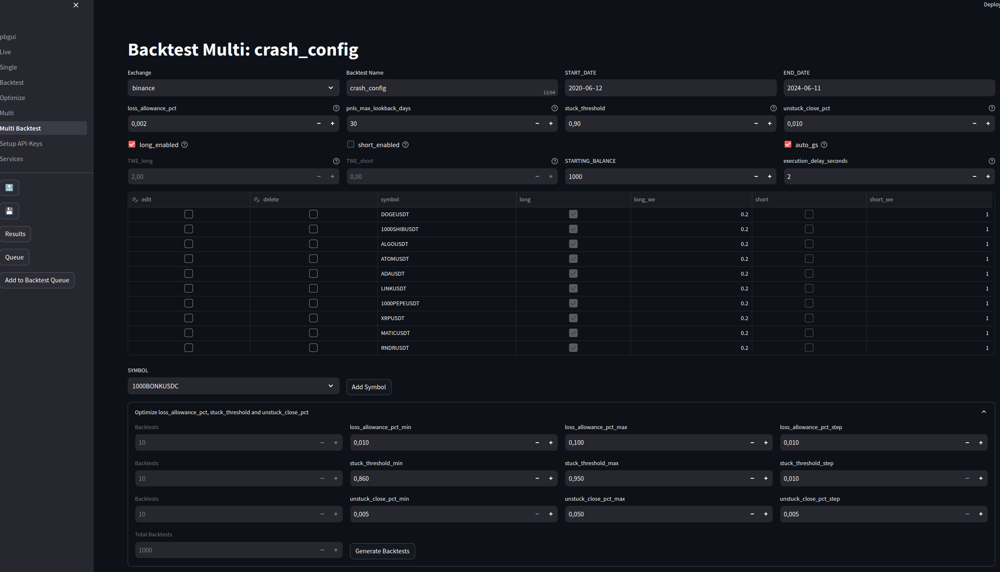

# GUI for Passivbot

## Contact/Support on Telegram: https://t.me/+kwyeyrmjQ-lkYTJk

v1.15

## Migration to v0.95 Multi (Will be removed on next version)

Watch the video here: https://youtu.be/MCQ7E5n-Dro  
Make sure to stop single instances before starting them in a passivbot_multi configuration  
Stop PBRun and PBRemote on any installation, and then start the new version of it  

## Overview
Passivbot GUI (pbgui) is a WEB Interface for Passivbot programed in python with streamlit









## Requirements
- Python 3.8.x and higher
- Streamlit 1.26.0 and higher
- Linux and Winodws (Run Module not supported)
- Live Modul only tested on bybit and bitget

## Installation
```
git clone https://github.com/msei99/pbgui.git
cd pbgui
pip install -r requirements.txt
```
## Running
```
streamlit run pbgui.py

```
Open http://localhost:8501 with Browser\
Password = PBGui$Bot!\
Change Password in file: .streamlit/secrets.toml\
On First Run, you have to select your passivbot and venv directories

## PBRun Instance Manager
To enable the PBGui instance manager in the GUI, you can follow these steps:

1. Open the PBGui interface.
2. Go to Live and enable PBRun

To ensure that the Instance Manager starts after rebooting your server, you can use the following method:

1. Create a script file, such as "start.sh", in your pbgui directory (e.g., ~/software/pbgui).
2. In the script file, include the following lines:

```
#!/usr/bin/bash
venv=~/software/pb_env # Path to your Python virtual environment
pbgui=~/software/pbgui # Path to your PBGui installation

source ${venv}/bin/activate
cd ${pbgui}
python PBRun.py &
```

3. Save the script file and make it executable by running the command: `chmod 755 start.sh`.
4. Open your crontab file by running the command: `crontab -e`.
5. Add the following line to the crontab file to execute the script at reboot:

```
@reboot ~/software/pbgui/start.sh
```

6. Save the crontab file.

Please make sure to adjust the paths in the script file and crontab entry according to your specific setup.

## PBStat Statistics
Actually, the best way to enable PBStat is by adding the following line to your start.sh script:
```
python PBStat.py &
```
This command will run the PBStat.py script in the background, allowing it to collect statistics.

## PBData Databank for Dashboard
Actually, the best way to enable PBData is by adding the following line to your start.sh script:
```
python PBData.py &
```
This command will run the PBData.py in the background and filling the database for the dashboard

## PBRemote Server Manager
With PBRemote, you can efficiently manage passivbot instances on multiple servers directly from your PC.
This includes starting, stopping, removing, and syncing instances from and to your servers.
PBRemote utilizes rclone to establish communication via cloud storage with your servers.
The advantage is that you do not need to open any incoming firewall ports on your PC or servers.
Additionally, all your passivbot config data is securely transferred and stored on your preferred cloud storage provider.
rclone supports over 70 cloud storage providers, you can find more information at https://rclone.org/.
To install rclone, you can use the following command:
```
sudo -v ; curl https://rclone.org/install.sh | sudo bash
```
As a recommendation, Synology C2 Object Storage offers a reliable option.
They provide 15GB of free storage, and you can sign up at https://c2.synology.com/en-uk/object-storage/overview.
After registration, create your bucket using your own unique name. Please note that using "pbgui" as a bucket name will not work, as it has already been chosen by me. Configure rclone on your PC and servers by following the steps below:
Rclone configuration (Synology):
```
rclone config create <bucket_name> s3 provider=Synology region=eu-002 endpoint=eu-002.s3.synologyc2.net no_check_bucket=true access_key_id=<key> secret_access_key=<secret>
```
You need to configure pbgui.ini with a minimum of this settings on your VPS.
Example pbgui.ini (replace parameters with your own correct settings).
```
[main]
pbdir = /home/mani/software/passivbot
pbname = manibot50
[pbremote]
bucket = pbgui:
```
There is no need to install or run streamlit on your Remote Server.
Start PBRun.py and PBRemote using the start.sh script.

## PBShare Data Sharing Manager
With PBShare, you can generate Live Grid pictures and upload them to imagekit.io.
On every instance, you have the option to enable the Live Grid feature.
Within the Services section of PBShare, you can download an index.html file that can be placed on your web server for sharing purposes.
To utilize this service, you will need to create a free ImageKit account.
For uploading the pictures to ImageKit, rclone is used.
To set up rclone, use the following command:
```
rclone config create <name> imagekit endpoint=<url_endpoint> public_key=<public_key> private_key=<private_key>
```

## Running on Windows
Copy the start.bat.example to start.bat
Edit pbguipath in the start.bat to your pbgui installation path
Add start.bat to Windows Task Scheduler and use Trigger "At system startup"

## v1.16 (28-09-2024)
- Run V7: First Version that can run passivbot v7
- PBRun: Can now start passivbot v7 instances
- PBRemote: Sync v7 added

## v1.15 (24-09-2024)
- Backtest V7: Added backtester for passivbot v7
- Bugfix OPtimizer autostart
- Optimizer V7: Added Name to results
- Bugfix venv for old passivbot

## v1.14 (19-09-2024)
- Optimize V7: Added optimizer for passivbot v7
- Add api-keys for passivbot version 7
- check for installed passivbot versions
- split venv pbgui and venv passivbot / Config Option for venv passivbot v6 and v7
- Dashboard: Added Timeframe to Order View and move the time left/right

## v1.13 (11-09-2024)
- Bugfix Multi Backtest Results, corrected time in View Results
- Removed PBShare, Live View, Grid Share for futures and removed old code from PBRun and PBRemote
- Speed Up when starting PBGui
- Bugfix Bitget Single

## v1.12 (31-08-2024)
- Dashboard: Bugfix Hyperliquid Price and Candlesticks timeframe
- Dashboard: Added Hyperliquid to PBData and Dashboard
- Multi and API-Editor: Added Hyperliquid
- Multi Added Button for Update Symbols from Exchange
- Bugfix for configparser. Under certain circumstances, configuration from other sections was being lost.

## v1.11 (27-08-2024)
- Dashboard: Change Bybit Income from positions_history to transactions for more accurate income history
- Dashboard: Kucoin added
- Dashboard: Move panels added
- Dashboard: Added 'ALL' to user selections

## v1.1 (20-08-2024)
- Dashboard: Added Dashboards for replacing the Live View in future versions of PBGui
- Dashboard: Added a SQLite database for fast view of the dashboards
- PBData: New scrapper for fetch balance, positions, orders, prices and income from exchanges

## v1.01 (23-07-2024)
- Optimize_Multi: Bugfix for object has no attribute 'hjson'
- Multi: Bugfix price_distance_threshold

## v1.0 (23-07-2024)
- Optimize_Multi: Generate Analysis from all_results added
- Optimize_Multi: Create Backtest from Analysis (Result)
- Optimize_Multi: Remove Results added
- Optimize_Multi: First running Version with multi optimizer

## v0.992 (19-07-2024)
- Live: Bugfix Refresh from disk switched to startpage
- API-Editor: Bugfix for user delete. It was posible to delete users that are in use
- API-Editor: Added a dialog yes/no for confirm the delete of a user
- PBRemote: Bugfix for API sync. The sync all button was not shown after adding a new api

## v0.991 (16-07-2024)
- Backtest Multi: Bugfix, not displaying all symbols from backtest results
- Backtest Multi: Delete Backtests added
- Backtest Multi: Preview GRID added
- Single and Multi: Don't allow to delete running instances.
- Live: Bugfix some calculation errors

## v0.99 (12-07-2024)
- Multi: Calculation of Real TWE
- Multi: Add all Symbols
- Multi: Mixing local configs together with forager
- Multi: Support for all config options
- MultiForager: Added Multi forager
- Bugfix for Windows Optimizer and MultiBacktest should now work
- PBRun: Add errorhandling for missing multi instances
- Backtest Multi: Speed up queue an results display

## v0.98 (11-06-2024)
- Backtest Multi: Run multiple backtests for find best settings of loss_allowance_pct, stuck_threshold and unstuck_close_pct
- Bugfix: Backtester no longer downloads ohlcv from exchanges multiple times parallel
- Multi: Add leverage (only global not by symbol)
- Multi: price_distance_threshold added
- Backtest Multi added
- Bugfix: Refresh on Multi Page not working
- Bugfix: PBStat Something went wrong, but continue 'list' object has no attribute ...
- Bugfix: Remove some debug print statement
- Bugfix: Make bitget work on ccxt version 4.3.24
- Bugfix: When switch from backtest to single, user and symbol was changed
- Bugfix: When changed the user on a instance, it was posible that you end up with the old and new instance running passivbot
- Bugfix: Switchpage from Multi config to Single was wrong
- Bugfix: Switchpage from Single Edit to Backtest sometimes end at backtest queue

## v0.97 (07-05-2024)
- Backup Instance before delete.
- Moved the Edit/Delete functions from Live to Single Instances Page.
- Select where to run a single instance and activate it.
- Version Number for Single Instances.
- Simplify PBRemote for single instances. No longer need to copy instances and start/stop them.

## v0.96 (28-04-2024)
- Services Status and Configure Page
- PBRemote bucket must be configured in pbgui.ini
- Recognize and display config type
- Preview Grid on Instance
- PBShare for generating Live Grid pictures
- Generating a index.html for sharing your Grid pictures

## v0.95 (28-03-2024)
- Bugfixes and realeased to master
- First version that can run the new passivbot_multi

## v0.94 (30-01-2024)
- Added System Information to PBRemote (memory, swap, disk, cpu and boottime)
- PBRemote: Displaying Table Start/stop Instances is now 10x faster.
- Optimizer: Bugfix when removing items from queue.
- Removed no longer needet requirements (streamlit-extras and streamlit-super-slider)
- Bugfix: Some widgets did not keep the correct state and switches back
- GUI: Removed some unnessesary reruns for better performace
- GUI: Enabled Dark mode from streamlit. You can change it in the file ".streamlit/config.toml"
- Optimizer: Bugfix some issues with the queue
- Upgrade streamlit to v1.30.0 (you have to run "pip install -r requirements.txt")

## v0.93 (27-01-2024)
- Backtest: Fixed import from pbconfigdb (New filters for exchange and market added)
- Optimizer: Now find new added items and start them if autostart is enabled.
- Backtest: Cleanup directory. Remove all Backtests from queue.
- Optimizer: No longer count killed runs as finished
- Optimizer: No longer create duplicate backtests
- PBRemote: You can now sync instances from remote to local, even they local not exist
- PBRemote: Bugfix not syncing new instances
- API-Edtor: Bugfix for bybit API without swap and spot rights
- Live: Fetch Trades on bybit max 2 years

## v0.92 (20-01-2024)
- Live: You can now direct go to History, no need to go to View first
- Backtest: New Results Browser
- Backtest: Setup Columns for Results Browser

## v0.91 (16-01-2024)
- Live: Spot now display SpotBalance as Position and uPnL as (Position * lasPrice)
- Optimize: When copy from optimize to backtest, now backtester keeps your settings
- PBRun: Added check for already running instances
- PBRemote: Sync to a running instance is now correct
- PBRun and PBRemote: Bugfix some path on windows
- History: Bugfix when no trade available
- Backtester: Bugfix not finding backtest from queue (spot)
- PBRun and PBRemote can now be running on Windows
- PBRun, PBStat and PBRemote added pidfile for check that it's not started more than one time
- PBRemote: Now runs on Windows. Added errorhandling for missing rclone and bucket
- Optimizer: Bugfix automatic backtest results not working
- Optimizer: Automatic backtest options. n_best, n_sharp, n_stuck, n_adg, n_drawdown
- Optimizer: Bugfix for wrong queue informations
- Optimizer: Added error handling for load hjson files with strange numbers
- Optimizer: Bugfix for number of cpu lower as in pbgui.ini
- Optimizer: Added new Symbol View to the Optimizer Results Browser
- Live: Bugfix History for kucoin
- Errorhandling: Added try: except to all json.load()
- PBRemote: Error handling for corrupted .json files added
- Live: passivbot.log in instances directory max. size = 10MB (cycle to .old)
- Logfiles: Max size for all logfiles in /data/logs (cycle to .old)
- Live: Bugfix for enable / disable logfiles
- PBRemote: Added Refresh Button and Sync API to all Servers
- PBRemote: Bugfix sync_api to multiple server at the same time
- Live: Bugfix when press Import and no instances in passivbot manager configured
- Live: Bugfix for errors in load instances. Try: except: for load instances
- Live: Bugfix Reload Button not reload instances from disk
- Optimizer: Only display long/short results if they are not 0
- Optimizer: Display all available results from all passivbot versions

## v0.90 (02-01-2024)
. Live: Bugfix Restart PBRun, PBStat and PBRemote after adding or removing instances
- Live: Bugfix not fetching trades from bybit without running PBStat
- Optimizer: Added Results Browser and Backtest View/Compare
- PBRemote: Bugfix bucket naming
- Live: Bugfix fetching fundings on binance (IndexError: list index out of range)
- PBRemote: cycle sync.log
- Optimizer: 2 Modes, circular and linear
- Optimizer: Rerun functionality for multiple searches
- Optimizer: Automatic backtest best found config
- Optimizer: Added queue to optimizer
- Optimizer: Full edit of optimizer configs (.hjson)
- Optimizer: Complete rewrite the optimizer module
- Live: Bugfix okx position and order size

## v0.82 (18-12-2023)
- Live: Bugfix for corrupted status.json in instances directory
- Live: Bugfix WE (did not use contractSize for calculations)
- Live: Add funding to calculations of history and starting balance
- Live: Restart PBStat when add/remove instance
- Live: Trading History for Spot binance and bybit corrected
- Live: Trading History Support for kucoin, okx and bingx added
- Exchanges: Add support for BingX

## v0.81 (11-12-2023)
- PBStat: Fetches Spot Asset Balance and display it as Position
- Live: Spot is now working (No uPnL and no Entry) Position = Symbol Asset
- PBRemote: Fixed start/stop remote instance when multiple remote servers are configured
- Run: Fixed an exeption if no instances in manager.yaml

## v0.8 (05-12-2023)
- PBRemote: Fixed Start/Stop local
- API-Editor: Full rewrite
- Live: Remote Server Manager added
- Live: Start / Stop Instances on local and remote servers
- Live: Sync API-Keys to remote servers
- Live: Sync Instances from and to remote servers
- Live: Remove Instances from remote servers
- Base: Bugfix save correct ccxt symbol when change symbol or exchange in instance config
- Live: Speedup display instances
- Live: Bugfix removed 1s timeframe from Live view
- Config: Bugfix when change WE without config
- Live: Bugfix PBRun find running instances
- Live: Add cleanup Logfile Button

## v0.72 (20-11-2023)
- Live: Bugfix for fetch_trades (bybit)

## v0.71 (19-11-2023)
- Backtest: Buxfix not load new finished backtests from queue
- Live: Bugfix division/zero when no instances configured
- Live: Remove Import when running in windows (passivbot manager not supported on windows)

## v0.7 (18-11-2023)
- Live: Add Backtest Button on Edit Page
- Live: Display Balance, uPnl, Position, Price, Entry, DCA, Next DCA, Next TP, Wallet Exposure
- Live: PBStat fetch trades, balance, positions, price and orders in background
- Live: PBStat added
- Live: Bugfix for select instances

## v0.66 (14-11-2023)
- Live: Bugfix for download trades history from bybit

## v0.65 (13-11-2023)
- Live: -co countdown added
- Live: PBRun is now the Instance Manager vom PBGui
- Run: Module removed / run is now included in Live
- Live: Bugfix for change symbol/market

## v0.61 (05-11-2023)
- Backtest: Bugfix for configs with long config_name from pbconfigdb
- Backtest: Added id to Import
- Backtest: Bugfix for backtest queue / remove backtests
- Backtest: Bugfix for change cpu and autostart

## v0.6 (04-11-2023)
- Live: Upload to pbconfigdb
- Backtest: Import from pbconfigdb
- Backtest: Total rewrite for look and feel like Live Module
- Backtest: Wallet_Exposure for long and short
- Backtest: Enable short/long
- Optimizer: Dynamic User / Symbol and Market_Type
- Optimizer: Quick hack for deleting optimizations
- Optimizer: Reverse Logfile
- Live: Fixed kucoin API-Editor / Live View
- Code: Added Base class for User/Symbol/market
- Code: Save ccxt_symbol to instance for speed up binance live module
- Code: Bugfixes for spot market

## v0.5 (21-10-2023)
- Support Windows (Exclude Run Modul)
- Live: Display ohlcv candlesticks with selectable timeframe and auto refresh
- Live: Show position, open/close orders, price, unrealizedPnL
- Live: Show trading history
- Live: Run backtests and compare trading history with backtest
- Live: Add, Edit, Delete instances
- Live: Dynamic edit config file
- Run: Add Instance to Live
- Code cleanup: Config, Instance class added
- Much more small changes

## v0.4 (02-10-2023)
- Run: Display Logfile
- Run: Add Backtest button
- Run: Display and compare backtests
- Backtest: Queue for run multiple backtests
- Backtest: View and Compare backtests
- Backtest and Optimizer: Load available Symbols from Exchange
- Code cleanup: User, Exchange, Backtest class 

## v0.3 (14-09-2023)
- Setup: API-Editor
- Check connection to exchange and get Wallet Balance

## v0.2 (11-09-2023)
- Run: Interface for manager (start/stop/edit live configs)
- Security: Adding Login credentials

## v0.1 (24-08-2023)
First release with basic backtest and optimization functionality

## Roadmap
- Sync: Use the same simple sync from multi on single instances
- Backtest: Add support for passivbot multi
- Live: Preview of the Gird on config editor
- Dashboard: Full Dashbord for history and results
- Backtest: Configure Default Values
- PBRemote: update passivbot and pbgui
- PBRemote: transfer logfiles
- ...

## Links:
- Telegram https://t.me/+kwyeyrmjQ-lkYTJk
- Passivbot https://www.passivbot.com/en/latest/
- Streamlit https://streamlit.io/

## Support:
If you like to support pbgui, please join one of my copytradings:\
If you don't have an bybit account, please use my Referral Code: XZAJLZ https://www.bybit.com/invite?ref=XZAJLZ \
Byybit:
- manicptlowrisk1: ADA, DOGE, RNDR, OP WE 0.5 TWE 2.0 https://i.bybit.com/28bMabOR
- manicptlowrisk2: INJ, FET, DOGE, AGIX TWE 2.25 https://i.bybit.com/25alabs3
- manicptlowrisk3: SOL, SHIB, INJ, RNDR TWE 2.25 https://i.bybit.com/1Kgab32u
- manicptrndr: RNDR only https://i.bybit.com/1qabmY01 \

Binance:
- manicptlowrisk: INJ, FET, RNDR, DOGE TWE 2.0 https://www.binance.com/en/copy-trading/lead-details?portfolioId=3746904129636329728

OKX:
- manicptlowrisk: INJ, OP, FET, RNDT TWE 2.25 https://www.okx.com/de/copy-trading/account/818D80B303AF08B6/swap
