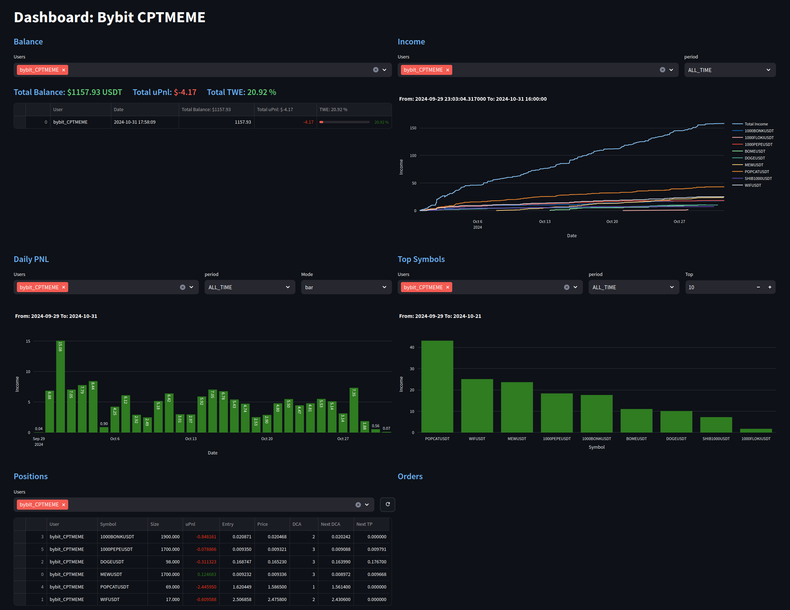
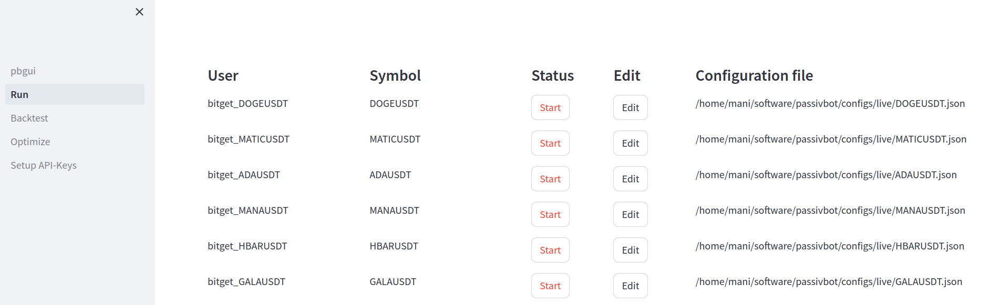
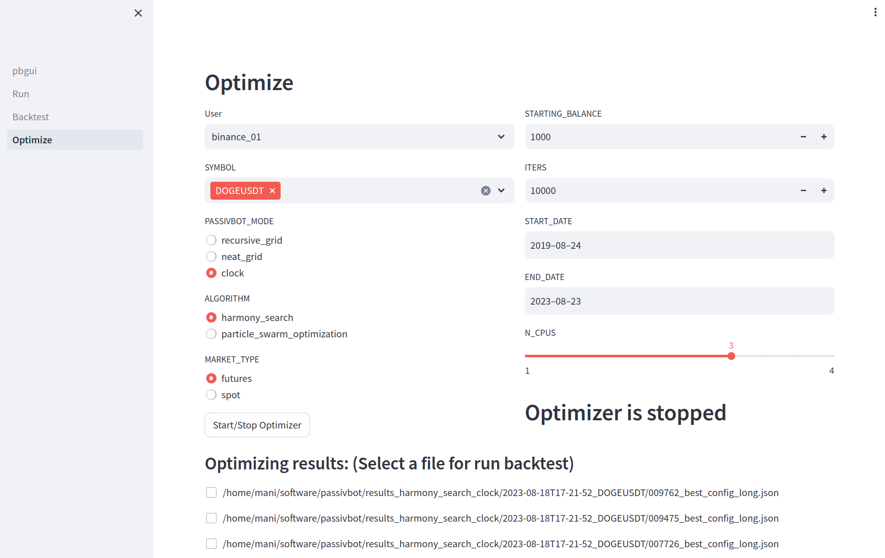

# GUI for Passivbot

[](https://ko-fi.com/Y8Y216Q3QS)

## Contact/Support on Telegram: https://t.me/+kwyeyrmjQ-lkYTJk
## Join one of my copytrading to support: https://manicpt.streamlit.app/
I offer API-Service where I run passivbot for you as a Service.
Just contact me on Telegram for more information.

# v1.36

### Overview
Passivbot GUI (pbgui) is a WEB Interface for Passivbot programed in python with streamlit

It has the following functions:
- Running, backtesting, and optimization Passivbot v7 and v6 (single and multi).
- Installing Passivbot configurations on your VPS.
- Starting and stopping Passivbot instances on your VPS.
- Moving instances between your VPS.
- Monitoring your instances and restarting them if they crash.
- A dashboard for viewing trading performance.
- An interface to CoinMarketCap for selecting and filtering coins.
- Installing and updating your VPS with just a few clicks.
- And much more to easily manage Passivbot.

### Requirements
- Python 3.10
- Streamlit 1.40.0
- Linux

### Recommendation

- Master Server: Linux with 32GB of memory and 8 CPUs.
- VPS for Running Passivbot: Minimum specifications of 1 CPU, 1GB Memory, and 10GB SSD.

### Get your VPS for running passivbot

I recommend the provider IONOS, as their smallest VPS plan is available for only 1 Euro \
I have been using their services for over a year without any outages \
Please use my [referral link](https://aklam.io/esMFvG) to obtain a VPS from IONOS \
A good alternative is a VPS from Contabo. Please use my [referral link](https://www.tkqlhce.com/click-101296145-12454592)

### Support:
If you like to support pbgui, please join one of my copytradings:\
If you don't have an bybit account, please use my Referral Code: XZAJLZ https://www.bybit.com/invite?ref=XZAJLZ \
Here are all my copytradings and statistics of them: https://manicpt.streamlit.app/

## Installation

### Ubuntu installer

There is a install.sh for Ubuntu. Working on Ubuntu from 20.04 to latest 24.04
```
curl -L https://raw.githubusercontent.com/msei99/pbgui/refs/heads/main/install.sh | bash
```

### Manual installation for all Linux distributions

Clone pbgui and passivbot v6 and v7
```
git clone https://github.com/msei99/pbgui.git
git clone https://github.com/enarjord/passivbot.git pb6
git clone https://github.com/enarjord/passivbot.git pb7
```
Create needed venv's
```
python3.10 -m venv venv_pbgui
python3.10 -m venv venv_pb6
python3.10 -m venv venv_pb7
```
Install requirements for pb6, pb7 and pbgui
```
source venv_pb6/bin/activate
cd pb6
git checkout v6.1.4b
pip install --upgrade pip
pip install -r requirements.txt
deactivate
cd ..
source venv_pb7/bin/activate
cd pb7
pip install --upgrade pip
pip install -r requirements.txt
cd passivbot-rust/
sudo apt-get install rustc
sudo apt-get install cargo
maturin develop --release
deactivate
cd ../..
source venv_pbgui/bin/activate
cd pbgui
pip install --upgrade pip
pip install -r requirements.txt
```
### Docker (Any OS)
Want to use **Docker** instead? Follow this [Quickstart guide](https://github.com/LeonSpors/passivbot-docker).

## Running
```
streamlit run pbgui.py

```
Open http://localhost:8501 with Browser\
Password = PBGui$Bot!\
Change Password in file: .streamlit/secrets.toml\
On First Run, you have to select your passivbot and venv directories
For the venv you have to enter the full path to python.
Example path for venv_pb7: /home/mani/software/venv_pb7/bin/python
Select Master on Welcome Screen if this System is used to send configs to VPS

## PBRun Instance Manager
To enable the PBGui instance manager in the GUI, you can follow these steps:

1. Open the PBGui interface.
2. Go to Services and enable PBRun

To ensure that the Instance Manager starts after rebooting your server, you can use the following method:

1. Create a script file, such as "start.sh", in your pbgui directory (e.g., ~/software/pbgui).
2. In the script file, include the following lines:

```
#!/usr/bin/bash
venv=~/software/pb_env # Path to your Python virtual environment
pbgui=~/software/pbgui # Path to your PBGui installation

source ${venv}/bin/activate
cd ${pbgui}
python PBRun.py &
```

3. Save the script file and make it executable by running the command: `chmod 755 start.sh`.
4. Open your crontab file by running the command: `crontab -e`.
5. Add the following line to the crontab file to execute the script at reboot:

```
@reboot ~/software/pbgui/start.sh
```

6. Save the crontab file.

Please make sure to adjust the paths in the script file and crontab entry according to your specific setup.

## PBStat Statistics
This is only needed if you trade spot and have some statistics
Actually, the best way to enable PBStat is by adding the following line to your start.sh script:
```
python PBStat.py &
```
This command will run the PBStat.py script in the background, allowing it to collect statistics.

## PBData Database for Dashboard
Actually, the best way to enable PBData is by adding the following line to your start.sh script:
```
python PBData.py &
```
This command will run the PBData.py in the background and filling the database for the dashboard

## PBRemote Server Manager
You can install rclone and configure bucket using PBGui. Go to Services/PBRemote/Show Details.

With PBRemote, you can efficiently manage passivbot instances on multiple servers directly from your PC.
This includes starting, stopping, removing, and syncing instances from and to your servers.
PBRemote utilizes rclone to establish communication via cloud storage with your servers.
The advantage is that you do not need to open any incoming firewall ports on your PC or servers.
Additionally, all your passivbot config data is securely transferred and stored on your preferred cloud storage provider.
rclone supports over 70 cloud storage providers, you can find more information at https://rclone.org/.
Manual install rclone, you can use the following command:
```
sudo -v ; curl https://rclone.org/install.sh | sudo bash
```
As a recommendation, Synology C2 Object Storage offers a reliable option.
They provide 15GB of free storage, and you can sign up at https://c2.synology.com/en-uk/object-storage/overview.
After registration, create your bucket using your own unique name. Please note that using "pbgui" as a bucket name will not work, as it has already been chosen by me.
Or do a manual Setup:
Configure rclone on your PC and servers by following the steps below:
Manual Rclone configuration (Synology):
```
rclone config create <bucket_name> s3 provider=Synology region=eu-002 endpoint=eu-002.s3.synologyc2.net no_check_bucket=true access_key_id=<key> secret_access_key=<secret>
```
You need to configure pbgui.ini with a minimum of this settings on your VPS.
Example pbgui.ini (replace parameters with your own correct settings).
```
[main]
pbdir = /home/mani/software/pb6
pbvenv = /home/mani/software/venv_pb6/bin/python
pb7dir = /home/mani/software/pb7
pb7venv = /home/mani/software/venv_pb7/bin/python
pbname = manibot50
[pbremote]
bucket = pbgui:
```
There is no need to install or run streamlit on your Remote Server.
Start PBRun.py and PBRemote using the start.sh script.

## PBCoinData CoinMarketCap Filters
With PBCoinData, you can download CoinMarketCap data for symbols and use this data to maintain your ignored_symbols and ignored_coins. You can filter out low market cap symbols or use vol/mcap to detect possible rug pulls early.

You need to configure the pbgui.ini file with a minimum of the following settings on your VPS. Here is an example of pbgui.ini (replace the parameters with your own correct settings):
```
[coinmarketcap]
api_key = <your_api_key>
fetch_limit = 1000
fetch_interval = 4
```
With these settings, PBCoinData will fetch the top 1000 symbols every 4 hours. You will need around 930 credits per month with this configuration. A Basic Free Plan from CoinMarketCap provides 10,000 credits per month, allowing you to run 1 master and 9 VPS instances with the same API key.
Start PBCoinData.py using the start.sh script.

## Running on Windows (Not tested with passivbot 7)
Copy the start.bat.example to start.bat
Edit pbguipath in the start.bat to your pbgui installation path
Add start.bat to Windows Task Scheduler and use Trigger "At system startup"

## v1.36 (07-08-2025)
- Added coin_overrides and removed old coin_flags
- Converted coin_flags to coin_overrides
- New ADG Dashboard
- Drawdown view for backtests
- Moved navigation to the top for more space on the left
- VPS cleanup to free up storage
- Option to skip installation or remove v6 bot from VPS
- Balance calculator
- Many bug fixes

## v1.35 (01-06-2025)
- Added new options from passivbot v7.3.13
  close_grid_markup_start, close_grid_markup_end
  mimic_backtest_1m_delay
  trailing_double_down_factor
- Config Archive
- Many small improvements
- A lot of bugfixes
- Update ccxt for work with okx

## v1.34 (21-04-2025)
- Compatible with passivbot v7.3.4
- Using fragments for speedup GUI
- Support for GateIO
- Send Telegram Messages on Bot errors
- logarithmic view of backtests
- TWE and WE view on backtests v7
- Update to streamlit v1.44
- hundreds of bug fixes


## v1.33 (30-12-2024)
- Filter for coins with warnings on CoinMarketCap
- Multi: Added only_cpt and apply_filter function
- Improved GridVis by Sephral
- Fetch notice from CoinMarketCap metadata for display warning messages
- Added preset manager for optimizer v7 by Sephral
- Small bugfixes

## v1.32 (26-12-2024)
- Converter for pb6 to pb7 configurations
- View Monitor for all VPS on one Page
- Small Bugfixes

## v1.31 (16-12-2024)
- Added coin_flags to pb7 run
- Reworked GridVisualizer
- Updated SYMBOLMAP for CoinData
- Change balance on bybit to totalWalletBalance
- Add install.sh for easy install PBGui, pb6 and pb7 on ubuntu
- Filters for all_results
- Added PBGui Logo
- Bugfix update VPS will no longer install all requirements.txt
- PBGui can now run without password
- Change password dialog
- pb7.2.10 multi exchange optimizer/backtester compatibility
- Much more Bugfixes

## v1.30 (03-12-2024)
- Added apply_filters for static symbol selection
- ignored_symbols will now always added to the dynamic_ignore
- Preview of dynamic_ignore, when enabling it
- Added copytrading only to dynamic_ignore filter
- Tags can be used as dynamic_ignore filter for running bots
- Add Tags filter from CoinMarketCap (example: memes, gaming, defi, layer-2 ... much more)
- Compare Backtests from All Results
- Show All Results on Backtest V7
- Update to Streamlit 1.40
- Add Position Value to Dashboard Positions
- Small Bugfixes
- Small cosmetic changes

## v1.29 (29-11-2024)
- Make PBGui passivbot v7.2.9 compatible
- Backtest V7 Compare results added
- Install requirements when updating vps or master
- Small bugfixes
- Added ko-fi for donations

## v1.28 (24-11-2024)
- VPS-Manager check for working rclone on Master before Setup a VPS
- Added GUI Settup for rclone buckets (Services PBRemote)
- Added Test Connection for rclone buckets
- VPS-Manager Install and Update rclone on Master
- Bugfix Optimize V7 corrupted results
- Higher verbosity Level when setup vps and select debug
- Disable ipv6 on VPS using grub
- Coindata Fix for NEIROETHUSDT on binance and correct marketcap
- Bugfix Hyperliquid import
- Expanded Settings when Setup an new VPS

## v1.27 (19-11-2024)
- Bugfix Results Backtest Single
- PBRemote: Added delete function for offline Remote Servers with cleanup remote storage
- VPS-Manager: Find new added VPS after a refresh of the Page
- VPS-Manager: View logfiles from VPS
- VPS-Manager: Don't allow add VPS with same names
- New P+L Dashboard (Sephral)
- New Navigation (Sephral)
- Added V7 Grid Visualizer (Sephral)
- Added optional notes to instances (Sephral)
- Imporved Titel & Page Headers (Sephral)
- VPS-Manager: Added update function for localhost (Master) for pbgui, pb6 and pb7
- A lot of small bugfixes
- More small improvements

## v1.26 (13-11-2024)
- VPS-Manager always build rust when update v7 passivbot
- VPS-Manager show status of PBGui Master
- VPS-Manager selectbox for easy switch between VPS
- VPS-Manager add option for delete a VPS
- VPS-Manager Bugfix for unknown vps hosts
- Bugfixes vol_mcap
- Select logfile size and view reverse for speed up big logfiles
- Bugfix API-Editor don't let you delete users that are used by pb7
- Bugfix Load v7 users wihtout need to have pb6 installed
- Show a OK when paths for pb6,pb7 and venvs are correct
- Remove /../.. from paths
- No longer need to restart passivbot 7 instances when dynamic_ignore select new coins
- More small bugfixes

## v1.25 (10-11-2024)
- Rewrite Config Module
- Bugfix for not saving selected coins
- Disable IPv6 on vps-setup
- Bugfix import config v7 on backtest and run

## v1.24 (09-11-2024)
- Added approved_coins_long and _short
- Added ignored_coins_long and short
- Added empty_means_all_approved option from v7.2.2
- Added compress_cache option on backtest_v7
- Bugfix for new passivbot v7.2.2
- Copy optimize_result before running analysis for not get locking errors
- Bugfix for PBRun create_parameters on pb6 single instances
- Bugfix for update pb6 and pb7 ignore error when no instance is running
- More small bugfixes

## v1.23 (07-11-2024)
- PBRun/PBRemote: Check if updates for Linux and reboot needed
- VPS-Manager: Overview of all VPS running versions and update/reboot status
- PBRemote: Compression for alive files, 75% less data usage
- VPS-Manager: Update only PBGui without pb6 and pb7
- PBRun/PBRemote: gater pbgui/pb6/pb7 versions and send them to master

## v1.22 (05-11-2024)
- VPS-Manager: UFW Firewall configuration
- VPS-Manager: Update pbgui, pb6 and pb7 and restart passivbot after update
- VPS-Manager: Update Linux
- VPS-Manager: Reboot VPS
- VPS-Manager: View Status and running passivbots
- Bugfix: Don't allow passwords with {{ or }}
- Add Master, Slave role, for using less traffic on PBRemote

## v1.21 (29-10-2024)
- VPS-Manager: Fully automate setup your VPS with PBGui, PB6 and PB7.
- starter.py for start, stop restart PBRun, PBRemote and PBCoinData.
- PBRemote: Finds new VPS without restart.
- Some small Bugfixes for new v7 functions.

## v1.20 (22-10-2024)
- V7: Added all latest config options to live and optimizer
- V7 Run: Added Dynamic filter for mcap and vol/mcap
- Multi: Filters for marketcap and vol/mcap added
- Multi: Dynamic filter for mcap and vol/mcap added
- PBRun: Dynamic filter update ignored_symbols
- PBCoinData: Update on start and every 24h symbols from all exchanges

## v1.19 (20-10-2024)
- CoinMarketCap integration
- V7 Run and Optimize filters for marketcap and vol/mcap added
- New Service PBCoinData fetch data from CoinMarketCap

## v1.18 (13-10-2024)
- Services: Show PNL Today, Yesterday from LogMonitor
- Services: Show Logmonitor Information Memory, CPU, Infos, Erros, Tracebacks
- PBRun/PBRemote: Monitor passivbot logs and send infos to master
- PBData: Reload User on every run for new added Users
- PBRun: Recompile rust if new pb7 version is installed
- PBData: Bugfix when removing User from API
- V7: Add Exchange and Time informations
- Bugfix: Update Symbols from Binance

## v1.17 (02-10-2024)
- V7: Run optimizer from a backtest result with -t starting_config
- Run V7 and Multi: Add All and Add CPT Symbols to approved_symbols
- Multi: lap, ucp and st in the Overview of Multi Run
- V7: Compile rust if needed
- V7: Show final_balance in backtests for easy sort them
- V7: refresh logfile fragment refresh for speed up

## v1.16 (28-09-2024)
- Run V7: First Version that can run passivbot v7
- PBRun: Can now start passivbot v7 instances
- PBRemote: Sync v7 added

## v1.15 (24-09-2024)
- Backtest V7: Added backtester for passivbot v7
- Bugfix OPtimizer autostart
- Optimizer V7: Added Name to results
- Bugfix venv for old passivbot

## v1.14 (19-09-2024)
- Optimize V7: Added optimizer for passivbot v7
- Add api-keys for passivbot version 7
- check for installed passivbot versions
- split venv pbgui and venv passivbot / Config Option for venv passivbot v6 and v7
- Dashboard: Added Timeframe to Order View and move the time left/right

## v1.13 (11-09-2024)
- Bugfix Multi Backtest Results, corrected time in View Results
- Removed PBShare, Live View, Grid Share for futures and removed old code from PBRun and PBRemote
- Speed Up when starting PBGui
- Bugfix Bitget Single

## v1.12 (31-08-2024)
- Dashboard: Bugfix Hyperliquid Price and Candlesticks timeframe
- Dashboard: Added Hyperliquid to PBData and Dashboard
- Multi and API-Editor: Added Hyperliquid
- Multi Added Button for Update Symbols from Exchange
- Bugfix for configparser. Under certain circumstances, configuration from other sections was being lost.

## v1.11 (27-08-2024)
- Dashboard: Change Bybit Income from positions_history to transactions for more accurate income history
- Dashboard: Kucoin added
- Dashboard: Move panels added
- Dashboard: Added 'ALL' to user selections

## v1.1 (20-08-2024)
- Dashboard: Added Dashboards for replacing the Live View in future versions of PBGui
- Dashboard: Added a SQLite database for fast view of the dashboards
- PBData: New scrapper for fetch balance, positions, orders, prices and income from exchanges

## v1.01 (23-07-2024)
- Optimize_Multi: Bugfix for object has no attribute 'hjson'
- Multi: Bugfix price_distance_threshold

## v1.0 (23-07-2024)
- Optimize_Multi: Generate Analysis from all_results added
- Optimize_Multi: Create Backtest from Analysis (Result)
- Optimize_Multi: Remove Results added
- Optimize_Multi: First running Version with multi optimizer

## Links:
- Telegram https://t.me/+kwyeyrmjQ-lkYTJk
- Passivbot https://www.passivbot.com/en/latest/
- Streamlit https://streamlit.io/

## Screenshots




