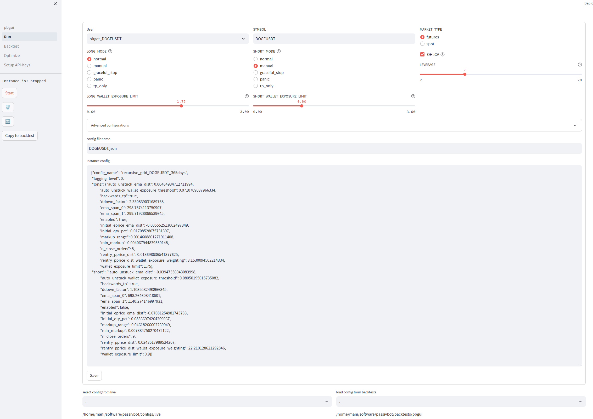

# GUI for Passivbot

v0.6

## Overview
Passivbot GUI (pbgui) is a WEB Interface for Passivbot programed in python with streamlit





## Requirements
- Python 3.8.x and higher
- Streamlit 1.26.0 and higher
- Linux and Winodws (Run Module not supported)
- Live Modul only tested on bybit and bitget

## Installation
```
git clone https://github.com/msei99/pbgui.git
cd pbgui
pip install -r requirements.txt
```
## Running
```
streamlit run pbgui.py &
```
Open http://localhost:8501 with Browser\
Password = PBGui$Bot!\
Change Password in file: .streamlit/secrets.toml\
On First Run, you have to select your passivbot directory

## v0.6 (01-11-2023)
- Live: Upload to pbconfigdb
- Backtest: Import from pbconfigdb
- Backtest: Total rewrite for look and feel like Live Module
- Backtest: Wallet_Exposure for long and short
- Backtest: Enable short/long
- Optimizer: Dynamic User / Symbol and Market_Type
- Optimizer: Quick hack for deleting optimizations
- Optimizer: Reverse Logfile
- Live: Fixed kucoin API-Editor / Live View
- Code: Added Base class for User/Symbol/market
- Code: Save ccxt_symbol to instance for speed up binance live module
- Code: Bugfixes for spot market

## v0.5 (21-10-2023)
- Support Windows (Exclude Run Modul)
- Live: Display ohlcv candlesticks with selectable timeframe and auto refresh
- Live: Show position, open/close orders, price, unrealizedPnL
- Live: Show trading history
- Live: Run backtests and compare trading history with backtest
- Live: Add, Edit, Delete instances
- Live: Dynamic edit config file
- Run: Add Instance to Live
- Code cleanup: Config, Instance class added
- Much more small changes

## v0.4 (02-10-2023)
- Run: Display Logfile
- Run: Add Backtest button
- Run: Display and compare backtests
- Backtest: Queue for run multiple backtests
- Backtest: View and Compare backtests
- Backtest and Optimizer: Load available Symbols from Exchange
- Code cleanup: User, Exchange, Backtest class 

## v0.3 (14-09-2023)
- Setup: API-Editor
- Check connection to exchange and get Wallet Balance

## v0.2 (11-09-2023)
- Run: Interface for manager (start/stop/edit live configs)
- Security: Adding Login credentials

## v0.1 (24-08-2023)
First release with basic backtest and optimization functionality

## Roadmap
- Live: Support Kucoin and OKX
- Live: Start / Stop / Status Instances
- Live: Autostart enabled Instances after reboot
- Live: Watchdog for crashed instances and restart them
- Run: Remove the Run modul. Move all to the Live modul
- Backtest: Configure Default Values
- Code cleanup (Optimizer class)
- Optimizer: add/edit configs/optimize/*.hjson
- Optimizer: Queue for run multiple optimizers
- Full support for Windows
- Remote managment for multiple passivebot servers
- ...

## Links:
- Passivbot https://www.passivbot.com/en/latest/
- Streamlit https://streamlit.io/

## Support:
If you like to support pbgui, please join one of my copytradings on bybit
ADA, DOGE, RNDR, OP WE 0.5 TWE 2.0
https://i.bybit.com/28bMabOR
RNDR only
https://i.bybit.com/1qabmY01