# GUI for Passivbot

v0.90

## Overview
Passivbot GUI (pbgui) is a WEB Interface for Passivbot programed in python with streamlit

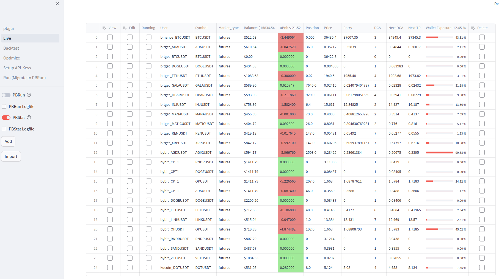
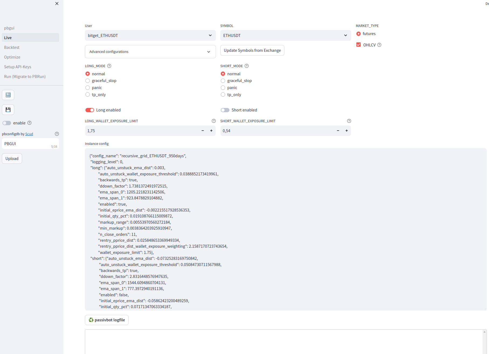
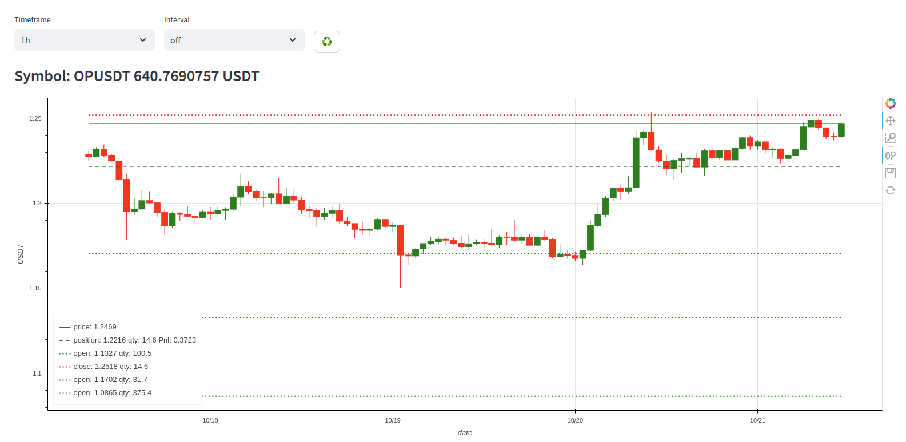
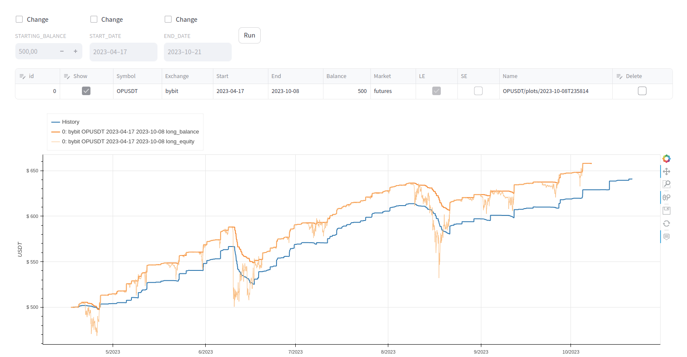
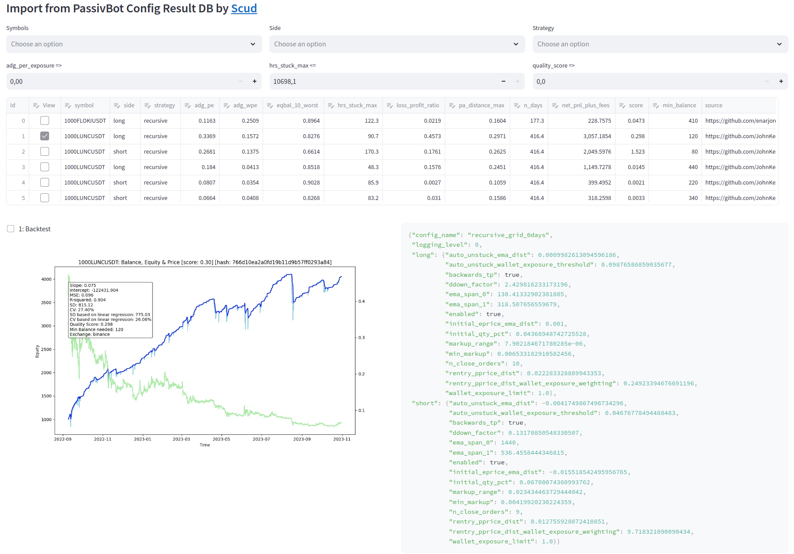


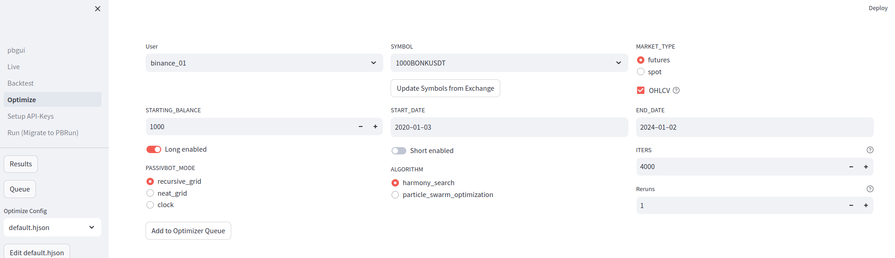
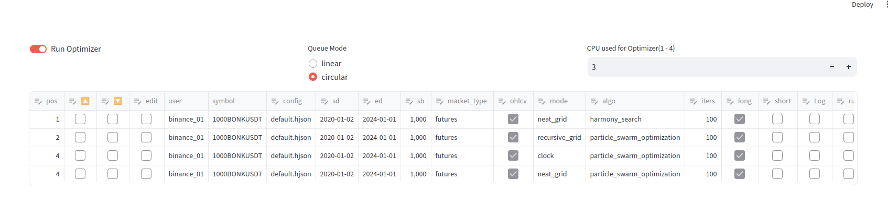
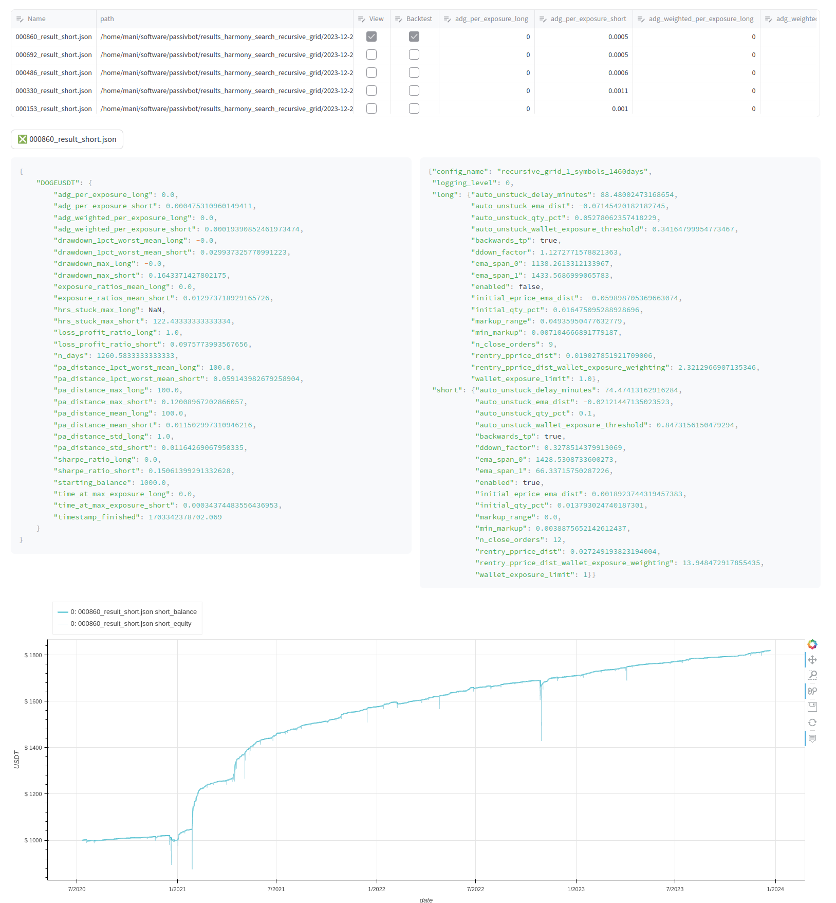
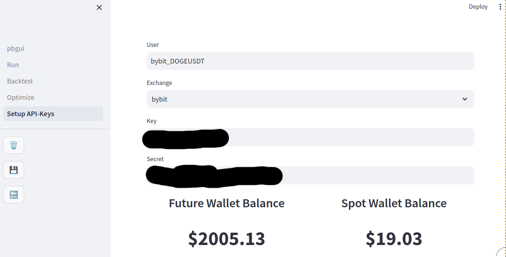
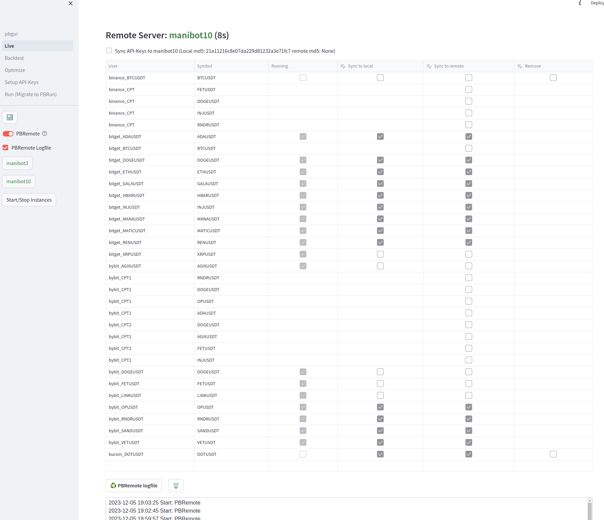
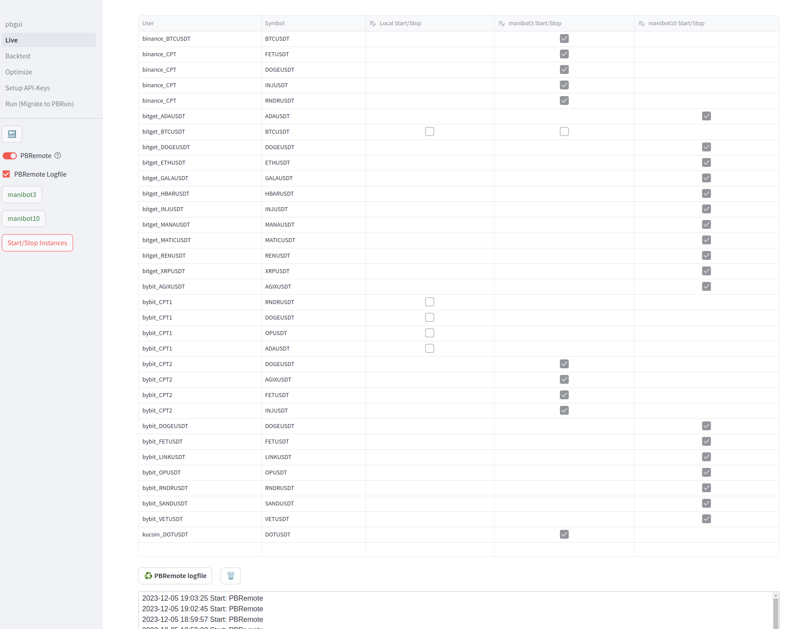

## Requirements
- Python 3.8.x and higher
- Streamlit 1.26.0 and higher
- Linux and Winodws (Run Module not supported)
- Live Modul only tested on bybit and bitget

## Installation
```
git clone https://github.com/msei99/pbgui.git
cd pbgui
pip install -r requirements.txt
```
## Running
```
streamlit run pbgui.py &
```
Open http://localhost:8501 with Browser\
Password = PBGui$Bot!\
Change Password in file: .streamlit/secrets.toml\
On First Run, you have to select your passivbot directory

## PBRun Instance Manager
To enable the PBGui instance manager in the GUI, you can follow these steps:

1. Open the PBGui interface.
2. Go to Live and enable PBRun

To ensure that the Instance Manager starts after rebooting your server, you can use the following method:

1. Create a script file, such as "start.sh", in your pbgui directory (e.g., ~/software/pbgui).
2. In the script file, include the following lines:

```
#!/usr/bin/bash
venv=~/software/pb_env # Path to your Python virtual environment
pbgui=~/software/pbgui # Path to your PBGui installation

source ${venv}/bin/activate
cd ${pbgui}
python PBRun.py &
```

3. Save the script file and make it executable by running the command: `chmod 755 start.sh`.
4. Open your crontab file by running the command: `crontab -e`.
5. Add the following line to the crontab file to execute the script at reboot:

```
@reboot ~/software/pbgui/start.sh
```

6. Save the crontab file.

Please make sure to adjust the paths in the script file and crontab entry according to your specific setup.

## PBStat Statistics
Actually, the best way to enable PBStat is by adding the following line to your start.sh script:
```
python PBStat.py &
```
This command will run the PBStat.py script in the background, allowing it to collect statistics.

## PBRemote Server Manager
With PBRemote, you can efficiently manage passivbot instances on multiple servers directly from your PC.
This includes starting, stopping, removing, and syncing instances from and to your servers.
PBRemote utilizes rclone to establish communication via cloud storage with your servers.
The advantage is that you do not need to open any incoming firewall ports on your PC or servers.
Additionally, all your passivbot config data is securely transferred and stored on your preferred cloud storage provider.
rclone supports over 70 cloud storage providers, you can find more information at https://rclone.org/.
To install rclone, you can use the following command:
```
sudo -v ; curl https://rclone.org/install.sh | sudo bash
```
As a recommendation, Synology C2 Object Storage offers a reliable option.
They provide 15GB of free storage, and you can sign up at https://c2.synology.com/en-uk/object-storage/overview.
After registration, create a bucket and configure rclone on your PC and servers using the following steps:
Rclone configuration (Synology):
```
rclone config create <bucket_name> s3 provider=Synology region=eu-002 endpoint=eu-002.s3.synologyc2.net no_check_bucket=true access_key_id=<key> secret_access_key=<secret>
```
Finally, enable PBRemote on your servers and home PC, and you're all set.
On your servers, you only need to run Streamlit once to configure the passivbot directory and server name. After that, you can stop Streamlit and only start PBRun.py and PBRemote using the start.sh script.

## v0.90 (02-01-2024)
- Optimizer: Added Results Browser and Backtest View/Compare
- PBRemote: Bugfix bucket naming
- Live: Bugfix fetching fundings on binance (IndexError: list index out of range)
- PBRemote: cycle sync.log
- Optimizer: 2 Modes, circular and linear
- Optimizer: Rerun functionality for multiple searches
- Optimizer: Automatic backtest best found config
- Optimizer: Added queue to optimizer
- Optimizer: Full edit of optimizer configs (.hjson)
- Optimizer: Complete rewrite the optimizer module
- Live: Bugfix okx position and order size

## v0.82 (18-12-2023)
- Live: Bugfix for corrupted status.json in instances directory
- Live: Bugfix WE (did not use contractSize for calculations)
- Live: Add funding to calculations of history and starting balance
- Live: Restart PBStat when add/remove instance
- Live: Trading History for Spot binance and bybit corrected
- Live: Trading History Support for kucoin, okx and bingx added
- Exchanges: Add support for BingX

## v0.81 (11-12-2023)
- PBStat: Fetches Spot Asset Balance and display it as Position
- Live: Spot is now working (No uPnL and no Entry) Position = Symbol Asset
- PBRemote: Fixed start/stop remote instance when multiple remote servers are configured
- Run: Fixed an exeption if no instances in manager.yaml

## v0.8 (05-12-2023)
- PBRemote: Fixed Start/Stop local
- API-Editor: Full rewrite
- Live: Remote Server Manager added
- Live: Start / Stop Instances on local and remote servers
- Live: Sync API-Keys to remote servers
- Live: Sync Instances from and to remote servers
- Live: Remove Instances from remote servers
- Base: Bugfix save correct ccxt symbol when change symbol or exchange in instance config
- Live: Speedup display instances
- Live: Bugfix removed 1s timeframe from Live view
- Config: Bugfix when change WE without config
- Live: Bugfix PBRun find running instances
- Live: Add cleanup Logfile Button

## v0.72 (20-11-2023)
- Live: Bugfix for fetch_trades (bybit)

## v0.71 (19-11-2023)
- Backtest: Buxfix not load new finished backtests from queue
- Live: Bugfix division/zero when no instances configured
- Live: Remove Import when running in windows (passivbot manager not supported on windows)

## v0.7 (18-11-2023)
- Live: Add Backtest Button on Edit Page
- Live: Display Balance, uPnl, Position, Price, Entry, DCA, Next DCA, Next TP, Wallet Exposure
- Live: PBStat fetch trades, balance, positions, price and orders in background
- Live: PBStat added
- Live: Bugfix for select instances

## v0.66 (14-11-2023)
- Live: Bugfix for download trades history from bybit

## v0.65 (13-11-2023)
- Live: -co countdown added
- Live: PBRun is now the Instance Manager vom PBGui
- Run: Module removed / run is now included in Live
- Live: Bugfix for change symbol/market

## v0.61 (05-11-2023)
- Backtest: Bugfix for configs with long config_name from pbconfigdb
- Backtest: Added id to Import
- Backtest: Bugfix for backtest queue / remove backtests
- Backtest: Bugfix for change cpu and autostart

## v0.6 (04-11-2023)
- Live: Upload to pbconfigdb
- Backtest: Import from pbconfigdb
- Backtest: Total rewrite for look and feel like Live Module
- Backtest: Wallet_Exposure for long and short
- Backtest: Enable short/long
- Optimizer: Dynamic User / Symbol and Market_Type
- Optimizer: Quick hack for deleting optimizations
- Optimizer: Reverse Logfile
- Live: Fixed kucoin API-Editor / Live View
- Code: Added Base class for User/Symbol/market
- Code: Save ccxt_symbol to instance for speed up binance live module
- Code: Bugfixes for spot market

## v0.5 (21-10-2023)
- Support Windows (Exclude Run Modul)
- Live: Display ohlcv candlesticks with selectable timeframe and auto refresh
- Live: Show position, open/close orders, price, unrealizedPnL
- Live: Show trading history
- Live: Run backtests and compare trading history with backtest
- Live: Add, Edit, Delete instances
- Live: Dynamic edit config file
- Run: Add Instance to Live
- Code cleanup: Config, Instance class added
- Much more small changes

## v0.4 (02-10-2023)
- Run: Display Logfile
- Run: Add Backtest button
- Run: Display and compare backtests
- Backtest: Queue for run multiple backtests
- Backtest: View and Compare backtests
- Backtest and Optimizer: Load available Symbols from Exchange
- Code cleanup: User, Exchange, Backtest class 

## v0.3 (14-09-2023)
- Setup: API-Editor
- Check connection to exchange and get Wallet Balance

## v0.2 (11-09-2023)
- Run: Interface for manager (start/stop/edit live configs)
- Security: Adding Login credentials

## v0.1 (24-08-2023)
First release with basic backtest and optimization functionality

## Roadmap
- Dashboard: Full Dashbord for history and results
- Backtest: Configure Default Values
- Full support for Windows
- PBRemote: update passivbot and pbgui
- PBRemote: transfer logfiles
- ...

## Links:
- Passivbot https://www.passivbot.com/en/latest/
- Streamlit https://streamlit.io/

## Support:
If you like to support pbgui, please join one of my copytradings:\
Byybit:
- manicptlowrisk1: ADA, DOGE, RNDR, OP WE 0.5 TWE 2.0 https://i.bybit.com/28bMabOR
- manicptlowrisk2: INJ, FET, DOGE, AGIX TWE 2.25 https://i.bybit.com/25alabs3
- manicptlowrisk3: SOL, SHIB, INJ, RNDR TWE 2.25 https://i.bybit.com/1Kgab32u
- manicptrndr: RNDR only https://i.bybit.com/1qabmY01

Binance:
- manicptlowrisk: INJ, FET, RNDR, DOGE TWE 2.0 https://www.binance.com/en/copy-trading/lead-details?portfolioId=3746904129636329728

OKX:
- manicptlowrisk: INJ, OP, FET, RNDT TWE 2.25 https://www.okx.com/de/copy-trading/account/818D80B303AF08B6/swap
