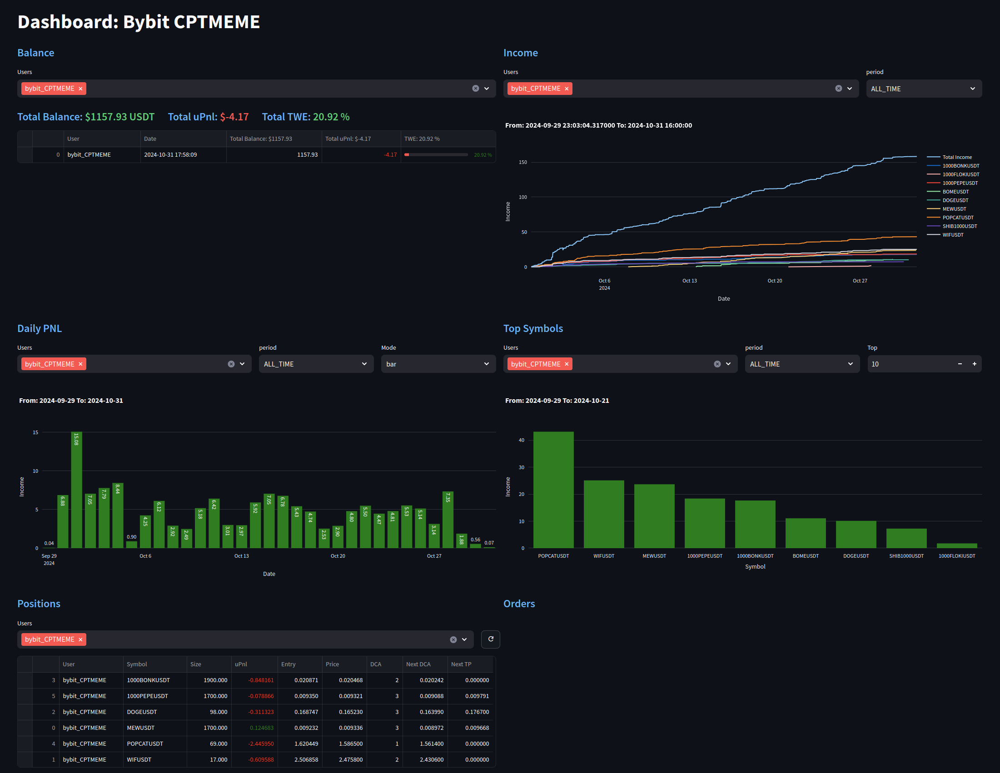
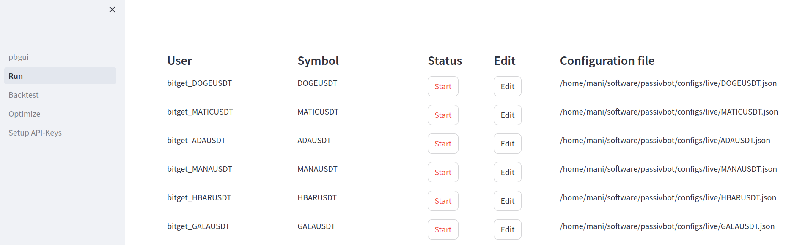
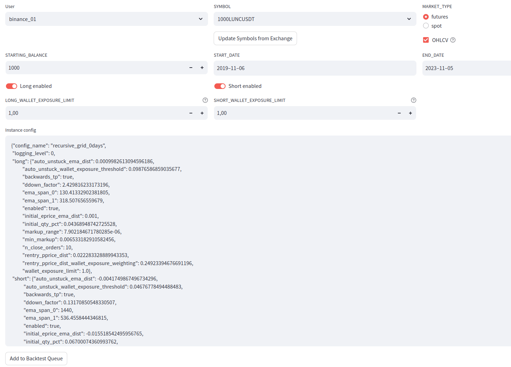
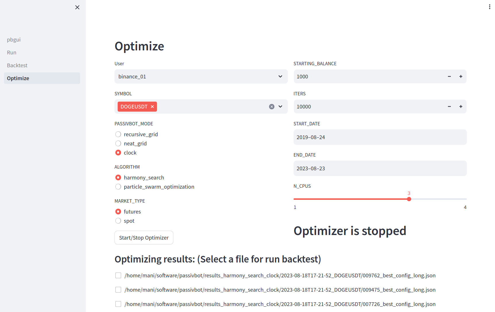

# GUI for Passivbot

[](https://ko-fi.com/Y8Y216Q3QS)

## Contact/Support on Telegram: https://t.me/+kwyeyrmjQ-lkYTJk
## Join one of my copytrading to support: https://manicpt.streamlit.app/
I offer API-Service where I run passivbot for you as a Service.
Just contact me on Telegram for more information.

# v1.77

### Overview
Passivbot GUI (pbgui) is a WEB Interface for Passivbot programed in python with streamlit

It has the following functions:
- Running, backtesting, and optimization Passivbot v7 and v6 (single and multi).
- Installing Passivbot configurations on your VPS.
- Starting and stopping Passivbot instances on your VPS.
- Moving instances between your VPS.
- Monitoring your instances and restarting them if they crash.
- A dashboard for viewing trading performance.
- Pareto Explorer for exploring optimizer results (Pareto front, correlations, 2D/3D plots, config inspection, start backtests, generate optimize configs with goal/risk presets).
- An interface to CoinMarketCap for selecting and filtering coins.
- Installing and updating your VPS with just a few clicks.
- And much more to easily manage Passivbot.

### Requirements
- Python 3.12 (default)
- Streamlit 1.54.0
- Linux

### Recommendation

- Master Server: Linux with 32GB of memory and 8 CPUs.
- VPS for Running Passivbot: Minimum specifications of 1 CPU, 1GB Memory, and 10GB SSD.

### Get your VPS for running passivbot

I currently recommend [IONOS](https://aklam.io/CBA3zSaZ).
For IONOS open `Server` -> `vServer (VPS)` -> `Linux VPS`.
For normal VPS bots I currently suggest `VPS S+` with 2 vCores CPU, 2 GB RAM and 80 GB NVMe.
For a remote master I currently suggest `VPS M+` with 4 vCores CPU, 4 GB RAM and 120 GB NVMe.

### Support:
If you like to support pbgui, please join one of my copytradings:\
If you don't have an bybit account, please use my Referral Code: XZAJLZ https://www.bybit.com/invite?ref=XZAJLZ \
Here are all my copytradings and statistics of them: https://manicpt.streamlit.app/

## Installation

### Install PBGui Master on a vps (Best Option)

Step 1: Get a Linux VPS from IONOS. Please use my [referral link](https://aklam.io/CBA3zSaZ)
- Select `Server` -> `vServer (VPS)` -> `Linux VPS`
- For normal VPS bots I currently suggest `VPS S+` with 2 vCores CPU, 2 GB RAM and 80 GB NVMe
- For a remote master I currently suggest `VPS M+` with 4 vCores CPU, 4 GB RAM and 120 GB NVMe
- For optimization you need a bigger system like `VPS XL+`, `VPS XXL+` or a dedicated server.
- Install the VPS with Ubuntu 24.04

Step 2: Connect to your new VPS and run Initial Setup
- Add your VPS IP and VPN IP to your hosts (/etc/hosts)

```
Syntax:
<ip> <hostname>
10.8.0.1 <hostname>-vpn

Example:
87.106.x.x manibot01
10.8.0.1 manibot01-vpn
```

- Connect with ssh to your new VPS and login as root with the temporary root pw
```
ssh root@<hostname>

# Setup hostname and user. Disable root login
bash <(curl -sL https://raw.githubusercontent.com/msei99/pbgui/refs/heads/main/setup/master_vps_init.sh) <hostname> <user>
```

Step 3: Connect as new user and Setup PBGui Master by running this commands
```
# Disconnect as root
exit

# ssh to your vps
ssh <user>@<hostname>

# Create swap
bash <(curl -sL https://raw.githubusercontent.com/msei99/pbgui/refs/heads/main/setup/setup_swap.sh) <size>

#  Setup openvpn
bash <(curl -sL https://raw.githubusercontent.com/msei99/pbgui/refs/heads/main/setup/setup_openvpn.sh)

# Setup google-authenticator and add QR code to your TOTP App
bash <(curl -sL https://raw.githubusercontent.com/msei99/pbgui/refs/heads/main/setup/setup_totp.sh)
cat /home/mani/GA-QR.txt

# Setup Firewall
The Firewall Setup can be run in 3 ways.
1. Default — allow SSH from everywhere (low secure)
bash <(curl -sL https://raw.githubusercontent.com/msei99/pbgui/refs/heads/main/setup/setup_firewall.sh)
2. VPN-only SSH access (high secure)
bash <(curl -sL https://raw.githubusercontent.com/msei99/pbgui/refs/heads/main/setup/setup_firewall.sh) -i
3. Specific IPs + VPN
bash <(curl -sL https://raw.githubusercontent.com/msei99/pbgui/refs/heads/main/setup/setup_firewall.sh) -i 1.2.3.4,1.2.3.5

# Setup PBGui
bash <(curl -sL https://raw.githubusercontent.com/msei99/pbgui/refs/heads/main/install.sh)

# Setup crontab for autostart
bash <(curl -sL https://raw.githubusercontent.com/msei99/pbgui/refs/heads/main/setup/setup_autostart.sh)
```

Step 5: Setup OpenVPN Client
- Get <user>.ovpn
```
scp <hostanme>:/home/<user>/<user>_client/<user>.ovpn .
```
- Import the ovpn to your OpenVPN Client

Step 6: Connect your VPN
- Use the GUI or connect from shell with 
```
sudo openvpn --config <user>.ovpn
```

Step 7: Connect to PBGui
- Now you are ready to connect to PBGui by open this url: http://<hostname>-vpn:8501/


### Ubuntu installer

There is an Ubuntu `install.sh` for PBGui + PB7. It works on Ubuntu 24.04 and only adds Deadsnakes when `python3.12-venv` is not available from the current distro repositories.
```
curl -L https://raw.githubusercontent.com/msei99/pbgui/refs/heads/main/install.sh | bash
```

### Manual Installation for all Linux distributions

Clone pbgui and passivbot v7
```
git clone https://github.com/msei99/pbgui.git
git clone https://github.com/enarjord/passivbot.git pb7
```
Create virtual environments
```
python3.12 -m venv venv_pb7
python3.12 -m venv venv_pbgui
```
Install requirements for pb7 and pbgui
```
source venv_pb7/bin/activate
cd pb7
pip install --upgrade pip
pip install -r requirements.txt
cd passivbot-rust/
sudo apt-get install rustc
sudo apt-get install cargo
maturin develop --release
deactivate
cd ../..
source venv_pbgui/bin/activate
cd pbgui
pip install --upgrade pip
pip install -r requirements.txt
```
### Docker (Any OS)
Want to use **Docker** instead? See the actively maintained community Docker project [dreamelite96/pbgui-docker](https://github.com/dreamelite96/pbgui-docker).

It is an independent Docker integration for current PBGui and Passivbot v7 releases and replaces the previous Docker link in this README.

## Running
```
streamlit run pbgui.py

```
Open http://localhost:8501 with Browser\
Password = PBGui$Bot!\
Change Password in file: .streamlit/secrets.toml\
On First Run, you have to select your passivbot and venv directories
For the venv you have to enter the full path to python.
Example path for venv_pb7: /home/mani/software/venv_pb7/bin/python
Select Master on Welcome Screen if this System is used to send configs to VPS

## PBRun Instance Manager
To enable the PBGui instance manager in the GUI, you can follow these steps:

1. Open the PBGui interface.
2. Go to Services and enable PBRun

To ensure that the Instance Manager starts after rebooting your server, you can use the following method:

1. Create a script file, such as "start.sh", in your pbgui directory (e.g., ~/software/pbgui).
2. In the script file, include the following lines:

```
#!/usr/bin/bash
venv=~/software/pb_env # Path to your Python virtual environment
pbgui=~/software/pbgui # Path to your PBGui installation

source ${venv}/bin/activate
cd ${pbgui}
python PBRun.py &
```

3. Save the script file and make it executable by running the command: `chmod 755 start.sh`.
4. Open your crontab file by running the command: `crontab -e`.
5. Add the following line to the crontab file to execute the script at reboot:

```
@reboot ~/software/pbgui/start.sh
```

6. Save the crontab file.

Please make sure to adjust the paths in the script file and crontab entry according to your specific setup.

## PBStat Statistics
This is only needed if you trade spot and have some statistics
Actually, the best way to enable PBStat is by adding the following line to your start.sh script:
```
python PBStat.py &
```
This command will run the PBStat.py script in the background, allowing it to collect statistics.

## PBData Database for Dashboard
Actually, the best way to enable PBData is by adding the following line to your start.sh script:
```
python PBData.py &
```
This command will run the PBData.py in the background and filling the database for the dashboard

## PBRemote Server Manager
You can install rclone and configure bucket using PBGui. Go to Services/PBRemote/Show Details.

With PBRemote, you can efficiently manage passivbot instances on multiple servers directly from your PC.
This includes starting, stopping, removing, and syncing instances from and to your servers.
PBRemote utilizes rclone to establish communication via cloud storage with your servers.
The advantage is that you do not need to open any incoming firewall ports on your PC or servers.
Additionally, all your passivbot config data is securely transferred and stored on your preferred cloud storage provider.
rclone supports over 70 cloud storage providers, you can find more information at https://rclone.org/.
Manual install rclone, you can use the following command:
```
sudo -v ; curl https://rclone.org/install.sh | sudo bash
```
As a recommendation, Synology C2 Object Storage offers a reliable option.
They provide 15GB of free storage, and you can sign up at https://c2.synology.com/en-uk/object-storage/overview.
After registration, create your bucket using your own unique name. Please note that using "pbgui" as a bucket name will not work, as it has already been chosen by me.
Or do a manual Setup:
Configure rclone on your PC and servers by following the steps below:
Manual Rclone configuration (Synology):
```
rclone config create <bucket_name> s3 provider=Synology region=eu-002 endpoint=eu-002.s3.synologyc2.net no_check_bucket=true access_key_id=<key> secret_access_key=<secret>
```
You need to configure pbgui.ini with a minimum of this settings on your VPS.
Example pbgui.ini (replace parameters with your own correct settings).
```
[main]
pb7dir = /home/mani/software/pb7
pb7venv = /home/mani/software/venv_pb7/bin/python
pbname = manibot50
[pbremote]
bucket = pbgui:
```
There is no need to install or run streamlit on your Remote Server.
Start PBRun.py and PBRemote using the start.sh script.

## PBCoinData CoinMarketCap Filters
With PBCoinData, you can download CoinMarketCap data for symbols and use this data to maintain your ignored_symbols and ignored_coins. You can filter out low market cap symbols or use vol/mcap to detect possible rug pulls early.

You need to configure the pbgui.ini file with a minimum of the following settings on your VPS. Here is an example of pbgui.ini (replace the parameters with your own correct settings):
```
[coinmarketcap]
api_key = <your_api_key>
fetch_limit = 1000
fetch_interval = 4
```
With these settings, PBCoinData will fetch the top 1000 symbols every 4 hours. You will need around 930 credits per month with this configuration. A Basic Free Plan from CoinMarketCap provides 10,000 credits per month, allowing you to run 1 master and 9 VPS instances with the same API key.
Start PBCoinData.py using the start.sh script.

## Running on Windows (Not tested with passivbot 7)
Copy the start.bat.example to start.bat
Edit pbguipath in the start.bat to your pbgui installation path
Add start.bat to Windows Task Scheduler and use Trigger "At system startup"

# Changelog

## v1.78 (unreleased)

- Fixed FastAPI `VPS Manager` `Update Linux` SSH host-key validation so the sudo pre-check now prefers the VPS hostname alias over the raw IP for `known_hosts` matching, and the Overview password flow now asks for confirmation before accepting and storing an unknown host key.

- Fixed FastAPI `VPS Manager` `Update Linux` sudo validation regression so the temporary SSH pre-check now accepts first-seen host keys like the rest of the VPS Manager again, instead of failing unknown hosts on missing `known_hosts` entries.

- Changed repo-local tooling ignores so `.claude/`, `.opencode/`, and `CLAUDE.md` now stay out of git status and commits, while the intentional EOF-normalization updates in `BacktestV7.py` and `OptimizeV7.py` remain part of the tracked repo state.

- Fixed FastAPI `VPS Manager` Overview live state after the new log-tail helper so the backend now imports `strip_ansi` correctly again instead of failing the WebSocket push loop and leaving the Overview empty.

- Fixed FastAPI `VPS Manager` `Update Linux` validation for private-key hosts so the SSH pre-check now uses the host's configured key-based login when applicable, while still validating `sudo -v` with the supplied sudo password.

- Changed FastAPI `VPS Manager` Overview task progress parsing so live refreshes now read only a capped tail of the per-host update log instead of loading the full log file on every update.

- Fixed FastAPI `VPS Manager` deploy progress caching so cache access is now protected by its own lock, and invalid latest deploy-history entries now log a warning instead of failing silently.

- Fixed FastAPI `VPS Manager` deploy robustness so VPS sudo validation now runs `sudo -v` without a PTY, and sequential deploy waits now abort early when a started host never switches to the expected run id.

- Changed FastAPI `VPS Manager` cleanup internals so deploy command names are now centralized through named constants in `vps_manager_service.py`, and `api/vps_manager.py` no longer leaves the context-detail helpers untyped.

- Fixed FastAPI `VPS Manager` deploy waiting so sequential VPS deploys now fail fast when a started host does not produce a run id, instead of waiting against an ambiguous host status.

- Updated the VPS Manager guides in `docs/help/32_vps_manager.md` and `docs/help_de/32_vps_manager.md` so the Overview documentation now matches the current FastAPI UI, including the `Bots` column, click-to-sort headers, per-column hide icons, and the single reset icon on the far right.

- Changed FastAPI `VPS Manager` Overview so the table headers now sort on click, each visible header provides its own small hide icon, and a single reset icon at the far right restores the default Overview layout and sorting.

- Added FastAPI `VPS Manager` Overview `Bots` column so each managed VPS now shows how many unique running bots are currently reported by telemetry.

- Added FastAPI `VPS Manager` Overview multi-select action so `Cleanup VPS` can now be started for the selected VPS hosts through the shared deploy flow.

- Fixed VPS Manager sequential deploy runs so `Deploy Settings` now starts hosts strictly one after another instead of delegating each host through the parallel deploy path.

- Changed FastAPI `VPS Manager` deploy-progress caching so stale per-host parsed-log entries are pruned whenever the active latest deploy changes, with an additional hard cache cap to prevent long-running sessions from accumulating unbounded progress-cache state.
- Changed FastAPI `VPS Manager` deploy-progress parsing so run matching no longer depends on the playbook start banner being present inside the cached tail window; the backend now falls back to reading the small log header directly and caches parsed per-host deploy progress by log file mtime/size to avoid reparsing unchanged deploy logs on every live refresh.
- Changed FastAPI `VPS Manager` deploy live-state so the WebSocket payload no longer embeds full deploy-log contents on every refresh; deploy progress is now derived server-side from capped log tails and shipped as structured per-host progress rows, while floating deploy-log windows continue to load the selected log on demand through the existing log viewer fetch path.
- Fixed FastAPI `VPS Manager` `Update Linux` sudo-password validation so the check now uses `sudo -k -S -v` over SSH, rejects unknown host keys, blocks direct Linux updates until a per-host sudo password was validated, and serializes deploy-history writes to avoid losing host-log metadata under concurrent updates.
- Fixed FastAPI `VPS Manager` VPS detail rendering after the Overview `API` column cleanup; the detail header now computes its own `API Sync` label again instead of failing while waiting for VPS detail.
- Changed FastAPI `VPS Manager` Overview table so the separate `API` column is removed, the `PBGui`/`PB7` version cells now show only the app version without the Python suffix plus a warning icon when not current, and the `PBGui GitHub`/`PB7 GitHub` cells now render colored OK/error/warning icons instead of plain text markers.
- Changed FastAPI `VPS Manager` Overview sidebar so the `Deploy History` button label is now shortened to `History`.
- Fixed FastAPI `VPS Manager` deploy task progress counting so Ansible `RUNNING HANDLER [...]` steps are now included in the same total-step sequence as normal playbook tasks; the progress bar no longer drops back to `0/x` when handler execution begins.
- Changed FastAPI `VPS Manager` `Deploy Progress` so completed rows now show a compact Ansible play recap summary such as `ok=... changed=... failed=...` directly beside the `successful` status tag to avoid spending an extra line of height in the status cell.
- Fixed the shared nav restart confirmation overlay in `pbgui_nav.js` so it now renders above floating FastAPI `VPS Manager` deploy-log windows instead of underneath them.
- Fixed FastAPI `VPS Manager` shared confirm/alert modals so restart and other prompt windows now open above floating deploy-log windows instead of being hidden behind them.
- Changed FastAPI `VPS Manager` multi-window deploy logs so opening the same deploy log twice now re-focuses the already open floating window instead of creating a duplicate second window for the same file alias.
- Fixed FastAPI `VPS Manager` sequential deploy log metadata so current waiting hosts no longer receive a synthesized legacy `file_alias` before their run starts; this prevents `Deploy Progress` and `Deploy History` from exposing an old log for a host that has not started yet.
- Fixed FastAPI `VPS Manager` multi-window deploy logs flickering even after the first file-switch guard because the floating deploy-log layer was still rebuilding its entire window DOM on every live refresh; open deploy log windows are now updated in place instead of being recreated each second.
- Fixed FastAPI `VPS Manager` multi-window deploy logs flickering on every live refresh while several deploy log windows were open; deploy log viewers now only switch files when the requested log file actually changes.
- Fixed FastAPI `VPS Manager` sequential deploy log opening so a host that is still waiting for its turn no longer falls back to an older host-global task log; `Open Log` now stays unavailable until that host has started its real run and produced a run-specific log alias.
- Changed FastAPI `VPS Manager` deploy log viewing so `Open Log` can now keep multiple floating deploy-log windows open at the same time instead of reusing a single shared modal.
- Changed FastAPI `VPS Manager` Overview sidebar to include a dedicated `Deploy History` button again so the shared deploy progress and recent-run view stays directly reachable even while `Settings` remains focused on VPS logging.
- Changed FastAPI `VPS Manager` `Overview -> Update Linux` so selected hosts now go through a host-by-host password workflow in the shared deploy view: each VPS user password is validated first with `sudo -v`, a successful host starts immediately in the background, and the UI then prompts for the next host while keeping the same shared deploy history/progress entry.
- Changed FastAPI `VPS Manager` Overview sidebar so `Settings` is again dedicated to VPS logging, while the fixed action buttons `Deploy Settings`, `Update Linux`, `Update PBGui`, `Update PB7`, and `Update PBGui and PB7` now reuse one selected-host deploy flow with a saved rollout mode (`parallel` or `sequential`), a saved `Debug` toggle, and the Linux reboot option; both single-host and multi-host runs now open the same shared progress/history/log view.
- Fixed VPS monitor host metadata collection so `VPS Manager` Overview no longer drops `UPDATES` back to `N/A` on slower hosts when `apt-get dist-upgrade -s` needs more than the old timeout, and older PB7 checkouts without `src/passivbot_version.py` now fall back to `git describe`/README version detection instead of showing `PB7 = N/A`.
- Fixed FastAPI `VPS Manager` Overview UI so the old sidebar host cards no longer remain listed there, VPS target selection now supports mouse drag multi-select directly in the Overview table without fighting the host-detail click action or reapplying stale saved selections, the logging deploy no longer requires entering a VPS user password first, deploy actions no longer perform an implicit settings save, and the shared progress/history view keeps recent runs, direct log links, the latest Ansible task plus recap counts, clear rollout phases (`Write config`, `Force single-file`, `Restart PBRun/PBRemote`, `Restart PBCoinData`), a reset of the previous success timestamp/state as soon as a new deploy starts, and run-specific host log aliases persisted into deploy history so `Open Log` can reopen the exact deploy run instead of only the latest host-global task log.
- Fixed a FastAPI `VPS Manager` regression after API restarts where all VPS could briefly show as down because the Overview trusted an empty live monitor snapshot before the SSH monitor had repopulated; the manager now falls back to the last persisted VPS monitor snapshot during that startup window instead of marking every host offline immediately.
- Fixed FastAPI `VPS Manager` deploy-history log reopening for older VPS logging runs that were recorded before run-bound `host_logs` metadata existed; legacy history entries now reconstruct the correct per-host rotated task-log alias (`vps-deploy-logging`, `.1`, `.2`, ...) so opening a past deploy no longer falls back to the newest host log and show an empty window.
- Fixed FastAPI `VPS Manager` deploy-log overlays opening with an empty viewer on first load because the shared local log viewer was started with `start_at_end`; deploy log windows now load the selected log contents immediately instead of clearing the panel until the user switches away and back.
- Fixed FastAPI `VPS Manager` `Deploys` progress occasionally showing stale `Waiting` rows after a newer multi-host logging deploy even though the backend host state had already moved to `successful`; the page now derives current deploy hosts directly from the latest persisted deploy-history entry instead of a stale transient frontend host list.
- Added a clear start banner to fresh VPS and master playbook task logs so each new Ansible run now writes its own timestamped header with target and task name at the top of the log before the play output begins.
- Fixed FastAPI `VPS Manager` Overview host selection persistence so previously selected deploy targets no longer come back preselected after a browser reload; VPS row selection is now treated as temporary UI state instead of being restored from saved `VPS Logging` settings.
- Fixed FastAPI `VPS Manager` task progress sometimes falling back to `Waiting` right after a deploy/setup/init started because the freshly persisted host JSON still contained `null` status until the first ansible-runner callback arrived; new runs are now persisted immediately as `starting` so refreshes keep showing active progress instead of regressing to idle.
- Fixed FastAPI `VPS Manager` `Deploys` progress semantics so the table now reflects the newest `Deploy VPS Logging` run itself instead of whichever unrelated host task happened to be current afterwards; the latest deploy entry now ships its per-host log contents in state and the frontend derives run status/step/recap directly from those deploy logs.
- Fixed FastAPI `VPS Manager` `Deploys` progress jumping straight to `successful` at the start of a new logging deploy because the frontend briefly reused cached deploy-log content from the previous run; starting a fresh deploy now clears the cached per-host deploy logs until the next live state push arrives.
- Fixed FastAPI `VPS Manager` `Deploys` progress to only trust parsed deploy-log results when the log header timestamp matches the newest deploy-history entry; this prevents an older successful run from being reused as the current result and falls back to the host's live in-progress task state until the new run's own log content arrives.
- Adjusted FastAPI `VPS Manager` `Deploys` progress to prefer the live current Ansible task/handler from backend state whenever a host is actively running `vps-deploy-logging`; parsed deploy-log results are now only used as a fallback for hosts that have already finished, so the page keeps showing the real current step instead of hiding progress behind completed-log inference.
- Switched FastAPI `VPS Manager` VPS task logs to real per-run filenames using the generated `command_run_id` while still maintaining the legacy host-global alias log, so repeated `Deploy VPS Logging` runs no longer overwrite each other's source file and the `Deploys` page can distinguish runs reliably instead of accidentally reading an older successful log as the current run.
- Added `task_run_id` to the FastAPI VPS overview state and changed `Deploys` progress to consider live host progress only when that live task belongs to the same deploy-run `run_id` as the newest deploy-history entry for that host; this prevents unrelated or older host tasks from being mistaken for the current deploy while still allowing genuine in-progress Ansible step updates to show immediately.
- Simplified FastAPI `VPS Manager` `Deploys` progress so each host now shows a single clean progress bar plus the current Ansible task text, removing the extra phase-strip, recap counts, and other verbose rollout metadata from the live deploy view.
- Stabilized FastAPI `VPS Manager` `Deploys` run matching so the live view now locks onto the newest deploy-history run per host, prefers that run's parsed log as soon as its own header appears, and ignores suspicious terminal live states until the new run has actually started writing its matching log; this prevents hosts from bouncing between `successful` and `running` during rollout startup.
- Fixed FastAPI `VPS Manager` live deploy progress getting stuck on `Waiting` even while Ansible kept running, because VPS overview progress only trusted the in-memory update-log buffer; deploy progress now reads the current per-run task log file first and falls back to the buffer only if no task log is available.
- Fixed FastAPI `VPS Manager` `Deploys` live updates getting visually stuck because the view-shell render signature did not include deploy progress data and the live refresh path skipped the `Deploys` page entirely; the deploy progress panel and recent history now re-render on incoming state updates.
- Fixed FastAPI `VPS Manager` `Deploys` progress bars visually growing and shifting the table on every live refresh because the width transition restarted whenever the progress HTML was replaced; the deploy bar now updates without width animation so the table stays stable while task text refreshes.
- Changed FastAPI `VPS Manager` `Deploys` progress from a rough mid-bar heuristic to real task-count progress for `vps-deploy-logging`; the bar now advances by completed playbook tasks instead of jumping straight to a fake halfway state as soon as any task starts.
- Fixed FastAPI `VPS Manager` `Deploys` table layout so the `STATUS` column now uses a fixed width and clipped task text instead of expanding with the progress bar, and added backend-provided deploy task position fields (`current_index`, `total_steps`, `current_label`) so the frontend can render progress from the actual playbook task position instead of guessing from the visible text alone.
- Changed FastAPI `VPS Manager` deploy progress metadata to read task names dynamically from the active Ansible playbook file instead of relying on a hardcoded backend task list, so task counts and task labels now stay aligned with the real playbook source.
- Fixed FastAPI `VPS Manager` `Deploys` row merging so parsed deploy-log updates no longer overwrite the backend-provided task index/total fields with zeros; the progress bar and `x/y` step marker now keep using the real backend task position while the task label still comes from the current run log.
- Fixed FastAPI `VPS Manager` deploy log windows dimming and blurring the full page too aggressively; the deploy-log overlay now uses a much lighter backdrop without blur so the background remains readable while the floating log viewer is open.
 - Added FastAPI `VPS Manager` `VPS Logging` controls in the Overview page with click-to-select VPS rows plus a `Deploy to selected VPS` action; the deploy now writes one shared VPS logging config for `PBRun`, `PBRemote`, `PBCoinData`, `sync`, `vps_cleanup`, and `tradfi_sync` and rolls it out through Ansible both on demand and automatically during `Setup VPS`.
 - Changed OHLCV preload jobs to keep their per-job output under `data/ohlcv_preload/logs/` instead of the shared top-level `data/logs/` directory, and stale preload cleanup now removes both expired preload config files and their matching job logs after the TTL window.
 - Fixed the FastAPI Logging Monitor rotation settings view to render reliably again and support `backup_count=0`, so single capped log files such as `PBCoinData.log`, `PBRemote.log`, and `PBRun.log` no longer fail the `Per-Log Rotation` UI or get forced back to one rotated copy.
 - Expanded the VPS cleanup job to remove legacy `data/instances` and `data/multi` trees, stale non-running bot logs, and the rebuildable `pb7/passivbot-rust/target/release` directory while keeping dormant `data/run_v7` bot configs intact; it reports per-item and total reclaimed disk space, writes to a single size-limited `data/logs/vps_cleanup.log` file capped at 64 KB with in-place tail trimming instead of `.old` rotation, and no longer assumes PBGui is installed only under `~/software/pbgui`.
 - Changed PBGui service log writers relevant to VPS/runtime operation so `PBRemote` `sync.log` and `PBRun` `passivbot_err.log` now use the same configured rotation settings source as the Logging Monitor instead of hard-coded 1 MB trimming, while `passivbot.log` cleanup for v7 runtime directories remains unchanged.
 - Added a dedicated `Update PB7` action to FastAPI VPS Manager for remote VPS hosts, including a new `vps-update-pb7.yml` playbook so VPS management now matches the local master update split.
 - Fixed the Master and VPS branch-management views to update only their branch panels instead of fully rerendering the whole view on branch/commit changes or remote commit loads; both the missing-commits and commit-preview expanders now stay open on first click.
- Updated the English and German VPS Manager guides to match the current FastAPI UI labels, sidebar actions, and the reduced hostname-only sidebar cards.
- Changed the VPS Manager sidebar cards to show only the host name and online state; branch/API detail lines now remain only in the main overview list.
- Changed the VPS provider recommendation copy in the README and VPS init flow to recommend only `IONOS`.
- Changed VPS monitor system alert summaries to use clearer threshold labels such as `memory free`, `swap free`, and `disk free` instead of shorter internal names.
- Fixed VPS monitor system alerts and recoveries to carry structured threshold names, so both active and recovered messages now state exactly which thresholds triggered and still include the full current values.
- Fixed VPS monitor service alerts to carry a structured restart flag instead of inferring restart events from the human-readable details text.
- Fixed VPS monitor instance alerts to use stable fallback names for missing bot usernames so alert IDs remain unique and per-instance acknowledgements do not collide.
- Removed dead helper functions from `async_monitor.py` that were no longer used by the alert pipeline.
- Fixed VPS monitor stream diagnostics to keep the last real stream error visible in UI state instead of clearing it immediately in the stream cleanup path.
- Fixed VPS monitor alert settings to reuse cached alert routes between requests and refresh them on INI changes instead of rereading the INI file on every alert snapshot.
- Removed the dead Streamlit `has_vps_errors()` hook from `set_page_config()` now that VPS alert UI is handled elsewhere.

- Fixed: Resolved entries in the shared nav `VPSMonitor Alerts` history now show both when the alert first appeared and when it was resolved, instead of only the resolved timestamp.
- Changed: The shared nav `VPSMonitor Alerts` window now behaves like the other floating PBGui windows, with drag and resize handles instead of a fixed centered modal.
- Changed: Telegram alerts from `VPSMonitor` now include the local sender hostname as a prefix, so alerts forwarded from different PBGui/API systems can be distinguished immediately in the same chat.
- Changed: Runtime JSON state files are now grouped under `data/state/` instead of being scattered directly under `data/`; VPS alert state/cache/history now live in `data/state/vps_monitor/`, file-sync state in `data/state/file_sync/`, API-key runtime state in `data/state/api_keys/`, and the PBRemote cleanup marker in `data/state/pbremote/`.
- Fixed: SSH command failures in `VPSMonitor` now log a short single-line command summary instead of dumping full inline `python -c` collector scripts and large env payloads into `data/logs/VPSMonitor.log`.
- Fixed: The new VPS alert sync path now imports `MonitorConfig` correctly again, so `/api/vps/alerts`, nav history, and GUI/Telegram alert state stay in sync instead of failing the main monitor loop with `NameError: MonitorConfig is not defined`.
- Fixed: A VPS reboot or abrupt SSH stream drop now marks the host disconnected as soon as the monitor stream ends, so the shared nav shield can raise the `offline` alert immediately instead of staying at `0/0` until a later keepalive timeout.
- Fixed: FastAPI `Welcome` now cache-busts the shared `pbgui_nav.js` asset like the other standalone pages, so the global nav shows the current shared controls such as the VPS alert shield instead of serving an older cached navbar copy.
- Fixed: The global VPS alert overlay now follows the shared modal rule and no longer closes when clicking the backdrop; it must be dismissed explicitly via the close button or `Esc`.
- Changed: VPS monitoring alerting now runs fully inside `PBAPIServer`/`VPSMonitor`, with grouped but fine-grained Telegram routing settings under `PBAPIServer -> VPS Monitoring`, a new global nav alert indicator with `new/ack` counts, and in-app acknowledge actions for active alarms.
- Changed: The global VPS alert overlay now also shows recent alert history below the active problems, separated by a divider so current issues and cleared episodes stay easy to scan.
- Removed: `PBMon` and the old persisted `vps_monitor_state.json` bridge were dropped; VPS alerts now stay in the API process, while GUI and Telegram routing use the same live alert state.
- Changed: FastAPI Welcome page sidebar simplified: `Runtime Status` button removed, `PB7 Setup` renamed to `Setup`, `Change Password` renamed to `Password`; Runtime Status content merged into `Overview` section so Overview now displays both summary cards and runtime status.
- Changed: API sync status now uses the shared SSH file-sync worker UI across FastAPI pages, so `API Keys`, `VPS Manager`, and `Services Monitor` all show the same worker-based `API Sync` state and quick-push action instead of mixed legacy rclone/MD5 buttons.
- Removed: FastAPI `API Keys` no longer shows the old `API not in sync (rclone)` button, and `VPS Manager` no longer uses the legacy `api_md5`/`api_sync_state` status path that could report green even when new worker-based hosts had no old MD5 metadata.
- Removed: `PBRemote.py` no longer keeps the old `data/cmd/api-keys.json` staging loop, `sync_api_up()`, `check_if_api_synced()`, or the related MD5 helper properties now that FastAPI API-key distribution no longer uses the legacy rclone compatibility path.
- Removed: `PBRemote.py` also no longer installs `api-keys.json` from bucket storage during its fallback sync loop; PBRemote is now limited to fallback bot-config/status sync, while API keys are handled only by the new SSH `API Sync` path.
- Fixed: FastAPI `VPS Manager` no longer includes dead `api_sync` overview payload fields now that the frontend derives API sync labels only from the shared worker controller, and the EN/DE VPS Manager help pages now describe the new `API Sync` button labels instead of the removed legacy red sync button.
- Fixed: The EN/DE VPS Manager help tables now describe the overview sidebar control as `API Sync Status` and list the actual dynamic labels (`API Sync`, `API X/Y out of sync`, `API all in sync`) instead of the older simplified wording.
- Fixed: FastAPI `VPS Manager` now loads `api_sync_status.js` before the inline page script uses `apiSyncController`, the dead WebSocket `sync_api` result handler was removed, and the duplicate fallback `TradFiTestRequest` model definition in `api/api_keys.py` was deleted.
- Changed: FastAPI `API Sync` now counts the full saved managed VPS fleet through the shared worker status payload, so disconnected hosts remain visible in the sync state without a separate `VPS Manager`-only implementation.
- Fixed: FastAPI `VPS Manager` Add VPS `PBRemote bucket` pre-flight check now runs the same real `rclone ls` connectivity test as the PBRemote service bucket test instead of only comparing the entered bucket name to the locally configured one, so valid edited bucket names no longer fail with a false `Bucket mismatch` error.
- Changed: FastAPI `VPS Manager` Add VPS `CoinData API key` pre-flight check now returns the same detailed CoinMarketCap key-status data as the settings service and shows monthly/day credit usage, remaining credits, and reset time directly in the pre-flight card instead of only a generic `API key OK` result.
- Changed: FastAPI `VPS Manager` Add VPS now treats `Allowed SSH IPs` as a pre-flight validation card instead of a generic status-detail field, and the redundant `Swap size` status card was removed because the dropdown already constrains that input to valid choices.
- Fixed: FastAPI `VPS Manager` `Setup VPS` now re-enables correctly after interrupted setup runs when the VPS user password is still only stored as a session secret, and the setup view now re-renders when late-loaded swap options arrive so the `Swap Size` dropdown no longer gets stuck showing only `0` until you leave and reopen the page.
- Fixed: FastAPI `VPS Manager` VPS setup still had one remaining old local-refresh gate that could disable `Setup VPS` again after render, and the VPS user-password eye button now reveals stored session secrets through safe host/field arguments instead of a broken inline function literal.
- Fixed: FastAPI `VPS Manager` `vps-setup` now also syncs browser/autofill/revealed password values from the visible password input back into the local form state, so `Setup VPS` no longer stays disabled just because the password was present in the DOM but missing from `ui.form`.
- Fixed: FastAPI `VPS Manager` no longer adds a VPS to `vps_monitor.enabled_hosts` before setup has actually succeeded, so fresh hosts do not get stuck red/offline in the async VPS monitor from early pre-setup SSH/auth failures; hosts are now auto-added only after a successful `Setup VPS` finish callback.
- Changed: FastAPI `VPS Manager` now opens the VPS task log immediately when `Initialize & Setup VPS` or `Setup VPS` is started, and when auto-setup begins after a successful init it shows a success toast and automatically switches from the init log to the setup log instead of returning to the host status page.
- Changed: FastAPI `VPS Manager` now also shows a `Setup successful.` toast and automatically returns from the VPS setup log to the host main view once the setup run finishes successfully.
- Fixed: FastAPI `VPS Manager` `Reboot Master` no longer uses Ansible's local `reboot` module path that refuses to reboot the control node; the localhost playbook now uses the same sudo-runtime guards as `Update Linux` and schedules the reboot via a detached local `shutdown -r now` command instead.
- Fixed: FastAPI `API Sync` status now uses one shared managed-host worker payload for both `API Keys` and `VPS Manager`, so disconnected saved VPS stay visible in the sync count without maintaining a separate `VPS Manager`-only overview implementation.
- Fixed: FastAPI `API Keys` now also cache-busts the shared `api_sync_status.js` asset and builds its advanced sync table from the same managed-host payload as `VPS Manager`, so the quick `API Sync` button no longer stays falsely green just because the browser was still using the older connected-host-only logic.
- Fixed: The shared `API Sync` button now treats connected hosts without an installed remote `api-keys.json` as out of sync too, so a fleet like `19/20 in sync` correctly shows red and names hosts such as `manibot80` in the tooltip instead of falling back to a neutral state.
- Fixed: Shared `API Sync` tooltips no longer mention misleading `PB7 status unknown` wording; they now describe only the actual API-key file state such as `api-keys.json not installed` or `api-keys.json mismatch`.
- Fixed: The shared `API Sync` controller no longer drops the per-host `connected` flag during live serial/cell updates, so `API Keys` now stays consistent with `VPS Manager` and keeps the quick button red when a connected host like `manibot80` still has no installed `api-keys.json`.
- Changed: The backend default for quick shared `API Sync` now targets only connected hosts that are currently out of sync, so every UI button uses the same server-side rule instead of re-uploading the same `api-keys.json` to already-synced VPS.
- Changed: Quick `API Sync` success/error toasts now include the affected hostnames, so a result like `1/1 OK` also shows exactly which VPS was synced.
- Changed: `Advanced API Sync` toasts now also include the affected hostnames, so manual single-host or multi-host pushes no longer end with anonymous messages like `Synced 1/1`.
- Fixed: Remote deletion or rename of `api-keys.json` is now detected immediately by the SSH file-sync watcher too, so `API Sync` no longer stays falsely green just because a VPS file vanished without a write event.
- Changed: After a VPS setup finishes successfully in FastAPI `VPS Manager`, the backend now auto-pushes `api-keys.json` once to that newly setup host, so fresh servers receive API credentials immediately without waiting for a later manual sync.
- Added: FastAPI `VPS Manager` Master view now has a `Host Logs` sidebar button that opens a browseable live log viewer for local system logs (PBRun, PBRemote, PBGui, etc.) and any running v7 bot instances on the master, consistent with the existing VPS `Host Logs` button.
- Fixed: FastAPI `VPS Manager` Master `Host Logs` navigation now writes and restores the `#master/host-logs` URL hash consistently, so reload and browser navigation keep the same view.
- Fixed: FastAPI `VPS Manager` Master `Host Logs` now switches from the local file list to the selected VPS service list correctly when you change the host dropdown away from `local`.
- Changed: FastAPI `VPS Manager` Master branch management now uses dedicated `PBGui Branch` and `PB7 Branch` sidebar views like the VPS flow, and the branch panels were removed from the Master overview.
- Added: FastAPI `VPS Manager` Master view now has a `Task Logs` sidebar button that opens a browseable list of all `MasterAction:*` task logs, consistent with the existing VPS `Task Logs` button.
- Fixed: FastAPI `VPS Manager` branch panels no longer report `behind origin` just because the cached branch history head differs from the current commit; the warning now only appears when the current commit is actually present behind the loaded branch head.
- Fixed: FastAPI `VPS Manager` branch panels no longer treat `HEAD (latest)` as an implicit commit switch when the loaded branch history is stale and does not contain the current local commit.
- Fixed: FastAPI `VPS Manager` PB7 branch management now defaults the selected remote to the branch's actual configured tracking remote when available, instead of blindly preferring `fork` or `origin`.
- Fixed: FastAPI `VPS Manager` PB7 branch management now updates the displayed remote URL immediately when you switch the selected remote name, instead of falling back to the previous default remote URL.
- Fixed: FastAPI `VPS Manager` PB7 remote-name changes now immediately load the matching configured remote URL from the current branch state for both Master and VPS views, so choosing `fork` no longer leaves the previous `origin` URL visible.
- Fixed: FastAPI `VPS Manager` PB7 branch management now renders its remote and branch input handlers with safe HTML quoting, so selecting a different remote in the dropdown actually triggers the intended setter instead of silently leaving the old URL on screen.
- Fixed: FastAPI `VPS Manager` PB7 `Switch to upstream master` now also updates the visible remote selection in the UI to `origin`, and the branch view re-syncs its default remote from fresh detail data again when no custom remote branch workflow is active.
- Fixed: FastAPI `VPS Manager` PB7 branch management no longer forces the selected remote back to the default on every render, so manual switches like `origin` -> `fork` now stay selected until you change them again.
- Changed: FastAPI `VPS Manager` PB7 branch management now separates `Remote Source` from the `Local Branch Target` section and uses clearer action/field labels, so fork/upstream selection is easier to understand without extra explanatory UI text.
- Changed: FastAPI `VPS Manager` PB7 remote workflow now auto-loads remote branches when you switch the selected remote and auto-loads remote commits when you pick or enter a remote branch, so the extra `Load remote commits` button is no longer needed.
- Changed: FastAPI `VPS Manager` PB7 remote workflow now also reloads its remote branches and branch commits automatically when the page is refreshed, so the manual `Load remote branches` button is no longer needed either.
- Fixed: FastAPI `VPS Manager` PB7 branch management now keeps the selected remote branch highlighted in the dropdown after view re-renders and page refreshes, so the visible branch selection stays in sync with the loaded remote commit history.
- Changed: FastAPI `VPS Manager` PB7 branch management now resolves an explicit source/target mapping, so `Remote Branch` is the source branch, `Local Branch` is the target branch, and the panel shows the resulting sync direction directly.
- Fixed: FastAPI `VPS Manager` PB7 `Remote Branch` dropdown no longer closes itself immediately when async remote-branch data arrives, because branch/commit refreshes now wait until the current dropdown interaction finishes before re-rendering the view.
- Fixed: FastAPI `VPS Manager` PB7 `Remote Branch` dropdown now also ignores the periodic master/VPS detail refresh re-render while the select is open, so reopening the branch list right after one selection no longer gets interrupted by the 3-second live refresh cycle.
- Fixed: FastAPI `VPS Manager` PB7 `Local Branch` dropdown now uses the same interaction guard as the remote-branch selector, so reopening the local branch list is no longer interrupted by background re-renders from the live detail refresh.
- Changed: FastAPI `VPS Manager` PB7 local branch selection now auto-switches `Selected Remote` to that branch's configured tracking remote when one exists, so choosing a local branch like `pr-561` can automatically move the source remote from `origin` to `fork` instead of leaving a misleading remote selection in place.
- Fixed: FastAPI `VPS Manager` PB7 branch switching now blocks invalid sync attempts when the resolved source branch does not exist on the selected remote, instead of only failing later inside the checkout/reset task.
- Fixed: FastAPI `VPS Manager` PB7 remote-source text inputs now apply on commit instead of on every keystroke, so editing the remote URL or manual remote branch no longer triggers failing auto-load requests against incomplete values like half-typed GitHub URLs.
- Fixed: FastAPI `VPS Manager` PB7 branch messaging no longer claims it will switch to a local target branch when the resolved source branch is missing on the selected remote; it now shows a direct `Cannot sync` warning instead.
- Changed: FastAPI `VPS Manager` PB7 `Remote Commit` is now a dropdown of the loaded source-branch commit history instead of a free text field, and that source-branch history now auto-loads even when `Remote Branch` is left on `Use local branch target`.
- Fixed: FastAPI `VPS Manager` PB7 source-commit autoload now resolves the effective source branch from `Remote Branch` or `Local Branch`, so opening the PB7 branch view no longer shows a false `Please provide a remote URL and manual branch first.` warning when `Remote Branch` is left on `Use local branch target`.
- Fixed: FastAPI `VPS Manager` PB7 remote commit loader now preserves the real git stderr when fetch/log setup fails, instead of collapsing backend-raised errors into the generic `Failed to run git to fetch remote commit history.` message.
- Fixed: FastAPI `VPS Manager` PB7 local-branch changes no longer auto-request remote commit history for source branches that are already known to be missing on the selected remote, so the panel now stays on the inline `Cannot sync` warning instead of raising a backend fetch error on the second branch selection.
- Changed: FastAPI `VPS Manager` PB7 remote-branch selection now also pre-fills `Local Branch` with the same branch name, so choosing a source branch like `docker` immediately targets local `docker` unless you intentionally change the local target afterwards.
- Fixed: FastAPI `VPS Manager` PB7 no longer falls the local target branch back to the current branch just because the chosen target is not yet present in the local branch cache, so remote-only targets like `docker` now stay selected instead of snapping back to `master`.
- Fixed: FastAPI `VPS Manager` PB7 `Local Branch` now also shows the currently chosen target branch in the dropdown even before it exists in the local branch cache, so the visible select value stays aligned with the `Source`/`Target` preview and the action that will run.
- Changed: FastAPI `VPS Manager` PB7 remote source selection now uses the `Remote Branch` dropdown as the only visible branch-source control, and the redundant `Remote Branch Name` text field was removed from the main panel.
- Changed: FastAPI `VPS Manager` PB7 remote-sync mode now removes the separate `Local Commit` selector from the main panel, so commit selection comes only from the remote source side instead of mixing remote and local commit targets in one action.
- Changed: FastAPI `VPS Manager` PB7 remote-sync mode now also removes the old `+50 local commits` and `All local commits` actions from the main panel, because that local-history expansion flow no longer belongs in the remote-source branch switch UI.
- Changed: FastAPI `VPS Manager` PB7 remote-sync mode now also removes the leftover `Reload` action from the main panel, because remote branch and commit state already refresh automatically and the button no longer had a clear purpose.
- Fixed: FastAPI `VPS Manager` PB7 no longer reports `Already on branch ... at the latest commit` just because the local and target branch names match; when a selected remote branch head differs from the current local commit, the action now stays enabled and the panel treats that as a pending reset/update instead of an on-target state.
- Fixed: FastAPI `VPS Manager` PB7 now shows how many commits the current local branch is behind when the selected remote source is the same branch name but a newer head, instead of only showing the target commit hash.
- Changed: FastAPI `VPS Manager` Master sidebar no longer shows the old standalone `Update PB7 venv` and `Install PBGui venv` actions, because those local master venv maintenance buttons were legacy leftovers.
- Changed: Removed the obsolete local-master venv playbooks `master-pbgui-python312.yml` and `master-pb7-python312.yml`, and cleaned up the remaining log-viewer/setup references that still mentioned those retired actions.
- Changed: Removed the obsolete Python 3.10 -> 3.12 migration scripts `setup/mig_py312.sh` and `setup/mig_py310.sh`, and cleaned the old migration documentation/help text that still referenced that one-time upgrade path.
- Changed: FastAPI `VPS Manager` Master sidebar now follows the VPS sidebar structure more closely: `Home` was renamed to `Overview`, update actions use live status-based button classes, `Tasks` and `Tools` separators were added, and the duplicate `Sudo password` field was removed from the main Master status panel.
- Changed: FastAPI `VPS Manager` Master `Install rustup` and `Install rclone` now prompt for the sudo password only when started, and the persistent Master sidebar sudo-password field was removed to match the VPS task flow more closely.
- Changed: FastAPI `VPS Manager` Master `Install rclone` is now shown as a neutral `Install or Update rclone` tool action instead of a warning-colored install-only button, because the underlying playbook can also act as a reinstall/update path when rclone is already present.
- Changed: FastAPI `VPS Manager` Master `Install rustup` is now also shown as a neutral `Install or Update rustup` tool action, because the underlying playbook updates the rust toolchain as well and is not only for first-time installation.
- Changed: FastAPI `VPS Manager` Master sidebar now also offers `Update Linux` with the same task-log flow and optional reboot toggle as the VPS sidebar, while the local localhost playbook currently fails fast with a clear message on unsupported non-Debian systems.
- Changed: FastAPI `VPS Manager` Master now also has a dedicated `Reboot Master` sidebar action, and `Update Linux` no longer stays in warning state just because only a reboot is still pending after packages are already current.
- Fixed: FastAPI `VPS Manager` Master sidebar action buttons now re-render when local master update/reboot state changes, so `Update Linux` no longer stays green after the Master detail cards already show pending package updates or reboot-required state.
- Fixed: `master-update-linux.yml` now skips sudo when the local Ansible run is already `root`, and otherwise fails with a clear PBGui message when localhost sudo is blocked by container `no_new_privileges` restrictions instead of surfacing a raw Ansible become stream error.
- Fixed: FastAPI `VPS Manager` Master status now reports when localhost Linux update tasks are blocked by the current API runtime privilege model (`NoNewPrivs`), and the Master sidebar disables `Update Linux` with the explicit reason instead of offering a task that cannot escalate locally.
- Fixed: FastAPI `VPS Manager` Master also applies the same local sudo-runtime guard to `Install or Update rustup` and `Install or Update rclone`, so those localhost sudo actions are disabled together with `Update Linux` when the API process cannot escalate locally.
- Fixed: FastAPI `VPS Manager` Master now refreshes localhost package-update and reboot-required state on every master detail refresh, so `Update Linux` immediately clears stale pending-update counts after a local Linux update instead of waiting for the next hourly full refresh.
- Changed: FastAPI `VPS Manager` Master now shows only one short runtime-warning notice for blocked localhost sudo tasks, instead of repeating longer warnings around the individual Linux/tool actions.
- Changed: FastAPI `VPS Manager` Master now places the `Reboot after Linux update` checkbox before `Update Linux`, matching the VPS sidebar action ordering exactly.
- Changed: FastAPI `VPS Manager` Add VPS sidebar no longer shows a redundant `Refresh` action, and the provider recommendation copy now points only to `IONOS`, including the affiliate link plus the concrete `Linux VPS` -> `VPS S+` / `VPS M+` specs; the README provider recommendation was updated accordingly.
- Changed: FastAPI `VPS Manager` Add VPS now also shows a `Status Details` card grid for the init form, so you can see init readiness and which required IP/hostname/user/credential fields are still missing before running `Init VPS`.
- Fixed: FastAPI `VPS Manager` Add VPS now pre-fills `VPS user name` from the local configured user and refreshes the new init `Status Details` cards live while you type, so fields like `VPS IP` no longer stay stale on `Missing` until a later full re-render.
- Changed: FastAPI `VPS Manager` Add VPS now only shows `Remove user from VPS after init` when the init method is `password` or `private_key`, matching the original Streamlit init form behavior.
- Added: FastAPI `VPS Manager` Add VPS now has a `Browse` button for the private key file path field, opening a server-side directory navigator similar to the original Streamlit file selector.
- Changed: FastAPI `VPS Manager` Master main view now mirrors the VPS main view text more closely by using the same `Status Details` title and removing redundant helper copy from the Master status/progress panels.
- Changed: FastAPI `VPS Manager` Master main view no longer shows a separate `Progress` panel, because the real task output already lives in the shared log viewer and the extra summary block did not add useful information.
- Changed: FastAPI `VPS Manager` Master `Status Details` now renders exactly five equal-width cards in one row for `Last update`, `Last command`, `Online`, `Rclone Ready`, and `CoinData Ready`, instead of mixing different card groups and stacked layouts.
- Fixed: FastAPI `VPS Manager` PB7 remote branch commit loading now fetches the selected remote branch into a temporary git object store before reading its log, so choosing an `origin` branch no longer fails with `fatal: bad object <hash>` for remote-only commits.
- Fixed: FastAPI `VPS Manager` PB7 branch management now clears stale custom-remote branch/commit caches when the selected remote changes, can load commit history for a manually entered fork/PR branch directly from the selected remote URL, and clarifies in the UI that a manual commit performs a branch reset to that commit instead of a detached checkout.
- Changed: FastAPI `VPS Manager` PB7 branch management now shows an expandable list of the commits missing from the current local branch head when it is behind `origin`, and each missing commit gets a direct GitHub details link when the tracked remote points at GitHub.
- Changed: FastAPI `VPS Manager` missing-commit entries in PB7 branch management can now lazy-load a GitHub-style inline commit preview inside PBGui, including the full commit message, per-file stats, and patch hunks from the GitHub commit API, cached per commit so you can inspect it without leaving the page.
- Fixed: opening the nested GitHub commit preview expander inside the PB7 missing-commits panel no longer triggers a full view re-render, so the outer expander stays open and the inner preview loads on the first click instead of only after reopening the outer panel.
- PBRun: only recalculate runtime `dynamic_ignore` lists when new CoinMarketCap metadata arrived (`metadata.json`), throttle those recalculations to at most once per minute instead of reevaluating them every 5 seconds, and keep bootstrap failures contained so bots stay in a logged waiting state instead of aborting the loop on exceptions.
- PBCoinData/PBRun: on slave nodes (VPS), keep coin-data refresh idle while no `dynamic_ignore` V7 bot is running, but let PBRun bootstrap the required CoinMarketCap/CCXT data once when such a bot is about to start so it can generate fresh ignore lists and then continue with normal configured refresh intervals while the bot is running.
- VPS Manager: fix the broken Guide initialization after the shared-help migration by aligning the page's help HTML/CSS with the shared `pbgui_nav.js` expectations, so the page no longer throws missing-element JS errors and the rest of the UI can finish loading.
- VPS Manager: replace the custom Guide modal with the same shared help-overlay structure used by the other FastAPI pages, so the nav-bar Guide button, maximize hook, topic list, and EN/DE controls behave consistently.
- VPS Manager: make the Guide button open the dedicated VPS Manager help topic (`32_vps_manager.md`) instead of just showing the generic first help entry.
- VPS Manager: fix the Guide button help overlay so it loads topics from the actual `/api/help/index` response shape, shows a loading state instead of an empty panel, and reloads correctly when the help language is changed.
- VPS Manager: remove the redundant metric-history footer close button and let the chart container occupy the remaining dialog body height so the overlay no longer shows a large empty block below the graph.
- VPS Monitor/VPS Manager: make the metric history chart area grow and shrink with the resized overlay window so the content uses the available height instead of leaving a large empty block under the graph.
- VPS Monitor/VPS Manager: restore the metric history overlay drag and multi-edge resize behavior after the new handles landed, and reduce the default popup height so charts open at a more content-sized window instead of nearly full-screen.
- VPS Monitor/VPS Manager: make the metric history overlay window draggable by its header and resizable from the bottom-right corner so long charts can be positioned and sized without closing the page context.
- VPS Monitor/VPS Manager: add UTC date tick labels along the bottom axis for bot `PNL Hist` and fill-history overlays so long-range daily history is easier to read at a glance.
- VPS Manager: make the bot `fills:` subtext under `PnL Today` and `PNL Hist` clickable, opening the fills-only daily history view from persisted bot PNL `fills_points`.
- VPS Monitor: make `Fills Hist` open a fills-only daily history view derived from persisted bot PNL history `fills_points`, so the overlay shows per-day fill counts instead of the cumulative PNL line.
- VPS Monitor: make the bot `Fills Hist` cell clickable so it opens the same persisted `PNL Hist` overlay as the adjacent PNL total.
- VPS Monitor/VPS Manager: widen the PNL history chart's left axis gutter dynamically for long numeric labels, so large negative cumulative PNL values no longer get clipped into misleading positive-looking scale text.
- VPS Monitor/VPS Manager: hide warning/error threshold pills and dashed threshold lines for bot `PNL Hist` overlays, and render visible PNL point markers so single-day histories do not look empty.
- VPS Monitor/VPS Manager: fix bot `PNL Hist` rebuilding and chart rendering by embedding the missing remote PNL parsing helpers in the SSH collector, ignoring `[health]` status lines when deriving fill PNL from `passivbot.log`, and correcting the shared history overlay so PNL charts no longer reference `meta` before initialization.
- VPS Monitor/VPS Manager: replace bot `PNL Yday` / `PnL Yesd` with a clickable `PNL Hist` total backed by persisted UTC daily PNL history keyed by `bot_name`, so full realized PNL from available logs survives normal VPS moves and the old yesterday view can be removed.
- VPS Monitor: replace the bot `Err Y` / `TBs Y` instance columns with dedicated `Err 4W` / `TB 4W` columns and remove the obsolete yesterday error/traceback counters from the shared FastAPI monitor payloads.
- VPS Manager: replace the bot `Err Yday` / `TB Yday` columns with dedicated `Err 4W` / `TB 4W` history columns and reorder the table to `Err Tdy`, `Err 4W`, `TB Tdy`, `TB 4W` now that the persisted 4-week history supersedes the old yesterday count view.
- VPS Manager: replace the small `4w` text links in bot error/traceback columns with a second full-size clickable bubble showing the persisted 4-week total next to the existing today/yesterday count bubble.
- VPS Monitor/VPS Manager: fix the restart rebuild for bot `errors` / `tracebacks` history so 4-week hourly buckets are counted from the remote VPS logs instead of trying to read VPS file paths locally on the master, ensuring the persisted history can actually repopulate after API restarts.
- VPS Monitor/VPS Manager: add per-bot 4-week UTC `errors` and `tracebacks` history overlays with hourly buckets, UTC daily totals, persisted restart-safe rebuilds from timestamped logs, and clickable UI entry points while keeping the VPS Manager today/yesterday log-match popup flow.
- VPS Monitor/VPS Manager: draw separate dashed warning and error threshold lines in the metric history overlays for host CPU/Memory/Disk/Swap and bot CPU/Memory/Swap, with host free-space thresholds converted to the displayed usage-percent scale before rendering.
- Services UI: move VPS monitor thresholds out of PBRemote and into PBAPIServer `VPS Monitoring`, then remove the obsolete Multi/Single monitor settings so the FastAPI and legacy monitor editors match the reduced `server` + `v7` config model.
- VPS Monitor/VPS Manager: fix bot Memory and Swap history charts to use MB-scaled axes and labels instead of the old percent-oriented guide lines, so the overlay scale now matches the persisted bot `rss_mb` and `swap_mb` history data.
- VPS Monitor/VPS Manager: add per-bot 24-hour Memory and Swap history in MB using persisted per-minute peaks from the fast live collector, expose those new bot history paths through the shared metric-history API, and make the bot Memory/Swap cells clickable so the same overlay now works for bot CPU, Memory, and Swap.
- VPS Manager: fix the live Memory telemetry rows after the new metric-history click targets by keeping the DOM refresh key on `mem` while still using `memory` as the history metric key, so the `1s` and `60s` Memory bars keep counting up instead of freezing after the initial render.
- VPS Monitor/VPS Manager: show `1s` plus real rolling `60s` peak bars for host Memory, Disk, and Swap in the FastAPI monitor panels, while the persisted 24-hour history for those host metrics now stores the per-minute usage-percent peak instead of the last sample.
- VPS Monitor/VPS Manager: extend the persisted 24-hour per-minute host telemetry history beyond `cpu_60s` to also store Memory, Disk, and Swap usage percentages, add shared FastAPI metric-history endpoints for those host charts, and let both pages open the same history overlay directly from the live resource meters while keeping bot history CPU-only.
- VPS Manager: align the host telemetry meters to a shared labeled-bar layout so Memory, Disk, and Swap use the same fast live-update row style as CPU, CPU keeps explicit `1s` and `60s` rows, all bars share the same width, and every row shows its percent value at the right edge with a dimmed 60-second warmup state.
- PBRemote: remove the last unused `has_error()` residue so PBRemote and `starter.py` no longer carry any dead `async_monitor` / master-only `asyncssh` dependency path on VPS installations.
- PBRemote: replace the old busy-loop with a small interval scheduler so startup still performs one immediate remote refresh, local status uploads stay on a short cadence, and the remote fallback pull now runs only every 15 seconds instead of continuously hammering rclone.
- PBRemote: run a one-time startup cleanup for legacy `alive_*.cmd*` leftovers in local `data/cmd`, mirrored `data/remote/cmd_*`, and matching bucket files, then persist a marker under `data/` so the migration does not repeat after success.
- VPS cleanup: make `Cleanup VPS` the only path that installs or refreshes the daily cleanup jobs, split the periodic maintenance into a quiet user-space cache cleanup plus a separate root `journalctl --vacuum-time=1d` cron, and keep alive-file cleanup out of the recurring jobs.
- PBRemote: remove `alive_*.cmd` writing/reading and alive-related rclone filters so remote host monitoring no longer depends on the alive filesystem path.
- PBRun: remove the last `class Monitor` / `self.monitor` residue and drop the remaining `monitor.json` copy-excludes now that runtime monitoring no longer uses that file.
- API sync: switch FastAPI sync-status/reporting paths to SSH `host_meta.api_md5` instead of PBRemote/alive-derived state, while keeping PBRemote only for bucket/config duties.
- Services UI: rename the remaining `/pbremote/info` host list payload from `remote_servers` to `servers` now that it comes from SSH/store data rather than PBRemote remote-server monitoring.
- FastAPI Run: Fixed the standalone Run editor so loading, importing, or drafting a config with empty coin or tag filters no longer reuses stale multiselect state from the previous editor session.
- FastAPI Optimize: Fixed editor state leaking coins, tags, limits, scoring, and suite edits across config switches when opening or saving under a different config name.
- FastAPI Backtest: Reset editor-local multiselect, suite, and chip-editor state on config switches so stale GUI selections do not leak into other configs.
- VPS monitor cleanup: refresh stale `monitor.json` wording in the async store while keeping compatibility excludes that prevent old leftover files from being copied forward.
- PBRun: remove the remaining legacy `monitor.json` writer path and keep only the in-memory process stats still needed for local low-memory bot restarts.
- PBRemote/PBMon: stop reading and shipping legacy `monitor.json` bot payloads through `alive_*.cmd`; alerting now stays on the persisted VPS monitor snapshot path.

- Added: The v7 optimize editor now exposes per-side `hsl_enabled` runtime overrides next to the HSL no-restart controls and automatically fixes HSL bounds when that side is disabled, avoiding wasted optimizer search space.
- Fixed: PB7 optimize `Results` now also lists pareto-only result directories when `write_all_results` leaves out `all_results.bin`, so completed runs with just `pareto/*.json` no longer disappear from the web UI.
- Fixed: VPS Monitor CPU history opening now uses delegated CPU click targets plus an explicitly forced overlay open state, so host and bot CPU clicks keep opening a visible modal even while the dashboard and instance DOM re-renders in the 1-second live loop.
- Fixed: VPS Monitor Instances now render only a single CPU hover/click frame around the full CPU cell; the inner live/60s text no longer draws a second nested outline.
- Fixed: the VPS Monitor Instances CPU hover frame now draws inside the cell with an inset border, so the first row no longer loses the top edge to table clipping.
- Changed: `vps_manager_service.py` no longer keeps the dead FastAPI fallback that read per-host bot rows from `PBRemote.server.monitor` / legacy `monitor.json`; active VPS Manager monitor payloads now use only the SSH monitor snapshot or the local collector path.
- Fixed: the shared top navigation now forces its own flat button shape and hover behavior in `pbgui_nav.js`, so the active menu underline stays consistent across pages including Welcome without page-specific overrides.
- Improved: VPS Manager bot tables now keep the CPU history click target on the CPU tag itself, widen the CPU column for the `60s CPU` subline, shorten the error/traceback/PNL column titles, and color PNL values green for profit and red for loss.
- Changed: `VPSMonitor` now keeps a compact 24-hour per-minute `cpu_60s` history for both hosts and bots in `data/state/vps_monitor/history/` using a small persisted binary ringbuffer, so CPU charts can be loaded on demand without bloating the 1-second full-state payload.
- Added: FastAPI VPS monitor and VPS Manager backends now expose on-demand host or bot `cpu_60s` history fetch paths, providing a shared history source for the upcoming CPU chart overlays in both pages.
- Changed: VPS system CPU alerts now use a true 60-second `/proc/stat` SSH collector CPU window from the persisted monitor snapshot, while the VPS Manager telemetry keeps the fast live CPU reading and also shows the separate 60-second CPU status.
- Changed: `PBMon` instance CPU alerts now also require a confirmed 60-second per-bot CPU window from the SSH collector snapshot, so brief single-bot spikes no longer trigger noisy bot CPU warnings.
- Changed: `VPS Monitor` metric tooltips now render CPU, RAM, Disk, and Swap details on separate lines inside the persistent custom hover, so the narrower tooltip stays readable without awkward wrapped `|` separators.
- Fixed: shared top-nav confirm dialogs now define their own spacing and font-size tokens in `pbgui_nav.js`, so restart confirmations on pages like `VPS Monitor` no longer collapse their action buttons into the message area.
- Fixed: `VPS Monitor` now renders the SSH pool `connecting` state as orange `Connecting...` instead of showing every non-connected host as red `Disconnected`, which makes API restart recovery less misleading for slower reconnecting hosts.
- Improved: `VPS Monitor` dashboard sorting now places `connecting` hosts between healthy `connected` hosts and truly `disconnected` hosts, so restart recovery order stays visually clear.
- Changed: per-bot CPU cells in both `VPS Monitor` and `VPS Manager` now show the live CPU together with the bot-specific 60-second CPU status or warmup progress, and the local master monitor path now computes the same 60-second bot CPU telemetry for its own instances.
- Fixed: the VPS Monitor SSH metrics collector no longer freezes after the first sample; a collector-local CPU helper name collision was removed so live dashboard CPU, RAM, disk, swap, and per-host age badges keep updating continuously.
- Changed: bumped `api/serial.txt` again after the live VPS Monitor freeze fix so the next API restart definitely picks up the final `async_monitor.py` collector change.
- Fixed: restored the actual `VPS Monitor` dashboard CPU 60-second rendering in `frontend/vps_monitor.html` after a broken partial frontend state had fallen back to the old 1-second-only compact row and CPU card logic.
- Changed: `VPS Monitor` metric hovers now use a persistent custom tooltip for CPU, RAM, Disk, and Swap instead of native `title` tooltips, so the hover text stays visible across the 1-second dashboard re-renders and also exposes the extra RAM/Disk/Swap details.
- Changed: `PBMon` and the Streamlit `VPS Errors` banner now read a persisted SSH monitor snapshot written by `VPSMonitor`, so alerting no longer depends on `PBRemote.has_error()` and legacy `alive` / `monitor.json` payloads.
- Fixed: legacy API-sync push actions now return explicit compatibility payloads when `FileSyncWorker` is not initialized, so the API Keys and Services pages no longer mis-handle that startup state as a hard transport failure or false successful push.
- Changed: legacy API-sync status endpoints now derive remote sync state from the SSH/FileSync worker and FastAPI monitor metadata instead of `PBRemote.remote_servers` alive snapshots.
- Docs: refresh stale VPS sync/migration docs to reflect the removed legacy VPS Manager page plus the removal of `monitor.json` and alive runtime files.
- Changed: FastAPI `VPS Manager` master detail no longer reads local bot monitor rows via `PBRemote.load_monitor()` / `monitor.json`; it now builds the master monitor panel from a local collector path with live process stats plus cached PB7 log counters.
- Fixed: Streamlit startup no longer crashes in `build_navigation()` after the legacy VPS Manager removal; the stale `pM4a` page reference was removed from the `SystemPages` list.
- Changed: FastAPI `VPS Manager` no longer auto-discovers import candidates in the sidebar; host imports are now manual by hostname and require a matching local `/etc/hosts` entry before the Add VPS form is prefilled.
- Fixed: the shared FastAPI navigation no longer exposes the removed `VPS Manager Legacy` menu entry, so all PBGui shells now point `System -> VPS Manager` only to the FastAPI page.
- Removed: the old Streamlit `VPS Manager Legacy` page and its navigation entry, so `VPS Manager` now routes only to the FastAPI implementation.
- Changed: VPS init `private_key_user` and `private_key_file` are now session-only and are no longer persisted in host JSON files.
- Changed: documented explicit code guardrails in VPS Manager so password, sudo, and init private-key fields must never be persisted back into host JSON or normal detail payloads.
- Fixed: FastAPI `VPS Manager` no longer persists VPS login or sudo passwords in `data/vpsmanager/hosts/*/*.json`; secrets now stay only in server memory per login session, expire after 15 minutes, are removed on logout/token cleanup, and can only be revealed on demand via the password eye within that TTL.
- Fixed: VPS Manager no longer creates host `tmp/` runner directories during plain config saves, and each VPS Ansible run now recreates and removes its private `tmp/` workspace explicitly so stale runner artifacts with secrets do not linger after failed or abandoned runs.
- Changed: cleaned stored VPS host JSON files under `data/vpsmanager/hosts/*/*.json` by removing persisted password and sudo credential fields (`user_pw`, `initial_root_pw`, `root_pw`, `user_sudo`, `user_sudo_pw`).
- Fixed: VPS Manager `Host Logs` now only offers real files from the VPS, keeps `data/logs/*.log.old` in the selector, and limits PB7 archive plus `passivbot_err(.old)` entries to currently running bots so stale bot logs are no longer offered.
- Fixed: opening VPS Manager `Host Logs` directly now triggers and keeps the VPS detail refresh in that view, so the shared log viewer hydrates with the real host log list, archived bot logs, and bot `error` / `error.old` entries without first opening the main VPS detail page.
- Fixed: VPS Manager Host Logs now merges VPS detail log files with the live monitor state's `bot_logs` and discovered host logs, so archived PB7 bot logs are no longer filtered out when the viewer builds its service list.
- Fixed: the shared `LogViewerPanel` now merges archived per-host bot log files from the VPS monitor state itself, so Host Logs can list historical `pb7/logs/*.log` files even before the richer VPS detail payload has refreshed.
- Fixed: VPS Manager Host Logs now maps archived `software/pb7/logs/*.log` files back to their bot names more reliably, so each bot's historical PB7 log files appear in the selector instead of only the current live log alias.
- Fixed: VPS Manager Host Logs now exposes the full per-host bot log history gathered for that VPS detail, not just the currently running bot log aliases, and the shared restart button is enabled there for selected bot logs.
- Changed: bumped the shared `log_viewer_panel.js` cache-buster so browsers fetch the new Host Logs selector logic instead of reusing stale cached JavaScript.
- Changed: VPS Host Logs now groups archived `pb7/logs/*.log` entries underneath their matching bot and shortens those labels to `YYYY-MM-DD HH:MM:SS`, so the selector no longer shows long raw archive filenames.
- Fixed: archived VPS Host Log entries now use the correct remote `software/pb7/logs/...` path when opened, so selecting a dated history entry loads content instead of showing an empty pane.
- Changed: when restarting a service or bot from the shared log viewer, the panel now clears immediately and re-subscribes shortly after, so the view starts fresh on the new log run instead of mixing old and new lines.
- Fixed: restarting from a dated bot-history entry now switches the viewer back to the live bot log and re-subscribes from the end, so the panel no longer jumps back into the old archived file right after restart.
- Changed: documented the VPS Manager `quick` vs `full` detail rule in code: quick pushes may be less fresh, but must reuse the last validated full-detail result for expensive status fields instead of overwriting them with weaker defaults.
- Fixed: VPS Manager quick detail updates now also preserve the last full-check `SSH Ready` result and cached live package status for update/reboot indicators, so those cards no longer regress to weaker quick-only approximations between full refreshes.
- Fixed: VPS Manager master detail now also gets a delayed full refresh after the initial quick WebSocket detail, so validated fields like CoinData status are no longer stuck on quick-only fallback values.
- Fixed: VPS Manager quick VPS detail pushes now reuse the last successful CoinData API validation for that host instead of resetting `CoinData Ready` to missing on every live refresh after the full detail check succeeded.
- Fixed: `VPSMonitor` now invalidates persisted per-host monitor caches when the bot counter format changes and also overwrites host cache entries with empty-but-valid refresh payloads, preventing stale error/traceback/PNL counts from surviving API restarts or partial collector responses.
- Fixed: VPS Manager now avoids the one-time forced full-view rebuild when the delayed full VPS detail arrives after an already rendered quick detail; the follow-up hydration updates the current view in place so initial text selections are no longer cleared a few seconds after opening a host.
- Fixed: `VPSMonitor` now also stores a small start-of-file signature for each PB7 stdout log, so truncate-and-rewrite log resets no longer risk skipping `ERROR` and `[fill]` lines when the rewritten file grows past the old offset between monitor polls.
- Fixed: VPS Manager now rehydrates the currently open VPS detail after WebSocket reconnects and API restarts; quick detail pushes no longer cancel the delayed full host refresh, so telemetry and running-bot panels recover without leaving and reopening the host view.
- Changed: VPS Manager bot rows now show the realized fill count directly under `PNL Today` and `PNL Yesterday`, so the existing PNL sums are easier to interpret without adding extra table columns.
- Fixed: `VPSMonitor` PNL counters now only use real `[fill]` log lines again; the collector no longer miscounts `[health] ... fills=(pnl=...)` status lines as new realized fills, which had massively inflated both fill counts and summed PNL in telemetry.
- Fixed: `VPSMonitor` bot counters now keep `today` reliable across PB7 log symlink switches and `passivbot_err.log` rotations; the collector tracks the current real log file, finishes unread bytes from the previous target before switching, and no longer misclassifies lines older than yesterday into the yesterday counters.
- Fixed: `VPSMonitor` stderr traceback counting now also detects `passivbot_err.log` truncate-and-rewrite rotations even when the new file has already grown past the old offset; the collector stores a small file-start signature so unread tracebacks can still be recovered from `.old` before continuing in the new file.
- Fixed: `VPSMonitor` remote instance collection no longer breaks the embedded `python3 -c` collector script with unescaped double quotes inside `INSTANCE_COLLECT_SCRIPT`; running PB7 bots are detected again in VPS telemetry and the FastAPI VPS Manager.
- Fixed: VPS Manager bot error/traceback popups now use the real `today` and `yesterday` UTC time windows in the remote collector, so `yesterday` no longer shows today's matches.
- Changed: VPS Manager bot error/traceback popup requests no longer carry the old `recent` fallback bucket; the frontend and FastAPI backend now require an explicit `today` or `yesterday` selection.
- Fixed: FastAPI VPS Manager error popups now actually pick up the `async_monitor.py` collector fixes after deployment; bumped the API serial so the running `PBApiServer` is restarted and no longer serves stale in-memory popup logic.
- Changed: PBRun now captures only stderr (not stdout) to `passivbot_err.log` with a UTC-timestamp wrapper thread, reducing log I/O by ~95%; the old `passivbot.log` and `.old` files are cleaned up automatically.
- Changed: VPS Manager error and PNL counters are sourced from Passivbot's own formatted log (`software/pb7/logs/{name}.log`), while traceback counters come from PBRun's stderr capture (`passivbot_err.log`) with wrapper timestamps for day-bucketing.
- Changed: the bot-log-match popup for tracebacks now reads from `passivbot_err.log` (stderr capture) which has the actual traceback content.
- Changed: removed deprecated v6 and single/multi routing from the monitor payload builder; all bot instances are now treated as v7-only.
- Changed: VPS Manager bot-table CPU, memory, and swap now update every second via the live metrics SSH stream including per-process `VmSwap` from `/proc/[pid]/status`.
- Fixed: VPS telemetry bot-log fetches now combine `passivbot.log.old` and `passivbot.log` into a single time-ordered tail on the remote host, so the viewer always shows the most recent N lines from the combined history instead of appending stale old-file entries behind the current log.
- Fixed: opening a bot log from VPS telemetry now recreates the shared host-log viewer for that selection, so the panel subscribes to the chosen bot log immediately instead of sometimes showing stale lines from the previously open log context.
- Fixed: FastAPI VPS Manager task-log pages no longer rebuild the whole log viewer shell on live progress updates, so a newly opened branch-switch log does not go blank mid-run before the final lines arrive.
- Fixed: FastAPI VPS Manager branch-switch actions now open the matching task log view immediately, instead of starting the playbook silently and forcing you to navigate to `Task Logs` manually.
- Fixed: FastAPI VPS Manager branch panels now show closer Streamlit parity for commit selection, including loaded commit counts, incremental `+50` loading, and commit metadata/details for the selected or current branch commit.
- Fixed: VPS Manager live panels now update individual cells/text in place instead of replacing the entire innerHTML on every push; the bot table, status flags, and status fields only touch DOM elements whose values actually changed, so the page no longer flickers and bot-name buttons remain clickable during live updates.
- Fixed: `PBRun.watch_log()` now reconstructs today/yesterday counters once after a `PBRun` restart by scanning only recently modified `passivbot.log.old` and `passivbot.log`, and it resets the live file offset after log truncation/rotation so monitoring does not silently stop reading new lines.
- Fixed: Host Log Viewer now only shows log files that actually exist on the remote VPS; the host metadata script dynamically discovers all `*.log` and `*.log.old` files in `data/logs/` on each host and the `LogViewerPanel` filters its service list accordingly, including extra logs like `tradfi_sync.log`.
- Changed: VPS Manager sidebar buttons (Update PBGui, Update PBGui and PB7, Update Linux, Reboot VPS) now show green when up to date and orange when an update or reboot is pending; removed the "Update PB7 venv" and "Update PBGui venv" buttons.
- Changed: VPS Manager detail header now shows update count with colored dot (green = 0, red = pending) instead of dash; removed duplicate Updates card from Status Details.
- Changed: VPS Manager host-detail sidebar now shows the `Overview` button above the host selector, and `Back to Host Overview` was shortened to `Back`.
- Changed: VPS Manager `Resize Swap` now opens a dialog to select the target swap size before starting the playbook, instead of immediately running with the saved value.
- Changed: VPS Manager `Update Firewall Settings` and `Update CoinData API` now open dialogs first, so the relevant values can be adjusted before launching the playbook.
- Changed: VPS Manager VPS-detail sidebar now shows the `Debug` checkbox at the top of the Actions section instead of at the end.
- Fixed: VPS Manager system header cards are now updated in place instead of rewriting the whole header block on every live refresh, so text selection in the cards no longer gets interrupted by RTD/uptime updates.
- Fixed: VPS Manager modal dialogs no longer close when clicking outside the window; closing now requires an explicit action.
- Fixed: `vps-resize-swap.yml` no longer uses Ansible `mount state=absent` on `/swapfile` during cleanup; it now removes the `/swapfile` line from `/etc/fstab` directly, avoiding the `rmdir /swapfile: Not a directory` error for file-based swapfiles.
- Fixed: restarting the same VPS/Master task now recreates the task log viewer even when it points to the same log alias, so the panel starts empty instead of keeping stale lines from the previous run until the new log content arrives.
- Fixed: newly started VPS/Master tasks now subscribe to their local task log from end-of-file, so the viewer begins empty for the new run instead of first replaying leftover content still present in the current log file.
- Fixed: restarting the API server no longer triggers a false `VPSMonitor` mass `Network blip` alert during monitor/bootstrap reconnects; connection alerts are now suppressed briefly during startup so only real post-start disconnects are reported.
- Changed: VPS Manager telemetry bot rows now let you open a running bot's log directly by clicking its name, and the error/traceback counters open a popup with filtered matches from the recent bot log.
- Changed: the VPS Manager bot error/traceback popup now uses a single scroll area and can be dragged/resized like a small working window.
- Fixed: the VPS Manager bot error/traceback popup now uses a dedicated bottom-right resize handle with viewport-clamped drag/resize interactions, so moving and resizing the window stays reliable instead of depending on the browser's native resize behavior.
- Fixed: VPS Manager live detail refresh now updates RTD and telemetry data again after the header-card optimization; the missing in-place `syncSystemHeader()` path was restored so live refresh no longer aborts before telemetry panels update.
- Fixed: clicking `Errors Today/Yesterday` or `Tracebacks Today/Yesterday` in VPS Manager telemetry now filters the popup to the selected day bucket instead of showing all recent matches of that type.
- Fixed: VPS Manager `Errors` popups now only show real `ERROR` log entries for the selected day bucket, instead of also matching `WARNING` lines or nearby `INFO` context just because they contained words like `error`.
- Fixed: VPS Manager bot log popups now read both `passivbot.log` and `passivbot.log.old`, fetch the full accessible log instead of a short tail, and carry the GUI counter into the popup request so count mismatches can be diagnosed instead of silently dropping yesterday's entries after rotation.
- Fixed: `PBRun.watch_log()` now parses real bot log timestamps with trailing `Z` correctly, so `monitor.json` no longer misclassifies current-day `ERROR` and `Traceback` entries as yesterday counts.
- Fixed: opening a VPS detail view no longer waits on the expensive initial full refresh before rendering; the websocket now sends a quick detail payload immediately and the frontend renders it even before the slower overview/state refresh finishes.
- Fixed: shared `log_viewer_panel.js` sidebar no longer flickers on every state push; file, service, and host dropdown lists are now only rebuilt when their contents actually change.
- Removed: duplicate "Read settings from VPS" button from VPS Manager sidebar (already exists in the Setup VPS main view).
- Changed: VPS Manager Setup VPS "Save VPS" and "Setup VPS" buttons now have distinct visual styles (neutral vs green), and "Save VPS" is only clickable when settings have actually been changed.
- Fixed: VPS Manager "Read VPS Settings" no longer overwrites the user-entered VPS password.
- Changed: VPS Manager Setup VPS page now shows Status Details panel at the top, so you can see setup readiness before editing settings.
- Added: VPS Manager Status Details now displays the VPS role (master/slave) with icon.
- Fixed: VPS Manager sidebar VPS dropdown no longer stays empty after API server restart; sidebar actions now use signature-based change detection so the host list re-renders automatically when the state message arrives with updated rows.
- Changed: VPS Manager Status Details fields (Role, Install Path, Last init/setup/update/command) are now rendered as styled info cards matching the Status Flags below, instead of plain unstyled text.
- Fixed: Host Log Viewer for slave VPS no longer shows master-only daemon logs (PBGui, PBApiServer, FastAPI, VPSMonitor, VPSManagerApi) — the service list is now filtered by host role in both the backend and the shared log viewer.
- Changed: FastAPI `VPS Manager` Host Log Viewer now exposes a broader master/server log set for managed hosts, including `PBMon`, `PBGui`, `PBApiServer`, `FastAPI`, `VPSMonitor`, `VPSManagerApi`, and `sync.log` in addition to the previous trading logs.
- Fixed: FastAPI `VPS Manager` now cache-busts the shared `log_viewer_panel.js` again after the expanded host-log service list change, so browsers load the updated remote service menu instead of staying stuck on the previous four-entry list.
- Fixed: remote host log streaming now resolves the expanded master/server log service names (`PBGui`, `PBApiServer`, `FastAPI`, `VPSMonitor`, `VPSManagerApi`) to their real files, so selecting them in the VPS Manager Host Log Viewer actually loads content instead of showing an empty pane.
- Fixed: remote host log streaming now falls back across both `~/software/pbgui` and `~/pbgui` layouts when resolving remote PBGui log files, so imported servers like `manibot01` still show host logs even when their remote install is not under the old default path.
- Fixed: `VPSMonitor` service health checks and auto-restart commands now also fall back across both `~/software/pbgui` and `~/pbgui` layouts, preventing false `PBRun` / `PBRemote` / `PBCoinData was down` alerts on hosts like `manibot01` where PBGui is installed directly under `~/pbgui`.
- Fixed: VPS Manager sidebar no longer flickers when hovering over action buttons during periodic state/detail updates; sidebar actions are now only re-rendered via `forceSidebarActions` (on navigation, save, init, delete) instead of on every automatic signature comparison, while button enabled/disabled states still update live via `refreshLocalInteractiveState`.
- Fixed: VPS Manager Host Log Viewer no longer flickers or re-sorts its file list on every telemetry update cycle; removed `logfiles` from the view shell signature (which was causing unnecessary full-page re-renders that destroyed and recreated the LogViewerPanel), and made the recreation check verify the viewer's internal DOM element exists instead of relying on a generic CSS class query.
- Changed: shared `log_viewer_panel.js` sidebar now auto-sizes to fit log file names (removed `max-width:240px`), and supports drag-resize via a handle at the right edge of the sidebar, so long log names are no longer truncated and the sidebar width can be adjusted freely.
- Fixed: `_install_dir_from_remote_pbgui_dir` now returns fully expanded absolute paths (e.g. `/home/mani`) instead of tilde-relative paths (`~`), so Ansible shell commands inside double-quoted playbook templates resolve correctly; bash does not expand `~` inside `""`.
- Changed: FastAPI `VPS Manager` VPS detail Status Details panel now shows the detected remote `Install Path` (derived from the cached `remote_pbgui_dir`), so you can immediately see which PBGui directory a host uses without checking the server manually.
- Fixed: all VPS Ansible playbooks (`vps-update-pb`, `vps-update-pbgui`, `vps-setup`, `vps-pb7-python312`, `vps-pbgui-python312`, `vps-switch-pb7-branch`, `vps-switch-pbgui-branch`, `vps-update-coindata`, `vps-resize-swap`, `vps-fetch-logfile`) now accept `install_dir` as a playbook variable with Ansible `extra_vars` override, and the VPS manager Python callers inject the cached `remote_pbgui_dir`-derived `install_dir` automatically, so Ansible no longer hardcodes `~/software` on hosts like `manibot01` where PBGui is installed under `~/pbgui`.
- Fixed: `VPSMonitor` host metadata collection now uses the cached `remote_pbgui_dir` instead of the hardcoded `~/software/pbgui` path, so PBGui version, PB7 version, branch, and Python version are correctly detected on hosts like `manibot01` where PBGui is installed under `~/pbgui`.
- Changed: remote PBGui path detection is now centralized in the SSH pool: it first prefers a cached host-specific `remote_pbgui_dir`, then derives candidates from running PBGui processes, verifies only a small trusted candidate set, and persists the detected path back into the local VPS host config so log streaming and service monitoring reuse the same known-good remote install path.
- Fixed: FastAPI `VPS Manager` now auto-adds saved and imported hosts to `vps_monitor.enabled_hosts` and removes them again on delete, so new servers start contributing telemetry immediately instead of showing up permanently offline until they are manually enabled under `API Server -> Monitored VPS Hosts`.
- Fixed: FastAPI `VPS Manager` no longer crashes imported-host detail rendering when no live `monitor.server` telemetry is available; the monitor panel now uses a fully null-safe server-metrics fallback object so missing CPU, memory, disk, or swap data cannot throw and leave the page stuck on `Waiting for VPS detail ...`.
- Changed: FastAPI `VPS Manager` now logs frontend detail-receive and render failures to the browser console while diagnosing imported-host detail loads that can get stuck on `Waiting for VPS detail ...`.
- Fixed: FastAPI `VPS Manager` VPS detail fallback now requests `${API_BASE}/detail/{hostname}` instead of duplicating the `/api/vps-manager` prefix, so imported hosts no longer stay stuck on `Waiting for VPS detail ...` when the websocket detail message is missed during reconnect.
- Fixed: VPS Manager host log and task log pages now keep page scrolling disabled and let the embedded log viewer own the scroll area, so `#main` no longer becomes the scrolling container in log views.
- Fixed: FastAPI `VPS Manager` Linux update now passes the reboot checkbox explicitly as `reboot_requested` and normalizes it as a real boolean before launching Ansible, so the final reboot task is no longer skipped because of fragile string/truthiness handling.
- Fixed: FastAPI `VPS Manager` Linux update now reads the reboot checkbox directly from the live sidebar DOM when the action starts, avoiding stale in-memory UI state from causing `reboot_requested=false` in the launched Ansible extravars.
- Changed: FastAPI `VPS Manager` VPS and Master detail views now show a compact system-header with hostname dot, status tags, boot time/uptime, update count, reboot status, API sync, PBGui/PB7 version with colored status dots — replacing the scattered summary tags and status fields.
- Changed: FastAPI `VPS Manager` now shows a prominent reboot-warning banner at the top when the host requires a reboot, with a password-prompt fallback for the reboot action.
- Changed: FastAPI `VPS Manager` Setup VPS, PBGui Branch and PB7 Branch panels moved from the main view into sidebar-accessible sub-views, keeping the overview clean.
- Changed: FastAPI `VPS Manager` monitor panel redesigned — removed redundant title, system boot pill, and round-trip delay duplication; CPU shown as resource bar alongside Memory, Disk, Swap; RTD shown as pill in system-header tags.
- Changed: FastAPI `VPS Manager` password-dependent sidebar buttons (Reboot, Update Linux) now prompt for the VPS user password via modal instead of being disabled, with config auto-save before command execution.
- Changed: FastAPI `VPS Manager` running-instances monitor table now shows separate `Errors Today`, `Errors Yesterday`, `Tracebacks Today` and `Tracebacks Yesterday` columns, matching the legacy Streamlit monitor layout.
- Changed: FastAPI `VPS Manager` now supports importing and managing remote PBGui master servers via SSH (Linux Update, PBGui Update, PB7 Update, Reboot, Log Viewer), and once configured they behave identically to managed VPS hosts.
- Changed: FastAPI `VPS Manager` Init Ready and Setup Ready status cards/tags hidden for already-operational VPS (detected via PBGui version telemetry).
- Changed: FastAPI `VPS Manager` Status Details panel simplified — removed duplicate fields (Start, Updates, API Sync, PBGui, PB7) now shown in system header; Progress panel removed (timestamps in Status Details suffice).
- Changed: FastAPI `VPS Manager` page-header ("VPS Manager" title + red rule) removed from all views; sidebar label shortened to "VPS Manager".
- Fixed: FastAPI `VPS Manager` view state is now persisted via URL hash, surviving browser refreshes.
- Fixed: `VPS.save()` now persists `user_pw`, `init_methode`, `root_pw`, `user_sudo`, `user_sudo_pw` and other credential fields; `VPS.load()` reads them back — previously passwords were lost after any `refresh()`, causing "Waiting for VPS detail" to hang forever.
- Fixed: `v7_edit.html` enabled_on dropdown no longer shows duplicate "disabled" entry when a host named "disabled" exists.
- Fixed: All VPS Ansible playbooks (`vps-update-pb`, `vps-setup`, `vps-switch-pb7-branch`, `vps-pb7-python312`) now write the passivbot Rust source stamp after `maturin develop`, preventing concurrent bot recompiles on restart.
- Fixed: `vps-update.yml` reboot condition now uses `reboot | default(false) | bool` and the backend coerces the `reboot` extravar to a proper Python boolean, ensuring the "Reboot after Linux update" checkbox is reliably honored.
- Changed: shared `log_viewer_panel.js` now pretty-prints structured ansible result payloads (`ok: ... => {...}`, `changed: ... => {...}`) into readable multiline JSON blocks, so detailed fields such as `stat` metadata are no longer shown as one unreadable long line.
- Fixed: shared `log_viewer_panel.js` now expands glued ansible markers and embedded escaped control sequences (`\n`, `\r`, `\r\n`) into clean display lines, so VPS Manager task logs no longer concatenate `TASK`, `[WARNING]`, `ok:` and package-manager output into unreadable single-line blocks.
- Changed: shared `log_viewer_panel.js` now uses terminal ANSI color sequences as the primary render source for supported logs and only falls back to text heuristics when no ANSI styling is present, so VPS Manager ansible task logs keep their original terminal colors much more faithfully in the browser.
- Fixed: shared `log_viewer_panel.js` now recognizes Ansible task/result lines (`TASK`, `ok`, `changed`, `skipping`, `failed`, `PLAY RECAP`) and strips ANSI escape codes before rendering, so VPS Manager task logs show the expected green/yellow/cyan/red emphasis instead of mostly plain default text.
- Fixed: FastAPI `VPS Manager` task-log views no longer re-select the local host on every live UI refresh, which stopped the shared log viewer from clearing, flickering, and jumping back to the top while streaming logs.
- Fixed: shared `log_viewer_panel.js` asset references now use a new cache-busting version after the VPS Manager task-log filtering changes, so browsers reload the updated viewer code instead of showing stale unfiltered local log lists.
- Changed: FastAPI `VPS Manager` VPS sidebars now separate utility actions from executable playbook tasks and add a dedicated `Task Logs` screen next to `Host Logs`, so you can browse all stored per-task ansible logs for the selected host from one filtered viewer.
- Changed: FastAPI `VPS Manager` now writes each ansible sidebar action into its own task log file and exposes rotated task history in the shared `Command Log Viewer`; the retained history count is configurable via `[vps_manager] task_log_history` and defaults to `10`.
- Changed: FastAPI `VPS Manager` sidebar actions that produce ansible output now switch the main pane into the shared PBGui `Command Log Viewer`, while service and file logs moved behind a dedicated `Host Logs` sidebar screen with a direct `Back to Host Overview` action.
- Fixed: FastAPI `VPS Manager` VPS detail status now overlays stale hourly `PBRemote` package metadata with a live SSH package-status probe, so pending Linux updates and reboot-needed hints refresh immediately after maintenance instead of staying stuck on old values.
- Fixed: `vps-update.yml` now treats the Linux reboot checkbox as a real boolean again, so `Reboot after Linux update` actually runs the reboot task when the VPS reports `/var/run/reboot-required`.
- Changed: FastAPI `VPS Manager` VPS detail pages now embed the shared PBGui `Log Viewer` instead of the old inline log preview, so service logs, running bot logs, and custom remote targets like `sync.log` all open through the same live viewer.
- Fixed: FastAPI `VPS Manager` now injects the active PBGui virtualenv `bin` directory into the Ansible runner environment, so VPS update/setup actions can still find `ansible-playbook` even when the API server was started from a shell without an activated venv.
- Fixed: FastAPI `VPS Manager` now parses its sidebar stylesheet correctly again, so the VPS sidebar uses the normal PBGui button and layout styles instead of falling back to unstyled browser default controls.
- Fixed: FastAPI `VPS Manager` now keeps watching the rendered VPS password field for delayed browser autofill too, so `Update Ready` switches to OK and `Update Linux` becomes clickable even when the browser fills the password after the form rendered and without firing an input event.
- Fixed: FastAPI `VPS Manager` now treats browser-autofilled VPS secrets as local input too, so `Update Ready` and the sidebar remote-action buttons react to the visible password field and still show the pending Linux update count while waiting for a password.
- Fixed: FastAPI `VPS Manager` now serves the patched on-disk VPS detail renderers again, so the browser picks up the restored snapshot table, richer remote monitor, and immediate local password-driven action enablement instead of the stale duplicate-toggle view.
- Fixed: FastAPI `VPS Manager` detail views now show pending Linux updates inside `Update Ready`, remaining CoinMarketCap credits inside `CoinData Ready`, restore the legacy-style summary snapshot plus remote server monitor, and enable `Update Linux` immediately once the VPS user password is entered locally.
- Fixed: FastAPI `VPS Manager` no longer shows a misleading `Update Ready` status card for the last update result, removes the duplicate `Debug` / `Reboot after Linux update` toggles from the main VPS view, and enables the sidebar action buttons immediately when the VPS user password is edited in the setup form.
- Fixed: FastAPI `VPS Manager` overview rows now use explicit navigation targets, so SSH-managed VPS still open the VPS detail page while foreign peer masters discovered via `alive` remain overview-only instead of being treated like locally managed servers.
- Changed: FastAPI `VPS Manager` now reads remote VPS status, live PB7 monitor rows, branch/version metadata, and API sync checks from the shared async SSH telemetry snapshot used by `VPS Monitor` instead of the `PBRemote` `alive` files.
- Fixed: PBRemote now derives local alive monitor rows from live `RunV7` process state plus `monitor.json` files instead of depending on a stale slave-side `status_v7.json`, so running VPS bots still appear without turning local runtime state back into the shared sync file.
- Fixed: FastAPI `VPS Manager` now falls back to `status_v7.json` for the Remote Monitor when a VPS publishes no live `monitor` rows, so running PB7 bots are still listed by name and the obsolete `Multi` / `Single` monitor sections are gone.
- Fixed: FastAPI `VPS Manager` now updates only the changed live regions during WebSocket refreshes, so Add/Edit forms keep focus, the cursor no longer jumps out of inputs, and opened password reveal fields stay open while status data refreshes.
- Fixed: FastAPI `VPS Manager` no longer rebuilds the sidebar every second while the WebSocket is idle, so the VPS selector stays open and usable during live updates.
- Fixed: FastAPI `VPS Manager` shows the reveal/hide eye button again for the VPS user password and CoinMarketCap API key fields in both the Add VPS and per-VPS setup forms.
- Fixed: FastAPI `VPS Manager` now receives the injected auth/bootstrap values correctly again, so opening the page no longer falls through the shared 401 redirect back to the login screen.
- Fixed: The FastAPI `VPS Manager` now loads the shared top navigation again and uses a much closer Streamlit-like overview shell with compact sidebar actions, no extra meta cards, and missing-VPS candidates kept in the sidebar instead of a separate main panel.
- Fixed: The FastAPI `VPS Manager` now uses the normal shared PBGui navigation and sidebar shell again, restores the legacy-style sidebar workflow for overview/master/VPS detail states, and keeps the old Streamlit page available under a separate `VPS Manager Legacy` menu entry.
- Added: A standalone FastAPI `VPS Manager` page with its own WebSocket-backed backend now replaces the default menu entry, while the previous Streamlit page remains available as `VPS Manager Legacy`.
- Fixed: `master-update-pbgui.yml` no longer contains a stray PB6 cleanup condition after the PB7-only cleanup, so the localhost PBGui update playbook stays structurally clean.
- Changed: Current setup, update playbooks, and operator documentation now consistently describe and execute a PB7-only workflow; the remaining PB6 cleanup blocks were removed from the active setup/update path.
- Changed: The Ubuntu `install.sh` flow now installs only PBGui plus PB7, removes the bundled PB6 bootstrap and config keys, and adds the Deadsnakes PPA only when the distro does not already provide `python3.12-venv`; legacy optimize config loading now tolerates a missing PB6 path.
- Fixed: `vps-setup.yml` now checks whether `python3.12-venv` is already available from the current distro apt sources before adding the Deadsnakes PPA, so Ubuntu 24.04 VPS setup no longer fails just because Launchpad is unreachable.
- Changed: The shared FastAPI top-nav logout action now uses the earlier simple door icon again so the control fits the rest of the navigation more naturally.
- Changed: Standalone FastAPI pages now expose a shared icon-only logout action at the far right of the top navigation next to `About`, so logout works consistently across all pages.
- Changed: The simple root login screen no longer uses background gradients and now stays cleanly centered on a plain black browser background.
- Changed: The FastAPI Welcome page now skips the redundant `Access` section entirely, and password-protected sessions are routed back to the simple root login page instead of handling login locally.
- Changed: Logging out from the FastAPI Welcome page now returns to the simple root login page, and that root page was reduced to the PBGui logo badge plus the password field only.
- Changed: Accessing the FastAPI root at `localhost:8000` now shows a minimal login page only when a password is configured; without a password it jumps straight into the Welcome page and auto-authenticates the browser session.
- Changed: The FastAPI Welcome change-password form now uses the same eye-toggle reveal control as other PBGui credential inputs so the current and new password can be shown temporarily while editing.
- Changed: The FastAPI Welcome hero no longer shows the large explanatory intro text and now keeps only the compact status summary.
- Added: The FastAPI Welcome `PB7 Setup` section now includes authenticated `Browse` actions for the Passivbot V7 path and Python interpreter fields, using a small server-side file browser instead of manual path typing only.
- Fixed: Streamlit now only mints FastAPI tokens for authenticated Welcome sessions, the Information menu is back to a single `Market Data` FastAPI entry, and the Welcome page reloads with the fresh token after login so the shared FastAPI menus unlock immediately.
- Fixed: The unreleased changelog was cleaned up after the `v1.77` release, so `v1.78 (unreleased)` now lists only the actual post-release work.
- Added: A standalone FastAPI `Welcome` page now handles login, password changes, PB7 path/interpreter setup, and direct entry into the standalone FastAPI pages.
- Changed: The FastAPI Welcome page now uses the shared PBGui top navigation and a standard left sidebar, removes the extra `Continue` / `Refresh Status` actions, and focuses the password field automatically in the logged-out password-protected state.
- Fixed: Logout from the FastAPI Welcome flow now also clears the mirrored Streamlit auth session, so refreshes, 401 redirects, and reopening `http://localhost:8501/` while logged out no longer silently sign the browser back in.
- Fixed: The shared FastAPI top navigation now keeps protected menu groups disabled while the browser is logged out, preventing guest clicks from ending on raw `Missing authentication token` API errors.
- Fixed: Streamlit now restarts a stale PBApiServer automatically when the running API process is missing the newer `/api/auth/*` welcome routes, and the Streamlit `Market Data` entry now points cleanly to the FastAPI page instead of the removed legacy target.
- Changed: PB7 config imports are now loaded lazily with a dedicated configuration error, so a broken `pb7dir` no longer prevents `PBApiServer.py` from starting and the UI can surface the problem cleanly.
- Fixed: FastAPI `VPS Manager` Add VPS init method switch now updates the visible credential fields immediately when you change the dropdown, instead of waiting for the next periodic state refresh.
- Fixed: FastAPI `VPS Manager` Add VPS file browser now updates the `private_key_file` input field immediately after selecting a file, instead of leaving the old path visible until the next full re-render.
- Fixed: FastAPI `VPS Manager` Add VPS init method switch no longer breaks the Step 4 form layout when fields update dynamically.
- Added: FastAPI `VPS Manager` Add VPS now shows a `Pre-flight Checks` panel with two status cards under Step 3: the first verifies that the IP and hostname exist in local `/etc/hosts`, and the second tests SSH connectivity using the entered init credentials as soon as the first check passes.
- Added: FastAPI `VPS Manager` Add VPS `Pre-flight Checks` now shows an `Add to local /etc/hosts` button when IP and hostname are entered but missing from `/etc/hosts`; clicking it prompts for the local sudo password and writes the entry directly, then re-runs the checks.
- Fixed: FastAPI `VPS Manager` Add VPS `Pre-flight Checks` SSH card now clearly states `Add IP/hostname to /etc/hosts first` instead of the ambiguous `Waiting for /etc/hosts check` when the hosts entry is still missing.
- Fixed: FastAPI `VPS Manager` Add VPS `Add to local /etc/hosts` no longer creates duplicate entries; it now updates the existing hostname line if present and preserves any other aliases on that line, and appends only if the hostname did not exist.
- Changed: FastAPI `VPS Manager` Add VPS `Pre-flight Checks` now detects when the hostname already exists in `/etc/hosts` but with a different IP, shows the mismatch explicitly in the hosts card, changes the button to `Replace in /etc/hosts`, and prompts for confirmation before overwriting the existing entry.
- Fixed: FastAPI `VPS Manager` Add VPS `Replace in /etc/hosts` now uses the shared `openConfirmModal` dialog instead of a native browser `confirm()` popup, matching the project's custom modal pattern.
- Fixed: FastAPI `VPS Manager` VPS deletion confirmation (`confirmDeleteVps`) now also uses `openConfirmModal` instead of a native browser `confirm()` popup.
- Added: FastAPI `VPS Manager` Add VPS now validates that passwords do not contain `{{` or `}}` (Jinja2 delimiters) both in the frontend status cards and in the backend form handlers, preventing Ansible playbook failures when passwords include those character sequences.
- Changed: FastAPI `VPS Manager` Add VPS flow now combines init and setup into a single step: the form collects all init credentials and setup fields (swap, bucket, CoinMarketCap API key, firewall) together, the button is now `Initialize & Setup VPS`, and the separate `Save VPS Entry` panel was removed.
- Changed: FastAPI `VPS Manager` Add VPS `canInitForm()` now also validates setup fields, and `renderAddStatusDetails()` shows status cards for swap size, PBRemote bucket, and CoinData API key readiness.
- Changed: FastAPI `VPS Manager` backend `init_vps()` now applies setup form fields before starting init and passes `auto_setup=True` to `VPSManager.init_vps()`, so the init callback automatically starts the setup playbook when init succeeds.
- Changed: FastAPI `VPS Manager` Add VPS `PBRemote Bucket` and `CoinMarketCap API Key` fields are now read-only and automatically pre-filled from the local runtime config (`pbremote.bucket` and `PBCoinData.api_key`).
- Changed: FastAPI `VPS Manager` Add VPS `ensureAddFormDefaults()` now injects the auto-configured bucket and API key into the form if they are missing.
- Changed: FastAPI `VPS Manager` `build_state()` now includes `bucket` and `coinmarketcap_api_key` in the `config` payload so the frontend can pre-fill setup fields without user input.
- Changed: FastAPI `VPS Manager` Add VPS `PBRemote Bucket` and `CoinMarketCap API Key` fields are now editable (not read-only) again; the CoinMarketCap key uses the shared visibility toggle with the eye icon.
- Added: FastAPI `VPS Manager` Add VPS now validates `PBRemote Bucket` and `CoinMarketCap API Key` live: debounced WebSocket checks run 600ms after typing stops, and the `Status Details` cards show `Checking...`, `OK`, or the actual error from the backend.
- Added: FastAPI `VPS Manager` backend `check_bucket()` verifies the bucket name against the local `pbremote.bucket` and that rclone is installed; `check_cmc_api_key()` validates the key via `PBCoinData.fetch_api_status()`.
- Changed: FastAPI `VPS Manager` Add VPS `canInitForm()` now requires both the bucket check and the CoinMarketCap API key check to pass before the `Initialize & Setup VPS` button is enabled.
- Changed: FastAPI `VPS Manager` Add VPS `PBRemote bucket` and `CoinData API key` status cards moved from the `Status Details` panel into the `Pre-flight Checks` panel, so all external dependency checks live in one place.
- Added: FastAPI `VPS Manager` Add VPS now validates `Allowed SSH IPs` on every keystroke; the `Firewall IPs` status card shows `Invalid IPv4: x.x.x.x` when a comma-separated list contains a bad address, and the `Initialize & Setup VPS` button stays disabled until the list is valid.
- Fixed: FastAPI `VPS Manager` Add VPS live checks (`/etc/hosts`, SSH, bucket, CoinData API key) no longer get stuck in a perpetual 600ms debounce loop because `renderAddView()` was re-triggering them on every background state refresh; checks are now started from `selectView('add')` and `setAddField()` only, and `ensureAddFormDefaults()` triggers bucket/CMC checks when it auto-fills values from the incoming runtime config.

## v1.77 (03-05-2026)
- Changed: the README `Docker (Any OS)` section now points to the actively maintained community project `dreamelite96/pbgui-docker` instead of the previous Docker link.
- Added: Market Data now runs as a full FastAPI workflow with native panels for `OHLCV Data`, `Build Best 1m`, `Download l2Books`, inventory management, and TradFi tools; the legacy Streamlit Market Data page was removed.
- Added: `System -> Services` now includes a dedicated `Workers` admin area with grouped queue, sync, and internal workers, including inline monitors, logs, and control actions.
- Added: the shared and Market Data Job Monitors now expose `View` for full job details and `Run` on pending jobs, including the Hyperliquid inline monitor used in `Build Best 1m` and `Download l2Books`.
- Added: Backtest queue jobs can now be compared directly from selected completed queue rows, and completed queue jobs refresh the `Results` list automatically.
- Added: Backtest and Optimize queue settings now include `Use PBGui Market Data`, which overrides `backtest.ohlcv_source_dir` right before launch.
- Changed: Backtest `HLCVS Cache Cleanup` now also cleans `pb7/caches/ohlcvs/materialized` in addition to `pb7/caches/hlcvs_data`.
- Improved: Hyperliquid Market Data now uses clearer short-name inventory labels, better queue/filter actions for PB7 cache and l2Book data, and clearer XYZ/TradFi mapping visibility.
- Improved: Hyperliquid Tiingo and TradFi tools now show throttling, ticker search, provider resolution, and mapping status more clearly.

## v1.76 (27-04-2026)
- Added: Coin Data now runs as a full FastAPI page with shared PBGui navigation, the in-page Guide overlay, sticky tables, hoverable status/details, and a draggable/resizable detail panel with an `Open CMC` button for direct CoinMarketCap links.
- Changed: Coin Data now uses a cleaner single-table workflow with sidebar view switches for `Matched Symbols`, `CMC Unmatched`, and Hyperliquid `HIP-3 Symbols`, plus header sorting and context-aware actions like `Only Copy Trading`.
- Changed: Coin Data refresh actions are now split into explicit `Refresh Selected Exchange`, `Refresh All Exchanges`, `Refresh CMC + Selected Exchange`, and `Refresh CMC + All Exchanges`, with real percentage progress overlays during longer refresh jobs.
- Changed: Coin Data filters were redesigned around live `market_cap` and `vol/mcap` inputs, searchable tag selection, a compact full-width table layout, and a dedicated `DEX` selector for Hyperliquid HIP-3 rows.
- Changed: Coin Data and Logging sidebar resizing now uses the same shared desktop resize handle as Run, Backtest, and Optimize.
- Changed: In FastAPI PBv7 Optimize, saving with a different `config_name` now creates a new config file and leaves the originally opened config unchanged.

## v1.75 (26-04-2026)
- Added: Help & Tutorials now runs as a pure FastAPI page at `/app/help.html`, while the Information menu and embedded Guide buttons open the shared Guide & Help overlay with consistent fullscreen and window behavior across FastAPI pages.
- Fixed: The About dialog opened from the shared FastAPI Help page now shows the current PBGui version and API serial instead of unresolved template placeholders.
- Added: PBv7 Backtest and Optimize now show a clear button (×) for the `ohlcv_source_dir` field so users can quickly reset the path without needing to manually select and delete text.
- Improved: PBv7 OHLCV Readiness and preload now run in a draggable floating window with fit-to-window support, real log-derived progress, better autoscroll/scroll retention, and clearer long/short source visibility.
- Fixed: PBv7 OHLCV preload planning now stays aligned with the validated effective start, handles pre-inception coins correctly, and reports archive/CCXT progress more reliably while jobs are still running.
- Improved: PBv7 FastAPI Optimize/Backtest now align suite aggregation and metric grouping with Passivbot v7.10.0 canonical `*_strategy_eq` and day-duration metrics.

## v1.74 (25-04-2026)
- Added: PBv7 Optimize is now available as a standalone FastAPI page with configs, queue, results, paretos, live WebSocket updates, integrated log viewing, and API-managed queue execution.
- Improved: The new Optimize editor now provides structured PB7-native controls for scoring, limits, bounds, runtime overrides, seeds, suite mode, backend-specific pymoo/DEAP settings, and live raw JSON sync.
- Improved: Optimize queue handling now supports drag-and-drop ordering, multi-row selection, autostart settings with optional CPU override, safer requeue/repair flows, embedded config snapshots, and recovery of live optimize processes/logs.
- Improved: Optimize results now support inline pareto browsing, suite-aware summaries, direct seeding from selected paretos or whole results, in-page Pareto Explorer / PB7 Pareto Dash / PB7 3D plot, and direct Backtest handoff.
- Improved: PBv7 Run, Backtest, and Optimize now hand off directly between their FastAPI pages instead of routing those transitions back through legacy Streamlit.
- Improved: Backtest and Optimize now use PB7-derived metadata more directly, including canonical logging labels, `hsl_signal_mode`, preserved `end_date = now`, CPU clamping to host limits, and better legacy config compatibility.
- Improved: Run editor approved/ignored coin handling now follows PB7's canonical `all` semantics directly and no longer writes the deprecated `empty_means_all_approved` flag.
- Improved: Shared FastAPI infrastructure now includes a common PB7 bridge for schema/meta lookups, persistent notification logging for more frontend toasts, and a more reliable shared log viewer.
- Fixed: SSH/VPS reconnect handling is more robust, reducing stale-channel failures and reconnect races during API-key sync and VPS monitoring.

## v1.73 (17-04-2026)
- Fixed: In the legacy Streamlit PBv7 Optimize editor, Hyperliquid `XYZ-...` approved coins now stay selected instead of being dropped immediately because the multiselect and saved config now use the same normalized symbol format.
- Improved: PBv7 Backtest now keeps PBGui-managed results on a visible, enforced `backtests/pbgui/<config-name>` path and adds a dedicated Legacy panel for older result folders found elsewhere under `pb7/backtests/*`.
- Fixed: Master-side PB7 updates now use the dedicated `master-update-pb7` path, and the related PB7 update/switch playbooks no longer fail on the post-maturin heredoc step.
- Changed: Hyperliquid expiry, Bybit expiry, and Bybit IP metadata now live in a local runtime state file instead of `api-keys.json`, avoiding false SSH sync drift and unnecessary API-key serial bumps.
- Improved: API restart detection is now more robust across the shared FastAPI nav and API Keys page, with better serial re-detection, SSE/live-serial checks, and `/api/server-status` fallback polling so the Restart button appears reliably.
- Improved: HL expiry warning handling is clearer and consistent: the GUI shows whether the Telegram warning threshold comes from `pbgui.ini` or the default, and PBMon now uses the same 7-day fallback.
- Improved: The red SSH Sync quick button now shows the concrete out-of-sync reason on hover, including affected VPS plus serial or MD5 mismatch details.
- Fixed: Added the missing `portalocker` runtime dependency so PBGui environments importing `pb7_config` start cleanly.
- Improved: PBGui/PB7 VPS maintenance now reduces disk pressure and reports space usage more accurately, including pip/apt cleanup, rustup temp cleanup, before/after disk measurements, and the switch to `ansible_facts[...]`.

## v1.72 (15-04-2026)
- New: PBv7 Backtest is now available as a full FastAPI page with Configs, Queue, Results, Archive, a new asyncio backtest worker with CPU/Autostart settings, shared log panel, rewritten guides, automatic HLCVS cleanup, and live WebSocket updates.
- Improved: Backtest Queue, Results, and Archive workflows now not only cover Streamlit parity but also go beyond it with config search, queue multi-select and restart actions, Add to Run, Add to Archive, Compare, Optimize from Result, live archive refresh, archive auto-pull interval support, liquidated-result highlighting, and more stable chart/result rendering.
- Improved: Run V7 and Backtest V7 now share the same editor foundations for JSON validation, raw↔structured sync, imports, multiselects, suite editing, Balance Calculator handoff, and Coin Overrides, so both pages behave consistently and older configs load more reliably.
- Improved: Run V7 config handling now uses the shared `pb7_config` pipeline and passivbot schema defaults, with better layout/tooltips, safer `enabled_on` handling, and correct copying of referenced Coin Override files when sending a backtest config to Run.
- Improved: Optimize, Pareto Explorer, and Live vs Backtest now hand off directly into Backtest V7: single `BT selected` opens the editor, multi-select and `BT all` use a shared parameter prompt, Pareto Explorer opens selected configs directly, and compare runs queue through the FastAPI Backtest queue.
- Improved: Logging and operations UX across the FastAPI pages, including the new top-right `🔔` notification log for `PBV7UI.log`, better local instance log handling, restart support in shared log views, and more reliable local bot restart/version status handling.
- Fixed: Dashboard live updates no longer reset chart zoom or table position: PNL, ADG, PPL, and Income charts preserve zoom, and the Income table keeps its scroll position during WebSocket refreshes.
- Fixed: Reliability issues around VPS and background services, including PBRemote heartbeat handling, Ansible Rust-build stamp updates, and PB7 version detection in VPS Manager.

## v1.71 (06-04-2026)
- Fixed: Log Viewer service list showed all configs instead of only running bots on remote VPS hosts
- Migrated: V7 Run Edit page to FastAPI — full editor with all settings, coin overrides GUI, dynamic ignore preview, import dialog, live log panel, stepper buttons on all number fields
- Migrated: Balance Calculator to FastAPI — standalone page with server-side calculation
- Migrated: PBv7 Run list page to FastAPI — sortable instance table with real-time WebSocket updates (~1s latency, diff-based DOM patching), search and status filter, Add/Delete/Backup/Restore buttons
- Unified: Log viewer — single shared `LogViewerPanel` component across all 5 pages (VPS Monitor, V7 Edit, Logging, Services, API Keys); host/service dropdowns, level filters, search with highlight/blocks, presets, stream/download
- Redesigned: V7 sync system — `status_v7.json` as Single Source of Truth; auto-sync on save to all VPS; multi-master config sync and delete propagation via inotify; fast activation feedback via `running_version.txt` watch
- Added: Instance delete with confirmation modal, running-instance guard, automatic backup, and VPS cleanup via SSH
- Added: Backup & Restore UI with versioned backups; automatic backup-on-save with configurable retention limit (default 50, +/− stepper in Backup modal)
- Added: Backtest "Add to Run" opens FastAPI editor with config pre-loaded via draft mechanism (no disk write until save)
- Added: "Backtest" button from V7 Edit sends current editor state as draft — works without saving first
- Added: Guide overlay on V7 Edit page (EN/DE toggle, topic TOC, markdown rendering)
- Added: Coin Overrides structured GUI — overview table, per-coin editor, per-coin config files
- Added: `candle_lock_timeout_seconds` setting in Advanced Settings
- Improved: Coin multiselects — "all" button, conflict detection (orange ⇄ marker), auto-removal from opposing list, clear-all ✕
- Improved: Dynamic ignore preview auto-refreshes on parameter change; TWE + n_positions on one row
- Improved: V7 Edit log panel — full-width, host/service dropdowns, restart button, disabled bots auto-connect to last active VPS host
- Improved: Balance Calculator exchange detection via `Users.find_exchange()` instead of directory name prefix
- Improved: inotify watchers — persistent streaming, clean SSH disconnect handling, exponential backoff on crash, diagnostic stderr
- Improved: SFTP operations retry once on transient connection errors
- Improved: HL trade history — direct `userFillsByTime` HTTP POST, eliminates 11s `load_markets()` per user per cycle
- Improved: History polling uses `history_scan_meta` table — subsequent polls scan 6h instead of full history
- Improved: WebSocket connections auto-detect `wss://` for HTTPS reverse proxy setups
- Improved: Atomic config writes (`os.replace`) to prevent corruption on crash
- Removed: All PB6 code — navigation entries, 14+ Python modules, PBRun/PBRemote v6 support, VPS ansible pb6 installation, PB6 Config class (~625 lines)
- Removed: "SSH Sync All" button — sync is now automatic on save
- Fixed: PB7 backtest ignored `ohlcv_source_dir` for Binance — auto-creates `binance -> binanceusdm` symlink
- Fixed: Binance monthly archive ZIPs missing last days — fills gaps via daily ZIPs
- Fixed: `Exchange.close()` in worker threads — uses `run_coroutine_threadsafe()` instead of `create_task()`
- Fixed: VPS PB7 Branch Management hidden when VPS offline but SSH reachable
- Fixed: VPS branch switch pinned to stale commit instead of origin HEAD
- Fixed: `start.sh.example` — added missing `PBApiServer.py` startup
- Fixed: Pareto Explorer crash when no Pareto-optimal configs found (e.g. PB7 v7.9 new metrics format) — shows info message instead of `UnboundLocalError`
- Fixed: Pareto Explorer crash with PB7 v7.9 scoring format — `optimize.scoring` changed from `["metric"]` to `[{"metric": "...", "goal": "..."}]`; normalizer now handles both formats
- Fixed: Pareto Explorer Deep Intelligence crash with PB7 v7.9 — nested dict params (`forager_score_weights`, `hsl_tier_ratios`) are now flattened in DataFrame; `var()` coerces to numeric before computation
- Fixed: Pareto Explorer load errors were permanently cached — failed loads now clear the `@st.cache_resource` so retrying works
- Fixed: Pareto Explorer Optimize Preset Generator crash with PB7 v7.9 — dict-format scoring entries normalized to strings before dedup/set operations
- Fixed: Pareto Explorer `find_similar_configs` crash on non-numeric bot params (dict/string) — skips non-numeric values in distance calculation
- Fixed: Pareto Explorer `get_parameters_at_bounds` crash on non-numeric bot params — filters out dict/string values before min/max computation
- Fixed: Pareto Explorer suite_metrics float coercion — prevents downstream type errors when metric values are strings or None
- Fixed: Optimizer scoring normalizer dropped PB7 v7.9 dict-format scoring entries — now extracts `metric` key from `{"metric": "...", "goal": "..."}` format
- Fixed: Strategy Explorer `BotParams` rejected unknown v7.9 params (`forager_score_weights`, `hsl_tier_ratios`, `tp_only_with_active_entry_cancellation`) — `BotParams.from_dict()` now filters to known numeric fields instead of crashing

## v1.70 (30-03-2026)
- New: Services page — fully migrated to FastAPI; start/stop/restart all 7 PBGui daemons; per-service log viewer and settings panels; context-aware Guide overlay (📖) opens the matching service guide directly
- New: Services page — PBData Status tab: per-user fetch table (Balances/Positions/Orders/History/Executions with fetch age and REST/WS colour coding) and Poller Metrics panel (HL rate-limit budget, Combined/History poller status, Market Data loop progress + run duration)
- New: Services page — PBData Fetch Summary: clicking the Prices card opens a draggable overlay with all tracked symbols, current price and age
- New: Services page — PBRemote Info tab: per-server instance table (name, version, start time, mem/cpu/pnl/fills/errors); server header shows last alive age + remote PBGui version; Hide/Show metrics toggle for RAM/Disk/Swap/CPU bars
- New: Services page — PBCoinData panel: persistent CMC API key status bar (Limit / Today / Monthly / Left / Resets in X days)
- New: Logging page — fully migrated to FastAPI; sidebar file picker, level/search filter, live WebSocket streaming, rotated-file selector, purge button, per-log rotation settings
- New: VPS Monitor — fully migrated to FastAPI; sidebar layout with Compact/Hide IP/Debug toggles; Guide overlay (📖)
- New: Dashboard — Live badge (● Live · Xs ago) in Positions and Balance widgets when ≤10 specific users are selected; updates every second via SSE-backed private WebSocket; falls back to REST polling on error
- Improved: PBData — account data (balances, positions, orders) now polled via REST on separate configurable timers (default balance/positions 300 s, orders 60 s); Hyperliquid rate-limit token bucket ensures 1200 weight/min budget is never exceeded; per-operation weight breakdown shown in Poller Metrics
- Improved: PBData Settings — poll intervals (balance/positions/orders/history) and market-data coin pause now configurable in the GUI
- Improved: Prices overlay — Exchange column added; same symbol on multiple exchanges shown as separate rows; filter also searches exchange names
- Improved: Log viewer — filename badge shown in toolbar when file sidebar is collapsed
- Improved: Nav bar — Restart button shows "Reconnecting…" overlay on all FastAPI pages and auto-reloads when server is back
- Improved: About dialog — shows current API serial number on FastAPI pages and in Streamlit; `PBGUI_VERSION` unified as single source of truth so `/docs` always shows the correct version
- Improved: Service guides (EN + DE) — fully rewritten against actual source code: corrected PBData REST-only architecture, daemon loop details, HL key expiry alerts, master/slave heartbeat, 3-tier Dashboard data flow
- Fix: Token expiry on FastAPI pages — automatic 30-min keep-alive; 401 interceptor redirects to Streamlit login instead of showing a raw error
- Fix: Services overview cards — equal height for running and stopped cards
- Fix: Dashboard — HL balance badge stability (correct exception handling, initial DB snapshot broadcast on connect)
- Fix: Backtest — no-fill backtests no longer incorrectly reported as liquidated

## v1.69 (28-03-2026)
- Fix: SSH Sync — secondary master did not pull api-keys on startup if remote serial was already higher than local (no inotify event triggered); `_fetch_remote_state()` now pulls when `remote_serial > local_serial`, with `_sync_lock` check
- Fix: SSH Sync pull — pulled api-keys were only written to pb7 path, not pb6; both paths are now updated atomically with individual backups; startup check (`_sync_local_pb6_from_pb7`) repairs existing masters where pb6 serial is behind pb7
- Fix: `info_market_data.py` — replaced deprecated `Series.view("int64")` with `astype("int64")` to suppress pandas FutureWarning
- Improved: API Keys guide (EN + DE) — completely rewritten for v1.69; covers all new features incl. new "Keeping secondary masters in sync" SSH Sync section
- Improved: Help overlay — content search; fixed false matches by replacing TreeWalker DOM approach with innerHTML-based regex; larger input field
- Improved: Help overlay — global search checkbox ("All") next to search field: searches across all topics, shows clickable result cards with highlighted snippets; click a card to open that topic and apply the search term
- Improved: Frontend CSS — migrated all hardcoded `font-size` values to CSS design tokens (`var(--fs-xs/sm/base/md/lg/xl)`) across all 11 FastAPI frontend HTML files and `css/app.css`; tokens defined in `:root` / scoped root vars per file
- Improved: FastAPI navbar (`pbgui_nav.js`) — all hardcoded font-sizes replaced with `var(--fs-*)` tokens; nav group/item text upgraded from `0.82rem` → `var(--fs-base)` (14px) for better readability
- New: API Keys — complete rewrite to FastAPI backend + Vanilla JS standalone page with Dashboard-style topnav; `frontend/pbgui_nav.js` shared nav bar for future FastAPI pages; direct navigation between standalone pages (API Keys ↔ Dashboards) without Streamlit detour
- New: API Keys — SSH push (`☁ SSH Sync`): distribute `api-keys.json` to all VPS via SSH/SFTP with backup, MD5 verify, retention cleanup, and selective bot restart (only bots for changed users); live 🔴/🟢 sync status via SSE; Advanced Sync panel with per-VPS control, dry-run mode, and retention settings
- New: API Keys — Hyperliquid & Bybit key expiry: bulk check, per-user buttons, badges color-coded by days remaining (green/yellow/red/black); configurable Telegram warning threshold via PBMon
- New: API Keys — Backup/Restore panel: timestamped backup list with diff viewer and one-click restore; "Current (live)" entry for diff comparison
- New: API Keys — TradFi data provider config: yfinance, Alpaca, Polygon, Finnhub, Alpha Vantage; install/test/save; all credentials masked with show/hide toggle (reveals real stored value from backend)
- New: API Keys — user renaming, required field validation, comment management (`_comment_*` keys), show/hide toggle on all credential fields
- New: API Keys — `📋 Logs` sidebar button: inline live log viewer (`LogViewerPanel` reusable class) with collapsible left-sidebar file picker, level filtering, search/filter, and configurable initial lines; SSH/VPS logs consolidated in `ApiKeys.log`
- New: Serial-based API server restart detection (`api/serial.txt` + SSE); orange Restart button in nav bar for API-level changes
- Improved: API Keys — Guide button opens local FastAPI docs overlay (EN/DE topics); guide completely rewritten
- Improved: API Keys — browser refresh restores open panel and user via URL hash/params; CSS fade-in on panel transitions; sort/filter state persisted in URL params
- Improved: API Keys — keyboard navigation (arrow keys + Enter in user table, Escape closes panels), auto-focus filter on load, unsaved-changes confirmation on Back
- Improved: API Keys — error/warning messages as centered modal dialogs; HL Expiry column sortable; sidebar badges enlarged; CSS design tokens (`--fs-*`) throughout
- Improved: VPS Monitor — "Debug logging" toggle in API Server settings controls verbose per-cycle log entries; persists in `pbgui.ini`
- Improved: PBData income history polling now runs one task per exchange in parallel
- Fix: Dashboard — names with special characters (`<`, `>`, `.`) caused a load error; validation regex now allows all printable characters except path separators (`/`, `\`)
- Fix: VPS Monitor — monitoring agent and log streamer (`tail -f`) processes were never terminated on task cancel, causing zombie processes on VPS servers; PPID-watcher thread added for TCP-drop cleanup
- Fix: Spot View (Single) — showed no instances; `Instance.load()` now correctly restores `_market_type` after `user.setter`

## v1.68 (23-03-2026)
- Fix: Dashboard — WebSocket connection now established on page load; live `income_updated` and `balance_updated` events from PBData are received and widgets refresh automatically
- Fix: Dashboard — WS-triggered widget refreshes no longer cause flicker; content stays visible during background fetch (spinner only on first load); Plotly charts update in-place via `Plotly.react()` without clearing the DOM; chart animations disabled (`transition.duration:0`); WS rebuild events debounced 300 ms; per-cell generation counter discards stale out-of-order responses
- Fix: Dashboard — resize handle double-click resets a cell to auto-height (fits visible rows)
- New: Dashboard view mode — "💾 Layout saved" status bar always visible at the top of the view; turns into a clickable "💾 Save layout" button after any widget swap or cell resize; returns to neutral state after a successful save
- Improved: Dashboard editor — per-cell height is persisted across saves; resize handle (bottom-right drag strip) adjusts height of any cell and immediately relayouts Plotly charts to fill the new height
- Improved: Dashboard Balance widget header — icon and totals group flush-left, Users dropdown and trash button pushed to the right via `margin-left:auto`; removed excess spacing caused by `justify-content:space-between`
- Fix: Orders widget — stale Entry price line is now correctly cleared when a position is closed during a WebSocket keepalive outage
- Fix: PBData — race condition in `_ws_restarted_once` during mass-disconnect events; key now claimed before first `await`
- Fix: PBData — memory leaks in unbounded state dicts/sets; periodic `_cleanup_stale_state()` prunes entries for removed users
- Fix: PBData — silent API notification failures now logged at DEBUG level
- Fix: PBData — `_price_watch_timeout` and `_rest_semaphore_acquire_timeout` now reloadable from `pbgui.ini`
- Fix: PBData — `_load_settings()` timer/interval block was nested inside `if log_level changed`; dedented so all settings reload independently
- Fix: PBData — `eval()` replaced with `ast.literal_eval()` in `load_fetch_users` / `load_trades_users` (security)
- Fix: PBData — dead/unreachable code in price watcher removed; duplicate `except` handlers merged
- Fix: PBData — combined poller now uses REST slot gating to prevent rate-limit violations
- Fix: PBData — duplicate `_rest_semaphore_limits_by_exchange` and `_default_rest_semaphore_limit` definitions consolidated
- Fix: PBData — atomic INI writes in `save_fetch_users` / `save_trades_users` (temp file + `os.replace`)
- Fix: PBData — removed dead `threading.Lock` fallback for `_price_buffer_lock`
- Fix: PBData — `_load_settings()` throttled to every 30s in WS loops (was on every message)
- Fix: PBData — O(n²) user filtering replaced with set-based list comprehension
- Fix: PBData — `asynccontextmanager` import moved to module level; debounce flusher outer catch now logs traceback

## v1.67 (22-03-2026)
- Fix: PBData — added per-exchange `asyncio.Semaphore(2)` to all three WS keepalive handlers (balance, positions, orders); when a server-side event drops all N connections simultaneously, at most 2 reconnects proceed concurrently per exchange, spreading the reconnect storm over several seconds and preventing event-loop congestion that caused cascading ping-pong failures on other exchanges
- New: Dashboard page fully migrated to pure FastAPI + Vanilla JS — no Streamlit polling, no iframes; editor and live view are standalone HTML pages served by the API server, embedded via `st.html`
- New: Dashboard editor — grid-based layout with configurable column count and per-cell height; drag-to-swap widgets in live view by dragging the widget title bar; resize cells via a bottom-right drag handle
- New: Dashboard widgets: ⚖️ Balance, 📊 PNL, 📈 ADG, 📉 P+L, 💰 Income, 🏆 Top, 📋 Positions, 📝 Orders — all configurable per cell (users, period, mode)
- New: 📝 **Orders widget** — candlestick chart powered by **TradingView Lightweight Charts**; shows open buy/sell orders and entry price as horizontal lines directly on the chart; live candle and uPnL updates via WebSocket; click a row in the Positions widget to instantly load its chart; supports 1m–1w timeframes with full-screen mode
- New: Dashboard templates — pre-built layouts can be applied with one click; templates can be renamed and deleted; user-created dashboards saved per name to disk; sidebar lists dashboards alphabetically
- Improved: Dashboard Balance widget — live updates via WebSocket push, custom user dropdown with text filter, sortable columns, stale-instance guard; user selection persisted across saves
- Fix: `psutil.ZombieProcess` now caught in all process-detection loops (`OptimizeV7`, `BacktestV7`, `PBRun`, `PBRemote`) — prevents Streamlit crash after ~130k optimizer iterations when zombie subprocesses appear in the process table
- Fix: Task-worker watchdog added to `PBApiServer` — checks every 60 s whether the `task_worker` process is alive; auto-restarts it if jobs are pending/running but the worker is dead (previously a crashed worker could leave the entire job queue stalled indefinitely)
- Fix: VPS log streaming now recovers automatically after a transient SSH connection drop — `_stream_worker` retries up to 5 times (waiting up to 60 s per attempt for reconnect) instead of permanently marking the stream inactive; SSH keepalive interval also reduced from 15 s → 10 s for faster dead-connection detection

## v1.66 (07-03-2026)
- Fix: Market data loop timer accuracy — fetch interval now correctly excludes processing time; all 3 exchange loops (HL, Binance, Bybit) subtract elapsed fetch duration so the next cycle starts on schedule
- Fix: PBData debounce flusher — `AuthenticationError` (e.g. missing Bitget passphrase) is now dropped immediately with a single log entry instead of retrying for 30 s
- Fix: `Exchange.connect()` now correctly supplies `passphrase`, `walletAddress`, and `privateKey` to the CCXT instance; previously these were assigned after `close()` (dead code with no effect), causing "requires password credential" errors for Bitget and "requires walletAddress" errors for Hyperliquid REST calls
- Improved: PBData service page — Log viewer and Fetch Status separated into tabs (📋 Log / 📊 Status) to eliminate visual overlap
- Fix: Heatmap WebSocket — `verify_token` import error fixed (`validate_token`); heatmap live updates and "Offline" indicator now work correctly
- Improved: Heatmap — silent background updates via `Plotly.react()` instead of full chart rebuild; no more flicker on live data changes
- Improved: Heatmap — WebSocket updates debounced (1s quiet period) to avoid redundant reloads during batch conversions
- Improved: Heatmap — `overflow: hidden` on chart containers prevents scrollbar-triggered layout jitter
- Improved: Job Monitor — active jobs sorted newest-first (running before pending, then by update time descending)
- Improved: Job Monitor — timestamps displayed as readable dates (`2026-03-06 18:36:01`) instead of raw Unix timestamps
- Improved: Job Monitor — `job_type` filter parameter added; Download and Build sections now show only their own jobs instead of all jobs for the exchange
- Improved: VPS Monitor — mass-disconnect detection: when ≥50% of hosts disconnect simultaneously (network blip), a single batched Telegram alert is sent instead of one per host; same for reconnect

## v1.65 (03-06-2026)
- **Important:** Firewall setup now opens port 8000 (API Server) for VPN clients. If you installed your VPS with our setup scripts before this change, the Log Viewer and WebSocket features will not work over VPN. **Fix:** Pull the latest code and re-run the firewall script on each VPS:
  ```
  cd ~/pbgui && git pull
  sudo bash setup/setup_firewall.sh -i <your_ssh_ips>
  ```
- New: PBMaster replaced by async FastAPI backend — all VPS monitoring, SSH connections, and WebSocket streaming now run inside the API Server (port 8000). The new server uses **asyncssh** (now a hard dependency) instead of Paramiko; the separate PBMaster daemon (port 8765) has been removed
- New: VPS Monitor powered by `/ws/vps` WebSocket endpoint — live host metrics, service state, instance collection, log streaming, and service restart all via a single multiplexed connection
- New: INI sections auto-migrated on first startup (`[pbmaster]` → `[vps_monitor]`, `[pbmaster_ui]` → `[vps_monitor_ui]`)
- New: FastAPI `/docs` enriched with version, description, WebSocket protocol documentation, and OpenAPI tags
- Improved: Log viewer connects to API Server WebSocket instead of old PBMaster port; banner updated accordingly
- Improved: Duplicate log lines in VPS Monitor Live Logs fixed (`tail -f -n 0` + buffer drain)
- Improved: API Server PID file now written correctly when started manually
- Improved: Uvicorn log output bridged to `human_log()` via custom handler; no more raw stdout logging
- Removed: 11 dead code files (PBMaster.py, master/ws_server.py, master/ipc_server.py, master/ipc_client.py, master/status_file.py, master/connection_pool.py, master/log_streamer.py, master/service_monitor.py, master/realtime_collector.py, master/command_executor.py, tests/test_pbmaster.py)
- Fix: L2Book inventory now includes files archived to NAS — coins that were fully moved to the archive directory no longer show 0 files / 0 MB
- Market Data/Heatmap: months with no l2Book data are now displayed as red "missing" blocks, with a legend added for l2Book coverage. The month selector and info endpoint include months through the current month even when empty.
- Heatmap overview chart gains a “Download missing” button which queues a background job to fetch l2Book data from the day after the last present file through today. The download API now accepts explicit start/end dates (YYYYMMDD) in addition to a single month.
- Fix: Job files now survive hard system crashes — `fsync` added to atomic JSON write ensures bytes hit disk before rename
- Fix: Worker startup now requeues all interrupted jobs unconditionally (previously only jobs older than 1h were requeued; actively-running jobs whose progress file was recently updated were silently lost)
- Fix: Job status field corrected to `pending` when requeueing (was left as `running` in the JSON content)
- Improved: Requeue at startup is now logged with job name and age so crashes are visible in MarketData.log
- Fix: Binance Build best 1m — Stop button now cancels within seconds during ZIP download; downloads now use streaming + per-chunk stop_check instead of blocking until full file received
- Improved: Binance Build best 1m — archive probing phase now starts from inception month instead of 2019-01; eliminates up to ~80 redundant HEAD requests for recently-listed coins (e.g. ~1 min → < 1 sec)
- Fix: Market Data — Exchange selector no longer jumps back to Hyperliquid after Stop button triggers a page rerun; session state is now pre-initialised once on first visit so subsequent reruns always preserve the user's selection
- Improved: Market Data — new high‑speed OHLCV downloader for Binance and Bybit 1m feeds (public.bybit.com + CCXT), dramatically reducing overall download time and avoiding rate‑limit delays
- Improved: VPS host picker converted to multiselect with All/None buttons; save button moved into the sidebar for all services for consistency
- Fixed: PBRemote monitor settings save button relocated to sidebar to avoid being obscured by the dropdown

## v1.64 (03-03-2026)
- Improved: Market Data — job worker now runs different job types in parallel (one thread per type); e.g. Hyperliquid 1m, Binance 1m, and L2Book downloads can run simultaneously instead of sequentially
- Improved: Market Data — inventory cache is now read-only in the UI; background task workers push updates per coin after each download, eliminating UI blocking during data fetch
- New: Market Data — `sweep_cache_mtimes()` + 10-minute background sweep thread to detect external file changes and refresh the inventory cache automatically
- Fix: Market Data — double-render of job panels removed; Stop/Log action buttons rendered outside auto-refresh fragment to prevent lost clicks; Running expander placed before Pending/Failed/Done expanders; `StreamlitAPIException` fixed via pending-key pattern for segmented-control navigation
- Improved: Replace deprecated `use_container_width=True` with `width='stretch'` across all pages

## v1.63 (02-03-2026)
- Improved: VPS Manager — API sync indicator replaced with colored status button (🔴 / 🟢) matching the API Keys page, with live progress counter and toast notification
- New: PBv7 Backtest — 5 top-level tabs: Configs | Queue | Log | Results | Archive; Log tab with a dedicated streaming viewer that starts before the backtest begins
- New: PBv7 Backtest guide (EN + DE) covering all 5 tabs, typical workflows, and sidebar actions
- Improved: PBv7 Backtest log path migrated from `data/bt_v7_queue/` to `data/logs/backtests/`; existing log files renamed automatically on first view
- Fix: PBCoinData crash (`TypeError`) when exchange is not configured — `load_mapping` and `get_mapping_tags` now return early on `None` exchange
- New: PBv7 Optimize — 4 top-level tabs: Config | Queue | Log | Results; Log tab with streaming viewer (replaces inline per-job log); optimize log path migrated to `data/logs/optimizes/`
- New: PBv7 Optimize guide (EN + DE) covering all 4 tabs, typical workflows, and sidebar actions
- New: PBv7 Run guide (EN + DE) covering instance list, edit form, status icons, and typical workflows
- New: VPS Manager guide (EN + DE) covering overview table, Master/VPS management, branch switching, and add-VPS wizard
- New: Dashboard guide (EN + DE) covering view, create, and edit workflows
- New: Per-job log files (`data/logs/jobs/`) — each task worker job writes its own timestamped log with per-coin progress, stage transitions, errors, and summary
- New: "Log" button on all job rows (Running/Done/Failed/Pending) — switches to Activity Log tab and opens the job's log in the streaming viewer; jobs subdir excluded from sidebar to prevent flooding
- New: "Rerun" button for Done jobs — re-queues a completed job with the same payload while preserving history
- Fix: Binance 1m daily ZIP fallback — when monthly archive ZIP is not yet published (e.g. on the 1st of a new month), each day of the month is fetched individually from the daily archive
- Improved: Live log viewer with WebSocket streaming — real-time log tailing in the UI without page reload
- Improved: Log viewer rotation settings moved to separate view; full-height display by default; log file list injected from Python (no PBMaster restart required)
- Improved: PBRemote sidebar — server list with status colors, API sync status button with live polling, per-server tooltips showing instance counts
- Improved: API Keys editor — API sync button with live polling loop
- Improved: Compact layout CSS applied globally — consistent padding and heading margins across all pages
- Improved: Full logging migration — all GUI modules now use `human_log` exclusively; no more `print()`, `logging.xxx()`, or `traceback.print_exc()` in GUI code
- Improved: 3-tier log routing via `LOG_GROUPS` in `logging_helpers.py` — 13 GUI helper classes consolidated into `PBGui.log`; daemon and data-pipeline services keep their own log files
- Improved: Logging guide updated with "Where to find what" table — users can quickly look up which log file contains messages for each component
- Fix: PBRemote — 10 stability fixes (file handle leaks, UnboundLocalErrors, atomic API key writes, list mutation during iteration, infinite recursion in `__next__`, corrupt JSON crash in sync loop)
- Fix: VPS branch switch playbooks — use `git reset --hard` instead of `git pull` to handle divergent branches (e.g. after PR merge)
- Improved: Pareto Explorer — sidebar navigation replaced with segmented-control tabs (Command Center / Pareto Playground / Deep Intelligence) matching Backtest and Optimize; oversized stage titles removed; 📖 Guide button added (EN + DE)
- New: Balance Calculator — 📖 Guide button added (EN + DE)

## v1.62 (01-03-2026)
- New: Binance USDM full historical 1m OHLCV backfill — inception-to-today via official monthly/daily archive ZIPs (data.binance.vision) with CCXT gap-fill; same NPZ format as PB7 cache
- New: Task worker job type `binance_best_1m` with per-coin progress, cancel support, and chunk tracking
- New: Market Data jobs panel — Pending/Failed/Done lists with selectable rows, bulk delete, retry failed, raw JSON inspection
- New: `PB7 cache` tab shows interactive OHLCV chart when a row is selected
- New: "Select all" / "Clear all" buttons for enabled-coins multiselect (Hyperliquid and Binance)
- New: "Run now", "Cancel queued" and "Stop current run" buttons for latest 1m refresh cycles (Hyperliquid and Binance)
- Improved: Status expanders auto-refresh every 5s with per-coin progress bar
- Improved: PBData restart respects remaining cycle interval; mid-cycle crash resumes from last completed coin
- Improved: Market Data "Already have" table ~10ms warm load via persistent SQLite inventory cache
- Fix: PBMaster no longer sends false-positive "service down" alerts on transient SSH errors
- Fix: PNL Today/Yesterday showed 0 for PB7 instances after bot restart

## v1.61 (27-02-2026)
- New: PBMaster SSH-based VPS management service — persistent SSH connections to all configured VPS nodes with centralized command execution, service monitoring, and real-time log streaming
- New: VPS Monitor real-time dashboard — WebSocket-powered HTML component with live host status, service restart, and interactive log viewer
- New: VPS Monitor log viewer features: real file line numbers, block collapse/expand, full-text search with highlighting, auto-scroll, live streaming mode, and compact display option
- New: PBMaster integrated in Services UI with toggle, settings, and connection status indicator
- Improved: PBMaster worker crash resilience — auto-restart on failure, stop_check pattern, robust main loop
- Improved: Session ID tracking prevents duplicate log lines on rapid host/service switching
- Improved: Compact mode display setting persisted in pbgui.ini
- Fix: Removed spurious console warning about obsolete limit metric `equity_balance_diff_mean`
- Fix: Streamlit empty label warning in Services page segmented control
- Improved: Build best 1m worker stability — robust main loop with auto-restart on crash, graceful stop via `stop_check` through entire Tiingo pipeline (rate-limit waits, IEX, FX), dead worker auto-detection in UI
- Updated: Streamlit 1.54.0, websockets 16.0, paramiko 4.0.0

## v1.60 (25-02-2026)
- Fix: OHLCV chart no longer shows stock split lines outside the actual data range (e.g. AMZN splits from 1998 without OHLCV data)
- Fix: Market Data "Already have" 1m tab now shows all coins (removed hard limit of 200 that cut off alphabetically later entries like NVDA, ORCL)
- Fix: TradFi XYZ spec fetch now only runs on master (skipped on slave VPS nodes to avoid bs4 dependency warning)
- Fix: Balance Calculator now works for XYZ stock-perp coins (normalized coin format mismatch between PB7 config `xyz:AAPL` and mapping `XYZ-AAPL`)

## v1.59 (25-02-2026)
- New: Interactive OHLCV chart in Market Data minute view — built as a bidirectional Streamlit component with Plotly.js for fast visual data validation and spotting gaps or anomalies in 1m builds
- The chart uses lazy auto-zoom: starts with daily candles when fully zoomed out and automatically switches to finer timeframes (1h → 15m → 5m → 1m) as you zoom in — no manual controls needed
- Coin name displayed in the top-left corner, volume bars always shown
- For equity stock-perps: historical stock split dates shown as vertical dashed orange lines with annotations (e.g. "Split 20:1"); OHLCV data automatically adjusted for splits using Tiingo Daily API
- Split factor data stored per exchange in `data/coindata/hyperliquid/split_factors.json`
- New: Market Data stock-perp minute view now includes toggles to disable `market holiday` and `expected out-of-session gap` overlays, so raw missing gaps can be inspected directly
- Docs: Market Data guides updated (EN/DE)

## v1.58 (23-02-2026)
- Improved: TradFi Build best 1m backfill now runs newest→oldest for both FX (weekly chunks) and equities (monthly chunks), with stop after consecutive empty periods to reduce Tiingo credit usage
- Improved: TradFi stock-perp start handling now honors mapped `tiingo_start_date` (or IEX floor) for consistent first-run style backfill behavior
- Improved: Tiingo quota wait status now updates as a live countdown in job progress instead of a static wait value
- Fix: US market holiday/early-close session handling added to TradFi 1m fill logic to avoid unnecessary requests and false gaps on closed periods
- Fix: Market Data `missing_minutes` / `coverage_pct` for TradFi 1m now use expected in-session minutes (holiday/early-close + current-day cutoff), preventing false missing counts
- Improved: `Build best 1m` now includes optional `End date` (in addition to optional `Start date`) to run bounded backfills (e.g. one month only)
- Improved: TradFi stock-perp backfill cursor now anchors on existing `other_exchange` history (same behavior pattern for FX and equities), while `refetch` still forces rebuild from the selected end
- Improved: FX weekend handling now uses explicit UTC session boundaries (Fri close/Sun reopen) and marks closed windows as expected out-of-session gaps in heatmaps
- Fix: FX holiday session model now handles year-end reduced windows (`12-24`/`12-31` early close around 22:00 UTC, `12-25`/`01-01` late reopen around 23:00 UTC), avoiding false missing blocks at day boundaries
- Improved: Minute heatmap now preserves real source colors (`api`/`other_exchange`/etc.) even outside expected session; out-of-session/holiday markers apply only to truly missing minutes
- Improved: Equity (IEX) TradFi write path now uses raw-first ingestion (write all minutes returned by Tiingo) without additional market-hours clipping
- Improved: Market Data `TradFi Symbol Mappings` table now supports filter controls for symbol, type, and status (ordered as symbol → type → status)
- Improved: Market Data `Already have` tabs (`1m`, `1m_api`, `l2Book`) now include coin/type filters, summary cards (`coins/files/size`), and hide redundant context columns (`exchange`, `dataset`)
- Improved: Market Data `PB7 cache` table now includes coin/type filters, hides redundant `exchange`, and keeps stable row selection after filtering

## v1.57 (23-02-2026)
- New: API-Keys now includes TradFi provider configuration for stock-perp backtesting (`yfinance` + extended provider `alpaca`/`polygon`/`finnhub`/`alphavantage`) with improved test UX and diagnostics
- New: Market Data page now includes a full TradFi Symbol Mapping workflow (edit/search/test resolve, start-date fetch, metadata/price refresh, XYZ specs view)
- New: `tradfi_sync.py` added for XYZ spec + TradFi map synchronization and Tiingo metadata-backed auto-mapping
- New: Tiingo runtime/quota integration (hour/day/month tracking) with in-page usage indicators and wait-state visibility in running jobs
- Improved: Stock-perp build pipeline moved to Tiingo IEX/FX flow with month/day progress context and FX newest→oldest backfill behavior
- Improved: Build best 1m job progress/details now include Tiingo request stats, wait reasons, and FX backfill streak information
- Improved: Download section naming/UX standardized (`Download l2Book from AWS`), queue moved below controls, plus collapsible `Last download job` summary
- Improved: `Last download job` now shows detailed statistics (downloaded/skipped/failed, size totals, done/planned %, duration)
- Fix: Strategy Explorer `Grid Size` now displays real percentage span for low-priced symbols (prevents false `0%` from integer truncation)
- Fix: Source-index updates now use file locking to prevent race conditions during concurrent writes
- Improved: Market-data heatmaps refined (holiday/early-close handling, session-aware minute coloring, simplified legends, duplicate/redundant panel cleanup)
- Improved: PBData auto-prunes invalid Hyperliquid live-meta coins from enabled market-data list
- Improved: PBCoinData mapping cycle integrates TradFi sync hooks and HIP-3 related mapping updates
- Ops: VPS update workflows adjusted (`vps-update-coindata.yml`, `vps-update-pb.yml`, `vps-update-pbgui.yml`)
- Docs: Help guides updated/synced in EN+DE for API-Keys and Market Data (plus related parity updates)

## v1.56 (20-02-2026)
- New: Hyperliquid HIP-3 stock perpetuals support — Exchange.py fetches and tracks stock-perp markets (AAPL, NVDA, etc.) alongside crypto swaps
- New: PBCoinData detects and records HIP-3 markets (`is_hip3` flag); HIP-3 symbols shown in a dedicated collapsible table in Coin Data Explorer
- New: Auto-rebuild Hyperliquid mapping when HIP-3 symbols are missing (self-heal in UI)
- New: HIP-3 stock perpetuals excluded from dynamic ignore lists (only regular crypto swaps are written to passivbot ini)
- New: Dedicated "Logging" page in System navigation — central log viewer for all services, configurable log rotation (default + per-service max size and backup count)
- New: Services page redesigned — tabbed layout (Overview + per-service tabs), unified ⚙ Settings expanders with dirty-aware save buttons (blue = unsaved)
- New: Bucket edit form inline in PBRemote Settings expander (no separate page)
- New: PBCoinData settings moved to service details page with live API status display and 5-minute credit cache
- New: Data-driven CMC symbol matching — static SYMBOLMAP replaced by live exchange→CMC mapping
- New: Mapping-based coin filters for BacktestV7, RunV7, OptimizeV7 and Multi
- New: Balance Calculator uses mapping-based instant calculation; exchange selection dialog for multi-exchange backtest configs
- New: Help guides added for Services, PBRemote, PBCoinData, Coin Data; PBRun and PBData guides updated
- Improved: PBRun major overhaul — atomic file writes, improved process management, hardened startup and race condition handling
- Improved: CMC fetch resilience and error logging
- Improved: Mapping update skip and unmatched CMC coin logging
- Fix: Self-heal success state correctly reset after recovery
- Fix: Balance Calculator coin parity with short coin names
- Fix: PBCoinData API status column width and label
- Updated: ccxt to v4.5.38

## v1.55 (14-02-2026)
- New: PB7 v7.8.x sync (candle interval, suite enablement, OHLCV source dir, market settings sources, volume normalization)
- New: Optimizer supports candle_interval_minutes
- New: BacktestV7 shows total_wallet_exposure, pnl_cumsum, and balance_and_equity_logy plots when available
- Fix: Balance Calculator works with short coin names
- Fix: Suite preflight warning logic aligned with PB7 behavior

## v1.54 (14-02-2026)
- New: **Hyperliquid Market Data** — download l2Book from AWS S3 and automatically convert to 1-minute candles
- New: **Simplified Coin Names** — use `DOGE` instead of `DOGEUSDT`, `BONK` instead of `kBONKUSDC` everywhere (configs, inputs, all UI)
- New: **Market Data Management Page** — centralized interface for downloading, managing, and optimizing Hyperliquid market data
- New: **Auto-trigger Jobs** — after downloading l2Book, 1m-candle generation starts automatically (no manual step needed)
- New: **Auto-refresh Latest 1m Candles** — PBData automatically downloads and updates the latest 1m candles from Hyperliquid API in the background (keeps your data always current)
- New: **Use PBGui Market Data in Backtest/Optimize** — select PBGui OHLCV data as your data source for backtests and optimization runs
- New: **Comprehensive Market Data Guides** — detailed workflows, troubleshooting, and optimization tips (EN/DE)

## v1.53 (06-02-2026)
- New: PBData can optionally download/store **Executions (my trades)** into a dedicated trades DB.
- New: PBData **Executions download allow-list** (opt-in user list).
- New: PBData timers + shared REST pause overrides are configurable via `pbgui.ini`.
- Improve: PBData log viewer + built-in PBData guide/tutorial (EN/DE).
- Improve: PBv7 “Live vs Backtest” diagnostics (live executions view + matching + entry gating/missed fills tools); tutorial updated (EN/DE).
- Fix: PBv7 Run/Backtest import stability (no stale values injected; apply-on-OK behavior).
- UI: Standardized 📖 Guide header layout (full-width divider, no overlap) across key pages.

## v1.52 (31-01-2026)
- New: PBv7 “Live vs Backtest” — compare your Live performance vs a PB7 backtest in one chart.
- New: Run “compare backtests” directly from the page (and select existing results, incl. combined).
- New: Built-in Guide/Tutorial (EN/DE) via the 📖 Guide button.

## v1.51 (29-01-2026)
- PB7 v7.7 compatibility: add `maker_fee_override`, `warmup_concurrency`, and `hedge_mode` to config + UI.
- BacktestV7: maker fee override can be enabled via checkbox (stores `null` when disabled).
- RunV7: expose `hedge_mode` and `warmup_concurrency`.
- Monitor: parse new PB7 fill/PnL log formats (keeps legacy support).
- VPS Manager: fix PB7 upstream switch logic.
- Strategy Explorer: Movie Builder fixes; ensure `n_positions` is treated as int.
- BacktestV7: handle `psutil.ZombieProcess` when checking PID.
- PB7 suite editor: refactor aggregation editor, fix UI state + aggregate metrics, and prevent invalid suite configs.
- Pareto Explorer: fix fast-mode pareto JSON loading order to keep config indices consistent.

## v1.50 (23-01-2026)
- PBv7 Strategy Explorer (successor to Grid Visualizer): compare Mode B/Mode C, inspect fills on candles, and build Movie replays.
- Strategy Explorer help/tutorial docs (EN/DE).
- Movie Builder: consistent frames, correct fill-marker placement (incl. 1d), responsive progress during long PB7 computations.
- MP4 export: codec/encoder selection.

## v1.49 (11-01-2026)
- Add: PB7 switch supports custom remotes and remote branch browsing.
- Improve: VPS Manager allows overriding PB7 remote URL (effective).
- Fix: OptimizeV7 queue now shows the correct exchange per job.
- Fix: Optimize bounds export now includes the `step` value (prevents missing/zero-step warnings in PB7).
- Add: PB7 live config parameters `warmup_jitter_seconds` and `max_concurrent_api_requests`.

## v1.48 (08-01-2026)
- Add: Scoring builder UI for PBv7 Optimize.
- Improve: Pareto Explorer correctness, caching, and performance.
- Improve: Metrics registry and optimizer limits tooltips.
- Fix: Deep Intelligence Evolution metric selectbox no longer loses options after selection (fast/full mode).
- Improve: Deep Intelligence parameter influence heatmap now renders in fast mode (small samples).

## v1.47 (06-01-2026)
- Improve: Pareto Explorer performance and stability for large `all_results.bin` (less recomputation, faster load paths).
- Improve: Enforce `crossover_probability + mutation_probability ≤ 1.0` in PBv7 Optimize without widget jumping.
- Add: Optional `msgspec` dependency for faster selected-config decoding.

## v1.46 (04-01-2026)
- Added step parameters to optimizer bounds
- Added candle_lock_timeout_seconds parameter to Live configuration

## v1.45 (03-01-2026)
- Fix: avoid nested Streamlit dialogs when importing configs (PBv7 Run/Backtest).
- Fix: show configs as real JSON (preserve `null` instead of `None`).
- Improve: VPS Manager updates are more robust on low-disk systems (disk checks, no pip cache, smaller PB7 installs).
- Improve: playbooks no longer error when trying to kill non-existing processes.

## v1.44 (02-01-2026)
- PBGui and PB7 now run on Python 3.12 by default (PB6 stays on Python 3.10).
- Easier installs/updates: dependencies are separated for Python 3.12 vs. legacy Python 3.10.
- New/updated upgrade helpers in the VPS Manager to update PBGui/PB7 on Master and VPS.

## v1.43 (01-01-2026)

**NEW: Pareto Explorer (PBv7)**
- Explore optimization results in a guided, multi-stage workflow (Command Center → Playground → Deep Intelligence)
- Fast mode loads `pareto/*.json`; optional full load from `all_results.bin` with progress + rank-range display filtering
- Interactive analysis: Pareto front exploration, 2D scatter, 3D projections, and correlations
- Drill into any config: full config JSON, key metrics + risk score, and a complete metrics table
- Quick actions: export results as CSV, run a PBv7 backtest from a selected config
- Create a follow-up PBv7 Optimize config from a selected config (refined bounds) with goal profiles + risk adjustment, and optionally open it directly in the Optimize editor

## v1.42 (28-12-2025)

**Updated to Streamlit 1.52.0**
- Migrated from deprecated `st.bokeh_chart` to `streamlit-bokeh` custom component
- Updated dependencies (bokeh 3.8.1, contourpy >=1.2) for Streamlit 1.52.0 compatibility
- Optimized chart heights (200px) for better screen utilization
- Note: Bokeh charts are only used in legacy PB6 single/multi backtest views

**Bugfixes & Improvements**
- Fixed missing Config.py setters for proper configuration management
- Fixed double reload issue on refresh button in VPS branch management
- Fixed force reload of PB7 branches data on refresh button
- Fixed Ansible playbooks PATH issues for rustup/maturin commands
- Improved VPS branch management stability and reload behavior

**Dependency Updates**
- streamlit 1.52.0 (updated from 1.50.0)
- streamlit-bokeh 3.8.1 (new - for legacy PB6 charts)
- bokeh 3.8.1 (updated from 2.4.3)
- contourpy >=1.2 (updated from 1.1.1)

## v1.41 (28-12-2025)

**VPS Branch Management**
- Interactive branch switching for PBGui and PB7 on Master and VPS servers
- View git branch history with commit details (author, date, message)
- Switch to specific commits or stay on branch HEAD for automatic updates
- Load more commits on demand (+50 or All)
- Real-time status showing current branch, commit hash, and commits behind origin
- Reload button updates VPS status directly from alive files without closing expanders

## v1.40 (23-12-2025)

**NEW: Suite for Backtest V7 and Optimize V7**
- Multi-scenario testing now available for Backtests and Optimzer
- Test your configuration across multiple scenarios simultaneously
- Each scenario can use different coins, date ranges, exchanges, and parameters
- Results are automatically aggregated (average, min, max, etc.)
- Find robust configs that work under different market conditions
- Works uniformly in both Backtest and Optimizer

**Bugfixes**
- Fixed display of backtest results (gain, ADG, drawdown, sharpe ratio) for new JSON format
- Support for both old and new analysis.json formats (_usd/_btc suffixes)

## v1.39 (20-12-2025)
- **Optimizer Limits**: Complete rewrite for PassivBot v7.5.x compatibility
  - New list-based limits format replacing the old dict format
  - Interactive UI with split metric/currency selection for cleaner dropdown menus
  - Support for all penalize_if modes: greater_than, less_than, outside_range, inside_range, auto
  - Optional stat aggregation: mean, min, max, std
  - Automatic legacy config conversion (old dict format → new list format)
  - Currency metrics with _usd/_btc suffix selection (default: usd)
  - Shared metrics (loss_profit_ratio, position_held_hours_max, etc.) without suffix
  - Edit/Delete limits directly from the table view
- **Suite Configuration**: Multi-scenario backtesting/optimization support
  - Evaluate configs across different coin sets, date ranges, exchanges, and parameter variations
  - Each scenario can override coins, dates, exchanges, and bot parameters
  - Results are aggregated across scenarios (mean, min, max, std)
  - Helps find robust configs that work across different market conditions
  - Interactive scenario editor with add/edit/delete functionality
- **UI Improvements**: Wider and taller help tooltips for better readability

## v1.38 (20-12-2025)
- Compatible with passivbot 7.5.8
- Added new Live parameters: recv_window_ms, order_match_tolerance_pct, balance_override, balance_hysteresis_snap_pct, max_warmup_minutes
- Added new Logging parameters: level, memory_snapshot_interval_minutes, volume_refresh_info_threshold_seconds
- Added new Backtest parameter: balance_sample_divider (controls resolution of balance/equity data to reduce file sizes)
- Added new Optimize parameter: pareto_max_size
- Improved Optimizer UI layout (4+4+1 row arrangement)
- Reordered bounds to match template.json alphabetical order
- Migrated use_btc_collateral to btc_collateral_cap and btc_collateral_ltv_cap
- PBData async for faster data fetching from exchanges
- Swap usage monitoring and memory-based bot restart
- Configurable server warning thresholds for memory, disk, swap and cpu
- Detect liquidation in backtest and display warning banner
- Enhanced websocket handling with backoff strategy and per-exchange client limits
- Price buffering and background writer for improved performance
- Dashboard: per-cell refresh intervals and auto-refresh functionality
- Income data edit/backup/restore functionality
- Enhanced VPS management: SSH key generation, firewall updates, role display
- Master VPS setup with OpenVPN and TOTP support
- Cleanup of pbgui_help.py (removed 185 duplicate help entries)
- Fixed KeyError issues in pareto view
- Many bugfixes

## v1.37 (19-10-2025)
- Compatible with passivbot 7.4.1
- Resize swap size on vps
- PBRemote optimized for more than 10 vps
- Update to Streamlit 1.50
- Save default sort options
- Display CMC Credits left for vps
- Dashboard new income as list
- Setup vps with privat key or user/pw
- Bugfixes

## v1.36 (07-08-2025)
- Added coin_overrides and removed old coin_flags
- Converted coin_flags to coin_overrides
- New ADG Dashboard
- Drawdown view for backtests
- Moved navigation to the top for more space on the left
- VPS cleanup to free up storage
- Option to skip installation or remove v6 bot from VPS
- Balance calculator
- Many bug fixes

## v1.35 (01-06-2025)
- Added new options from passivbot v7.3.13
  close_grid_markup_start, close_grid_markup_end
  mimic_backtest_1m_delay
  trailing_double_down_factor
- Config Archive
- Many small improvements
- A lot of bugfixes
- Update ccxt for work with okx

## v1.34 (21-04-2025)
- Compatible with passivbot v7.3.4
- Using fragments for speedup GUI
- Support for GateIO
- Send Telegram Messages on Bot errors
- logarithmic view of backtests
- TWE and WE view on backtests v7
- Update to streamlit v1.44
- hundreds of bug fixes


## v1.33 (30-12-2024)
- Filter for coins with warnings on CoinMarketCap
- Multi: Added only_cpt and apply_filter function
- Improved GridVis by Sephral
- Fetch notice from CoinMarketCap metadata for display warning messages
- Added preset manager for optimizer v7 by Sephral
- Small bugfixes

## v1.32 (26-12-2024)
- Converter for pb6 to pb7 configurations
- View Monitor for all VPS on one Page
- Small Bugfixes

## v1.31 (16-12-2024)
- Added coin_flags to pb7 run
- Reworked GridVisualizer
- Updated SYMBOLMAP for CoinData
- Change balance on bybit to totalWalletBalance
- Add install.sh for easy install PBGui, pb6 and pb7 on ubuntu
- Filters for all_results
- Added PBGui Logo
- Bugfix update VPS will no longer install all requirements.txt
- PBGui can now run without password
- Change password dialog
- pb7.2.10 multi exchange optimizer/backtester compatibility
- Much more Bugfixes

## v1.30 (03-12-2024)
- Added apply_filters for static symbol selection
- ignored_symbols will now always added to the dynamic_ignore
- Preview of dynamic_ignore, when enabling it
- Added copytrading only to dynamic_ignore filter
- Tags can be used as dynamic_ignore filter for running bots
- Add Tags filter from CoinMarketCap (example: memes, gaming, defi, layer-2 ... much more)
- Compare Backtests from All Results
- Show All Results on Backtest V7
- Update to Streamlit 1.40
- Add Position Value to Dashboard Positions
- Small Bugfixes
- Small cosmetic changes

## v1.29 (29-11-2024)
- Make PBGui passivbot v7.2.9 compatible
- Backtest V7 Compare results added
- Install requirements when updating vps or master
- Small bugfixes
- Added ko-fi for donations

## v1.28 (24-11-2024)
- VPS-Manager check for working rclone on Master before Setup a VPS
- Added GUI Settup for rclone buckets (Services PBRemote)
- Added Test Connection for rclone buckets
- VPS-Manager Install and Update rclone on Master
- Bugfix Optimize V7 corrupted results
- Higher verbosity Level when setup vps and select debug
- Disable ipv6 on VPS using grub
- Coindata Fix for NEIROETHUSDT on binance and correct marketcap
- Bugfix Hyperliquid import
- Expanded Settings when Setup an new VPS

## v1.27 (19-11-2024)
- Bugfix Results Backtest Single
- PBRemote: Added delete function for offline Remote Servers with cleanup remote storage
- VPS-Manager: Find new added VPS after a refresh of the Page
- VPS-Manager: View logfiles from VPS
- VPS-Manager: Don't allow add VPS with same names
- New P+L Dashboard (Sephral)
- New Navigation (Sephral)
- Added V7 Grid Visualizer (Sephral)
- Added optional notes to instances (Sephral)
- Imporved Titel & Page Headers (Sephral)
- VPS-Manager: Added update function for localhost (Master) for pbgui, pb6 and pb7
- A lot of small bugfixes
- More small improvements

## v1.26 (13-11-2024)
- VPS-Manager always build rust when update v7 passivbot
- VPS-Manager show status of PBGui Master
- VPS-Manager selectbox for easy switch between VPS
- VPS-Manager add option for delete a VPS
- VPS-Manager Bugfix for unknown vps hosts
- Bugfixes vol_mcap
- Select logfile size and view reverse for speed up big logfiles
- Bugfix API-Editor don't let you delete users that are used by pb7
- Bugfix Load v7 users wihtout need to have pb6 installed
- Show a OK when paths for pb6,pb7 and venvs are correct
- Remove /../.. from paths
- No longer need to restart passivbot 7 instances when dynamic_ignore select new coins
- More small bugfixes

## v1.25 (10-11-2024)
- Rewrite Config Module
- Bugfix for not saving selected coins
- Disable IPv6 on vps-setup
- Bugfix import config v7 on backtest and run

## v1.24 (09-11-2024)
- Added approved_coins_long and _short
- Added ignored_coins_long and short
- Added empty_means_all_approved option from v7.2.2
- Added compress_cache option on backtest_v7
- Bugfix for new passivbot v7.2.2
- Copy optimize_result before running analysis for not get locking errors
- Bugfix for PBRun create_parameters on pb6 single instances
- Bugfix for update pb6 and pb7 ignore error when no instance is running
- More small bugfixes

## v1.23 (07-11-2024)
- PBRun/PBRemote: Check if updates for Linux and reboot needed
- VPS-Manager: Overview of all VPS running versions and update/reboot status
- PBRemote: Compression for alive files, 75% less data usage
- VPS-Manager: Update only PBGui without pb6 and pb7
- PBRun/PBRemote: gater pbgui/pb6/pb7 versions and send them to master

## v1.22 (05-11-2024)
- VPS-Manager: UFW Firewall configuration
- VPS-Manager: Update pbgui, pb6 and pb7 and restart passivbot after update
- VPS-Manager: Update Linux
- VPS-Manager: Reboot VPS
- VPS-Manager: View Status and running passivbots
- Bugfix: Don't allow passwords with {{ or }}
- Add Master, Slave role, for using less traffic on PBRemote

## v1.21 (29-10-2024)
- VPS-Manager: Fully automate setup your VPS with PBGui, PB6 and PB7.
- starter.py for start, stop restart PBRun, PBRemote and PBCoinData.
- PBRemote: Finds new VPS without restart.
- Some small Bugfixes for new v7 functions.

## v1.20 (22-10-2024)
- V7: Added all latest config options to live and optimizer
- V7 Run: Added Dynamic filter for mcap and vol/mcap
- Multi: Filters for marketcap and vol/mcap added
- Multi: Dynamic filter for mcap and vol/mcap added
- PBRun: Dynamic filter update ignored_symbols
- PBCoinData: Update on start and every 24h symbols from all exchanges

## v1.19 (20-10-2024)
- CoinMarketCap integration
- V7 Run and Optimize filters for marketcap and vol/mcap added
- New Service PBCoinData fetch data from CoinMarketCap

## v1.18 (13-10-2024)
- Services: Show PNL Today, Yesterday from LogMonitor
- Services: Show Logmonitor Information Memory, CPU, Infos, Erros, Tracebacks
- PBRun/PBRemote: Monitor passivbot logs and send infos to master
- PBData: Reload User on every run for new added Users
- PBRun: Recompile rust if new pb7 version is installed
- PBData: Bugfix when removing User from API
- V7: Add Exchange and Time informations
- Bugfix: Update Symbols from Binance

## v1.17 (02-10-2024)
- V7: Run optimizer from a backtest result with -t starting_config
- Run V7 and Multi: Add All and Add CPT Symbols to approved_symbols
- Multi: lap, ucp and st in the Overview of Multi Run
- V7: Compile rust if needed
- V7: Show final_balance in backtests for easy sort them
- V7: refresh logfile fragment refresh for speed up

## v1.16 (28-09-2024)
- Run V7: First Version that can run passivbot v7
- PBRun: Can now start passivbot v7 instances
- PBRemote: Sync v7 added

## v1.15 (24-09-2024)
- Backtest V7: Added backtester for passivbot v7
- Bugfix OPtimizer autostart
- Optimizer V7: Added Name to results
- Bugfix venv for old passivbot

## v1.14 (19-09-2024)
- Optimize V7: Added optimizer for passivbot v7
- Add api-keys for passivbot version 7
- check for installed passivbot versions
- split venv pbgui and venv passivbot / Config Option for venv passivbot v6 and v7
- Dashboard: Added Timeframe to Order View and move the time left/right

## v1.13 (11-09-2024)
- Bugfix Multi Backtest Results, corrected time in View Results
- Removed PBShare, Live View, Grid Share for futures and removed old code from PBRun and PBRemote
- Speed Up when starting PBGui
- Bugfix Bitget Single

## v1.12 (31-08-2024)
- Dashboard: Bugfix Hyperliquid Price and Candlesticks timeframe
- Dashboard: Added Hyperliquid to PBData and Dashboard
- Multi and API-Editor: Added Hyperliquid
- Multi Added Button for Update Symbols from Exchange
- Bugfix for configparser. Under certain circumstances, configuration from other sections was being lost.

## v1.11 (27-08-2024)
- Dashboard: Change Bybit Income from positions_history to transactions for more accurate income history
- Dashboard: Kucoin added
- Dashboard: Move panels added
- Dashboard: Added 'ALL' to user selections

## v1.1 (20-08-2024)
- Dashboard: Added Dashboards for replacing the Live View in future versions of PBGui
- Dashboard: Added a SQLite database for fast view of the dashboards
- PBData: New scrapper for fetch balance, positions, orders, prices and income from exchanges

## v1.01 (23-07-2024)
- Optimize_Multi: Bugfix for object has no attribute 'hjson'
- Multi: Bugfix price_distance_threshold

## v1.0 (23-07-2024)
- Optimize_Multi: Generate Analysis from all_results added
- Optimize_Multi: Create Backtest from Analysis (Result)
- Optimize_Multi: Remove Results added
- Optimize_Multi: First running Version with multi optimizer

## Links:
- Telegram https://t.me/+kwyeyrmjQ-lkYTJk
- Passivbot https://www.passivbot.com/en/latest/
- Streamlit https://streamlit.io/

## Screenshots




