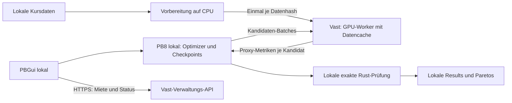

# Vast.ai-Anbindung für PBGui und Passivbot

**Aktueller Umsetzungsplan:** [PB8-Optimizer vollständig auf Vast, PBGui als
Steuerzentrale](vast-ai-implementation-plan.md). Nach dem erfolgreichen Test
ist dies die gewählte nächste Richtung. Die folgenden RPC-Varianten bleiben
historische Architekturprüfung, nicht der aktuelle Implementierungsauftrag.

Stand: 13. September 2026. Architekturvorschlag mit separatem Benchmark-Kit und erfolgreichen RTX-3090-Messfenstern; noch keine PBGui-Laufzeitintegration für Cloud-Jobs oder Remote-GPU-RPC. Die [Messergebnisse und der aktuelle Mietstatus](vast-ai-gpu-benchmark-results.md) sind separat dokumentiert.

**Empfehlung und Variantenvergleich**

Die gewünschte Trennung aus lokaler CPU und Vast-GPU entspricht Variante C, zunächst mit einem vorbereiteten PB8-Image als Verpackung des GPU-Services. Ein installiertes PB8-Paket bedeutet nicht, dass der vollständige Optimizer remote laufen muss. Die ersten Messungen sprechen allerdings für Variante A als schnellsten produktiven Einstieg: Bei dieser ETH-Suite liefern vier und acht mitgemietete CPU-Prüfprozesse denselben Durchsatz; ein Vorteil der lokalen CPU ist bislang nicht belegt. Variante C bleibt der passende Ausbau, wenn lokale CPU-Nutzung zwingend ist oder andere Workloads einen messbaren Vorteil zeigen. Sie benötigt die unten beschriebenen PB8-Schnittstellenänderungen.

**Neuere GPU-Commits und ihre Bedeutung**

Die lokale PB8-Installation steht weiterhin auf `1f8f52b69`. Der öffentliche `master` wurde zusätzlich in einer isolierten Kopie unter `/tmp/pb8-vast-review-20260913` geprüft, Stand `ee2b7d49fd53ef790a66a28e2c85f2a6c8faebe8`. Die lokale Installation wurde weder aktualisiert noch verändert. Gegenüber der ersten Prüfung sind zwei Änderungen hinzugekommen:

- [`e18539a` – Yield CPU during long CUDA screening waits](https://github.com/enarjord/passivbot/commit/e18539a8d3cc09b43d4def987e6d046982fefa7e), gemergt mit PR #1733: `wait_for_cuda_stream()` fragt ein CUDA-Event ab und gibt nach 0,5 Sekunden aktiven Wartens mit kurzen Sleeps CPU-Zeit frei. Der Helper wird auch vor dem Dekodieren bestimmter GPU-Ausgaben eingesetzt. Das reduziert unnötige Host-CPU-Belegung beim Warten; es entfernt weder die exakte Rust-Prüfung noch verteilt es Berechnung auf andere Rechner. Im hybriden Aufbau gehört dieser Code auf den Vast-Worker.
- [`d1d4535` – Fix GPU HSL episode reset and single-close tick parity](https://github.com/enarjord/passivbot/commit/d1d4535a4defe362f10be344f1a9450353a8f938), gemergt mit PR #1734: GPU-HSL setzt abgeschlossene Rolling-PnL-Episoden korrekt zurück; Rust normalisiert Preise einzelner Trailing-Martingale-Schließorders vor der simulierten Fill-Prüfung. Diese Änderung betrifft die Rechensemantik. Lokale Rust-Erweiterung und entfernter GPU-Kernel müssen deshalb aus derselben überprüften Revision gebaut werden.

Die schon zuvor enthaltenen Änderungen am Parameter-Packing (`eda5a5b`) und an der CUDA-Scratch-Größe (`8be0d68`) bleiben ebenfalls Teil dieser Basis. Der Vergleich `1f8f52b..ee2b7d4` verändert zehn Dateien, aber weder `gpu_backend.py` noch `gpu/service.py`: Es gibt weiterhin keinen nativen Remote-GPU-Transport. Die zuvor identifizierte Proxy-Grenze gilt unverändert.

**Konkreter Bauplan: lokale CPU plus Vast-GPU**

Die exakte CPU-Auswertung ist eine Entscheidung des aktuellen PB8-Backends, keine grundsätzliche GPU-Beschränkung. Der GPU-Pfad ist ein Screening-Proxy: Float32 statt der Float64-Referenz sowie teilweise angenäherte Metriken und konservative Regeln können Handelsverläufe und Rangfolgen ändern. Beispielsweise beschreibt PB8 Histogramm-/Stunden-Näherungen für bestimmte Risikometriken und konservative Verlust-/Mindestordergrenzen. Kleine Rundungsunterschiede an einer Fill- oder HSL-Grenze können nachfolgende Positionen und Ergebnisse verändern. Die CPU führt für ausgewählte Kandidaten daher einen vollständigen Referenz-Backtest aus; sie prüft nicht bloß die Sortierung einer Ergebnisliste. Auch die Referenz ist eine Simulation, keine Garantie für reales Handelsverhalten.

Nicht jeder GPU-Kandidat wird nochmals exakt ausgewertet. Die geprüften Defaults sind `population_size=1024`, `validate_per_generation=8` und `drift_probes=4`; vier der acht geplanten Validierungen sind damit breite Kontrollproben. Tatsächliche Zahlen hängen von Phase, Budget, Deduplizierung und Konfiguration ab. GPU-Werte fließen in die Suchsteuerung ein, CPU-Werte liefern Referenzergebnisse und Drift-Evidenz. Kontrollproben sollen auch eine irreführende GPU-Rangfolge erkennen; sie garantieren nicht, dass jeder durch das Screening verworfene gute Kandidat gefunden wird.

Alternativen: weniger laufende CPU-Prüfung bzw. ausschließlich finale CPU-Prüfung spart Referenzarbeit, kann die Suche aber länger auf Proxy-Artefakte optimieren und verlangt einen eigenen klar gekennzeichneten Suchmodus. Ein vollständiger GPU-Backtester mit nachgewiesener Referenzparität könnte reguläre CPU-Nachprüfungen langfristig weitgehend ersetzen. Dafür reicht ein Wechsel auf Float64 nicht: Orderreihenfolge, Rundung, HSL, Gebühren, Portfoliozustand und sämtliche unterstützten Metriken müssen übereinstimmen. Eine CUDA-Fassung der Referenz ist ein eigenes Passivbot-Entwicklungsprojekt; Remote-GPU-Transport allein verändert diese Rechensemantik nicht. Vor einer Änderung der Validierungsrate zuerst tatsächliche Exact-/Proxy-Zeit und Ergebnisabweichungen messen.

| Lokal | Auf Vast |
| --- | --- |
| PBGui, Jobverwaltung, Marktdaten und Konfiguration | Festes PB8-/Python-/CUDA-Image |
| PB8 NSGA-II/Pymoo-Suchsteuerung und Kandidatenauswahl | Persistenter Service mit den vorhandenen GPU-Proxy-Klassen |
| Exakter `multiprocessing.Pool` mit Rust-Backtests | GPU-Kernel, Device-Speicher und Proxy-Metrikberechnung |
| Drift-Gates, Suite-Reduktion, Pareto-Ergebnisse und Checkpoints | Begrenzter Cache für übertragene Datensätze und Kontexte |

PB8 erzeugt seinen Exact-Pool in `gpu_backend.py` mit `optimize.gpu.exact_workers`, ansonsten `optimize.n_cpus`. Dieser Pool bleibt unverändert lokal. Die Schnittstelle wird an der Erstellung von `MpsSingleCoinProxy`/`MpsMulticoinProxy` und an deren `evaluate`-Aufrufen eingeführt. Es wird kein separater vollständiger Optimize-Job auf Vast gestartet.

1. **Proxy-Factory in PB8:** lokale und entfernte Implementierungen hinter demselben Vertrag. Für den ersten Remote-Pfad die bereits lokal vom CPU-Evaluator vorbereiteten NumPy-Daten `hlcvs`, `mss`, `btc` und `timestamps` sowie Proxy-Konfiguration und Metrikauswahl übertragen. Der Worker ruft damit die vorhandenen Proxy-Konstruktoren auf. GPU-Tensorbau und Reduktionen dürfen zunächst vollständig remote bleiben; das vermeidet eine sofortige komplette Umstrukturierung von `model.py`.
2. **CPU-only-Client ermöglichen:** `validate_gpu_preparation_scope` vermischt derzeit statische Prüfung mit Torch-/Device-Prüfung. Beides trennen und den Gerätecheck zum Worker verlagern. Außerdem importiert `gpu/metrics.py` Torch bereits auf Modulebene; statische Metrikdefinitionen/Validierung aus diesem Importpfad lösen. Die bloße Entfernung von `torch.cuda.is_available()` reicht nicht. Der lokale Remote-Pfad muss mit dem CPU-Installationsprofil ohne Torch/CuPy starten können.
3. **Dauerhafte Daten-/Kontextregistrierung:** Binärarrays mit Shape, Dtype, Byte-Limits, Hash und vollständiger Coin-/Zeitzuordnung übertragen. Datensatz einmal registrieren, dann einen oder mehrere Strategie-/Suite-Kontexte darauf öffnen. Konfiguration, Gebühren, Overrides und Metrikauswahl sind Teil der Kontextidentität. Keine Candles je Generation erneut senden; Cache-Miss nach Worker-Verlust explizit behandeln.
4. **Batch-RPC:** pro Aufruf eine Kandidatenliste beziehungsweise später Parametermatrix senden. Der Worker liefert geordnete Proxy-Metriken je Kandidat zurück. IDs, Counts, Hashes und Kontextgeneration prüfen; dieselbe Request-ID mit anderem Payload ablehnen. Für den ersten Stand eine ausstehende Auswertung je Kontext zulassen und die vorhandene Suchreihenfolge erhalten. CUDA-internes zeitliches Chunking bleibt innerhalb des Workers, ohne Netzwerkaufruf je Kernel oder Candle.
5. **Vollständigen Proxy-Vertrag abbilden:** neben `evaluate` sind `checkpoint_contract`, `coin_override_contract`, `profile_enabled`, `last_profile` und die Zeitfensterberechnung für Successive Halving relevant. Single-Coin-Aufrufe verwenden unter anderem `history_start_step` und `trade_start_step`. Der Client benötigt dieselben Antworten wie der lokale Proxy; Suite-Aggregation und Drift-Prüfung bleiben lokal.
6. **Worker-Verbindung:** zunächst authentifizierte SSH-Verbindung mit festem Worker-Kommando und gerahmten Requests/Antworten oder ein nur an Loopback gebundener Worker hinter SSH-Tunnel. Keine API-Keys im PB8-Config, kein allgemeiner Remote-Codeausführungs-Endpunkt und keine unkontrollierte Pickle-Deserialisierung. PB8 sollte die Worker-Verbindung für seinen Lauf besitzen; ein PBGui-API-Neustart darf sie nicht beenden.
7. **PBGui anbinden:** getrennte Anzeige `Optimizer: Local`, `GPU: Vast.ai` und `Exact CPU workers`. GPU-VRAM und Proxy-Durchsatz stammen von Vast, CPU-Auslastung und exakter Durchsatz vom lokalen Rechner. Vorschläge für diese englischen UI-Felder sind noch keine implementierten Einstellungen. PBGui provisioniert eine konkret genehmigte Instanz, prüft Version/GPU, übergibt nur eine lokale Verbindungsreferenz und überwacht Kosten/Lebenszyklus. Bestehende lokale Results/Paretos benötigen keinen Remote-Import.

Ein GPU-Worker braucht weiterhin etwas Host-CPU/RAM für Python, Datenaufbereitung, CUDA-Steuerung und Metriken. Die teuren parallelen exakten Backtests laufen jedoch lokal. Vast-Ressourcen werden als Angebot gemietet; deren CPU-Anteil lässt sich dadurch nicht zwingend aus dem Preis herauslösen. Das ist ein Vorteil bei der Ressourcenverteilung, noch keine Garantie für geringere Kosten.

**Parallelität, Abbruch und Wiederaufnahme im hybriden Betrieb**

Während der Client blockierend auf eine Netzwerkantwort wartet, können bereits gestartete lokale Exact-Worker weiterrechnen. Der Client darf dabei weder aktiv CPU pollen noch den PBGui-Eventloop blockieren. Bestehende parallele Arbeit erhalten; zusätzliche generationsübergreifende Vorberechnung erst nach Paritätsnachweis ergänzen, weil sie Auswahl, Drift-Gates und Suchreihenfolge verändern kann. Für geeignete Abschnitte kann CPU/GPU-Überlappung helfen; eine ideale Gesamtlaufzeit nach `max(CPU-Zeit, GPU-Zeit)` ist wegen Abhängigkeiten und Transfers nicht garantiert.

Verbindungsverlust bedeutet zunächst unbekannten Batch-Status. Über Request-ID wieder anknüpfen; bei gleichem Worker eine fertige Antwort wiederholen, bei verlorenem Worker einen Batch aus unverändertem lokalem Zustand erneut auswerten. Erst eine vollständig validierte Antwort darf Population oder Drift-Zustand ändern. Retry-Cache begrenzen; nach Ablauf eine explizite Nichtverfügbarkeit statt einer alten Antwort melden. Ein neuer Kontext erhält eine neue Generation, damit verspätete Antworten verworfen werden.

Stop setzt lokal das vorhandene Interrupt-Signal, schickt Remote-Cancel und beendet keinen fremden Job. Laufende CUDA-Kernel sind nicht notwendigerweise sofort unterbrechbar; Cancellation an vorhandenen sicheren Dispatch-Grenzen prüfen. Lokaler Checkpoint nur an einem konsistenten Suchzustand schreiben. Bei dauerhaftem GPU-Ausfall auf den letzten bestätigten Checkpoint zurückgehen; kein stiller Wechsel des Suchalgorithmus. Native PB8-Runtime-/Checkpoint-Prüfungen bleiben maßgeblich.

**Erste implementierbare Etappe**

Ein `RemoteGpuProxy` und ein `gpu_worker` (vorgeschlagene neue Komponenten) auf Basis von `ee2b7d4`, zunächst Single-Coin Trailing Martingale mit einer bestehenden Instanz. Auf Vast bleibt vorerst das vollständige PB8-Paket installiert, aktiv ist ausschließlich der GPU-Service. Erst nach erfolgreichem Betrieb ein kleineres Worker-Paket bauen. Damit lassen sich Aufwand für Netztrennung und Aufwand für Paketverkleinerung getrennt kontrollieren.

Abnahmekriterien: lokaler Start ohne GPU und ohne Torch/CuPy; exakte Rust-Worker nachweislich lokal; einmaliger Daten-Upload mit Cache-Nutzung; gleiche Proxy-Ausgaben wie direkter CUDA-Aufruf auf derselben GPU/Runtime; neue HSL-/Tick-Paritätsfälle bestehen; kein doppeltes lokales Verbuchen nach Timeout; kontrollierter Stop/Resume; PBGui-API-Neustart unterbricht den Optimizer nicht. Danach Multi-Coin, Suite und Successive Halving jeweils mit eigenem Paritätsnachweis freigeben. Lokale CPU-Auslastung, Exact/s, Proxy/s, Netzwartezeit, Upload, Remote-CPU/VRAM und Gesamtkosten gemeinsam messen. Ein schnellerer Proxy allein beweist keinen schnelleren Optimize-Lauf.

| Variante | Auf Vast / lokal | Vorteile | Nachteile und Grenzen | Relativer Aufwand |
| --- | --- | --- | --- | --- |
| A: PB8-Image + benötigte OHLCV-Dateien | Gesamter Optimize-Job remote; PBGui lokal | Vorhandenen PB8-Ablauf verwenden; GPU und Exact-CPU auf demselben Host; läuft bei lokaler Verbindungsunterbrechung weiter; einfache Jobgrenze | Remote-CPU/RAM mitbezahlen; Daten und Ergebnisse übertragen; striktes Offline-Verhalten separat absichern | Mittel in PBGui; wenig bis keine PB8-Änderung für den Grundbetrieb |
| B: PB8-Image + vorbereitete HLCV-Datenpakete | Vorbereitung lokal; gesamter Optimize-Job remote | Kein zweiter OHLCV-Download oder erneute Vorbereitung nötig; exakte Datenidentität kontrollierbar; geringer Netzwerkaustausch während der Optimierung | Versionierter Importvertrag und vollständige Metadaten nötig; vorbereitete Daten können größer sein; Kompatibilität bei PB8-Updates | Mittel bis hoch; gezielte PB8-Erweiterung |
| C: Schlanker GPU-Worker + lokaler Optimizer | Nur GPU-Screening remote; Auswahl, Checkpoints, Exact-CPU und Ergebnisse lokal | Kein vollständiger PB8-Optimizer auf Vast; vorhandene lokale CPU nutzbar; laufend nur Kandidaten/Metriken übertragen | Deutlich mehr PB8-Refactoring; lokale CPU und Verbindung begrenzen Durchsatz; RPC, Versionsgleichheit und Wiederherstellung nötig | Hoch |
| D: Vast Serverless | Vollständiger Job oder GPU-Service in Custom Worker | Ressourcenverwaltung und Skalierung teilweise durch Vast; interessant für viele unabhängige Aufträge | Eigener Worker, Datenablage und Sessions nötig; Cold Starts und Cache-Verlust; nicht automatisch billiger für lange zustandsbehaftete Optimierungen | Hoch für den ersten PBGui-Anschluss |
| E: PBGui und PB8 komplett auf Vast | Oberfläche, Daten und Compute remote | Bestehenden lokalen PBGui-Ausführungspfad in der Cloud nutzen; wenig neue Jobtransportlogik | Dauerhafte Verwaltungsinstanz auf Miet-GPU; Sicherung, Browserzugang und persistente Daten zusätzlich betreiben | Geringer Prototypaufwand, ungünstiger Dauerbetrieb |
| F: Standardimage + PB8-Installation bei jedem Start | Wie A, aber Laufzeit wird erst eingerichtet | Schnellster manueller Versuch; noch kein eigenes Image veröffentlichen | Wiederholte Installation/Builds, längere Startphase und Abhängigkeiten schwerer reproduzierbar | Niedrig für Versuch, weniger geeignet als Produkt |

Die Größen sind relativ; alle produktiven Varianten benötigen Fehlerbehandlung, Kostenkontrolle und Tests. A und B verwenden denselben Provider-/Jobtransport. C ist ein anderer Ort für die Prozessgrenze, nicht lediglich ein kleineres Docker-Image.

**Variante A: eigenes Image und selektiver Marktdatenexport**

Das Image enthält Linux, Python 3.12, einen festgelegten PB8-Commit, die dazugehörige kompilierte Rust-Erweiterung, `full,gpu-cuda` und einen kleinen Job-Wrapper. Torch, CuPy, CUDA-Runtime/NVRTC und NVIDIA-Hosttreiber müssen zusammenpassen. PB8 unterstützt diese CUDA-Extras in der geprüften Revision. Das Image über einen Digest fixieren und vorher bauen; zur Joblaufzeit kein `git pull` und keine wechselnden Paketversionen. Im Image sind Code und Abhängigkeiten, keine Zugangsdaten und keine laufend wechselnden Marktdaten. Vast-Templates referenzieren Image und Startkonfiguration. [Templates](https://docs.vast.ai/guides/templates/introduction).

PBGui erstellt ein Manifest aus allen tatsächlich benötigten Coins/Exchanges, Datumsbereichen, maximal benötigtem Warmup und Suite-Szenarien. `end_date = now` vor Export auf einen festen Zeitpunkt auflösen. Konfiguration, Coin-Overrides und gegebenenfalls Pareto-Seeds/Checkpoints separat bündeln. PBGui-eigene Metadaten für Sweep/Validierung erhalten. Daten mittels Hashes deduplizieren und per SSH/SFTP übertragen. Das Ziel arbeitet erst nach abgeschlossener Manifestprüfung mit dem Paket.

Der bestehende PB8-Datenanschluss ist `backtest.ohlcv_source_dir`. Beispielsweise wird nur in der Remote-Ausführungskopie eingestellt:

```json
{
    "backtest": {
        "ohlcv_source_dir": "/workspace/jobs/JOB_ID/market_data"
    },
    "optimize": {
        "backend": "gpu"
    }
}
```

Das ist ein Konfigurationsausschnitt, keine vollständige lauffähige PB8-Konfiguration. PB8 erwartet darunter `<exchange>/1m/<coin_or_symbol>/YYYY-MM-DD.npz` oder `.npy`. Laut lokalem `docs/backtesting.md` enthalten NPZ-Dateien unter `candles` die strukturierten Felder `ts`, `o`, `h`, `l`, `c`, `bv`; NPY verwendet die Spalten Timestamp, Open, High, Low, Close, Volume. Timestamp-Einheiten und Symbolnamen müssen dem nativen Vertrag entsprechen. Exportformat und Coin-Auflösung aus PB8/PBGui übernehmen, nicht selbst erraten.

PBGui setzt diesen Config-Key bereits in `api/optimize_v8.py::_apply_queue_launch_settings`, wenn seine Market-Data-Quelle aktiviert ist. Die Remote-Variante kann dasselbe Prinzip mit dem Zielpfad nutzen. Suite-spezifische Quellen und alle übrigen Dateiverweise müssen ebenfalls geprüft und auf erlaubte Remote-Pfade umgeschrieben werden. `optimize.n_cpus` und Exact-Worker-Zahlen anhand der zugeteilten Remote-CPU bestimmen, nicht von der lokalen Maschine übernehmen.

Der Source-Ordner wird im vorgesehenen Vorbereitungspfad direkt gelesen, ohne die Tagesdateien zunächst in den v2-Rohdatenspeicher zu spiegeln. PB8 schreibt weiterhin vorbereitete Lauf-Caches. Dies allein garantiert keine vollständige Offline-Ausführung: `hlcv_preparation.py` lädt auch Marktspezifikationen und erste Handelstimestamps; `get_ohlcvs` besitzt ohne `source_dir_only` einen Fallback und `fetch_ohlcvs_for_v2_store` ebenfalls einen Remote-Pfad. Diese allgemeinen Pfade beweisen nicht, dass jeder Source-Dir-Optimize-Lauf sie benutzt, verhindern aber eine pauschale Offline-Zusage allein anhand des Config-Keys.

Für einen strikt reproduzierbaren Modus daher fehlende Tagesdateien, Referenzdaten und Marktmetadaten vor Start ablehnen. Alle benötigten Metadaten übertragen oder einen nativen PB8-Modus ergänzen, der Netzwerk-Fallbacks ausdrücklich verbietet. Das mit einem isolierten Test bei gesperrtem Exchange-Zugriff nachweisen. Benutzer muss zwischen erlaubtem Metadatenzugriff und vollständig offline ausgeführtem Rechenjob unterscheiden können.

Remote-Start über eine feste Worker-Schnittstelle mit Job-ID, persistenter Prozessidentität, Startbestätigung und atomarem Exitstatus. Der Job darf nicht an der Lebensdauer der SSH-Sitzung hängen. PBGui zeigt Fortschritt und Logs, rekonstruiert seine Verwaltung nach API-Neustart und lädt Ergebnisse zunächst in ein Staging-Verzeichnis. Konfigurations-/Datenhash, Versionen und erlaubte Dateipfade prüfen, dann atomar in das lokale PB8-Ergebnisverzeichnis importieren. Remote-Pfade in Artefaktverweisen müssen beim Import auflösbar gemacht oder mit einem expliziten Herkunftsmanifest abgebildet werden. Unvollständige Downloads dürfen nicht als fertige Results erscheinen.

Der vorhandene `pb8_optimize_runner.py` ist eine Vorlage für den Vertrag, aber nicht ohne Weiteres eigenständig: Er importiert PBGui-Helfer und erwartet lokale Sperr-/Datenpfade. Nur notwendige Wrapper-Abhängigkeiten paketieren. GPU-Preflight muss auf Vast laufen, während der lokale Rechner weiterhin ohne GPU Queue und Bedienung bereitstellt. API-Start/-Shutdown, automatische Queue, Stop, Resume, Pareto-Auswertung und Ergebnisimport brauchen eine echte Remote-Jobintegration; nur den lokalen Startbefehl durch SSH zu ersetzen genügt nicht.

**Variante B: vorbereitetes Datenpaket als Zwischenlösung**

PBGui/PB8 bereitet lokal bereits die exakten Eingaben vor: HLCV-Arrays, Zeitstempel, Coin-Reihenfolge, Marktspezifikationen, BTC-Referenzen, Gültigkeits-/Warmup-Grenzen und die Zuordnung aller Suite-Szenarien. Ein versionierter Paketvertrag mit Hashes verbindet diese Daten mit Konfiguration und PB8-Revision. Remote übernimmt ein expliziter Importpfad die Eingaben, ohne erneut Märkte oder Candles zu beschaffen. Bei Unvollständigkeit oder Inkompatibilität bricht er ab.

PB8 besitzt bereits vorbereitete HLCV-Caches und Artefaktverweise; deren bloßes Kopieren ist jedoch noch kein stabiler portabler Jobvertrag. Absolute Pfade, Cache-Signaturen, Versionswechsel und Fallbacks müssen kontrolliert werden. Vorgeschlagene PB8-Erweiterung deshalb: ausdrücklicher Export/Import vorbereiteter Optimize-Datensätze, einschließlich aller Suite-Kontexte und ohne stilles Neuaufbereiten. CPU- und GPU-Backend können denselben Importvertrag nutzen. Gegenüber C bleibt der gesamte Optimizer zusammen, wodurch Batch-RPC und Netzwerklatenz in der Suchschleife entfallen.

**Speicherstrategie für A, B und C**

1. Frische Instanz je Lauf: einfaches Aufräumen, aber Daten erneut übertragen, sofern kein anderer Cache verfügbar ist.
2. Eine Instanz für mehrere aufeinanderfolgende Jobs: fehlende Hash-Blöcke ergänzen und Startaufwand amortisieren; verbindlicher Leerlauf-Timeout erforderlich.
3. Wiederverwendbares Vast-Volume: Daten können zwischen Instanzen auf derselben physischen Maschine erhalten bleiben. Vast dokumentiert aktuell lokale, hostgebundene Volumes, keinen frei zwischen beliebigen GPU-Hosts wandernden Speicher. Separate Speichergebühren und Cleanup beachten. [Volumes](https://docs.vast.ai/guides/instances/storage/volumes).
4. Später optional Object Storage als zentraler Paketcache: schneller verteilbar bei vielen Jobs, aber zusätzlicher Anbieter, Berechtigungen und Kosten; für den ersten Umfang nicht erforderlich.

Direktes SSH für größere Transfers bevorzugen, soweit das Angebot es unterstützt; Vast weist auf geringeren Durchsatz seiner SSH-Proxyverbindung hin. Übertragungszeit und Gebühren vor einer dauerhaften Cache-Entscheidung messen. [Data Movement](https://docs.vast.ai/guides/instances/storage/data-movement).

**Entscheidungsvorschlag für die erste Umsetzung**

Die konkretisierte Vorgabe zur lokalen CPU macht C zum Ziel. A/B dienen weiterhin als Vergleich für Durchsatz, Aufwand und Mietkosten. Mit einem GPU-Service im normalen PB8-Image zuerst die Prozessgrenze nachweisen; die Verkleinerung des Images folgt später. D und E sind für diesen Anwendungsfall zunächst nachrangig.

Der erste Versuch benötigt keine vollständige Marktplatzoberfläche: vorhandene, konkret freigegebene Vast-Instanz, festes Image, eine Konfiguration, Datenregistrierung, Remote-Preflight und Batch-Auswertung bei lokalem Optimizer. Danach Angebotssuche und bestätigte automatische Anmietung ergänzen. Im hybriden Modell kann die lokale exakte Prüfung den Gesamtdurchsatz begrenzen; GPU-Mietzeit während solcher Phasen muss mitgemessen werden.

**Variante C im Detail: abgetrennter GPU-Service**

PBGui, der PB8-Optimizer, die Kursdatenverwaltung und die exakte CPU-/Rust-Auswertung bleiben lokal. Auf Vast läuft ein kleiner, persistenter GPU-Worker. Passivbot erhält einen austauschbaren GPU-Proxy, der vorbereitete Daten einmal überträgt und anschließend ganze Kandidaten-Batches auswerten lässt. Dafür sind gezielte Änderungen an Passivbot nötig. Der vorhandene lokale GPU-Pfad bleibt unterstützt.

**Was sich vermeiden lässt und was nicht**

| Wunsch | Machbarkeit |
| --- | --- |
| PBGui und Optimizer lokal behalten | Ja, mit einem Remote-GPU-Proxy in PB8. |
| Vollständiges PB8-Repository auf Vast vermeiden | Ja, nach Abtrennung und Paketierung des GPU-Workers. |
| Kursdaten auf Vast nicht erneut von Börsen herunterladen | Ja, lokal vorbereiten und direkt übertragen. |
| Den gesamten lokalen Kursdatenbestand nicht kopieren | Ja, nur die tatsächlich benötigten Eingaben exportieren. |
| Kursdaten nicht mit jedem Batch erneut senden | Ja, persistenten Worker und Cache mit Datenhash verwenden. |
| Überhaupt keine historischen Preisinformationen an die GPU übertragen | Für den vorhandenen Backtest-/Screening-Ansatz nein. Die GPU braucht die zeitlich aufgelösten Eingaben. |

Einmaliges Übertragen ist pro Datensatz und verfügbarer Cache-Kopie gemeint. Ein neuer Host, gelöschter Cache, geänderte Daten oder ein inkompatibler Datenvertrag können erneuten Upload verlangen. Vorbereitete Arrays sind weiterhin Kursdaten; sie werden dadurch weder geheim noch zwingend kleiner. Zusätzliche Masken, Tick-Grenzen und Referenzreihen können das Volumen sogar erhöhen.

Vast stellt Instanzen mit einem wählbaren Docker-Image und zugeteilten GPUs, CPUs, RAM und Disk bereit. Ein spezielles Passivbot-Image von Vast ist nicht erforderlich. Die Vast-API verwaltet Ressourcen; sie stellt PB8 keine transparente entfernte CUDA-Karte zur Verfügung. [Instanzen](https://docs.vast.ai/guides/instances/overview), [Templates](https://docs.vast.ai/guides/templates/introduction).

**Architektur**



Die lokale Optimierung erzeugt Kandidaten, sendet einen ganzen Batch und verarbeitet die zugeordneten Proxy-Metriken. Exakte CPU-/Rust-Validierung, Drift-Prüfung, Auswahl, Suite-Reduktion und dauerhaft archivierte Ergebnisse bleiben lokal. Es werden keine einzelnen CUDA-Aufrufe oder einzelne Candles über das Internet weitergereicht.

**Geprüfte Ansatzpunkte in Passivbot**

Gelesen wurde der lokale PB8-Quellbaum unter `/home/mani/software/pb8`, HEAD `1f8f52b69`. Das sind Befunde im vorhandenen Quelltext, keine Zusage über andere PB8-Versionen.

- `src/optimization/backends/gpu_backend.py::run_backend` erzeugt `MpsSingleCoinProxy` oder `MpsMulticoinProxy` und kapselt deren Auswertung in `evaluate_proxy`. Dort ist ein geeigneter Ansatz für die Auswahl zwischen lokalem und entferntem Proxy.
- `src/optimization/gpu/service.py` stellt in beiden Klassen `evaluate(candidates)` bereit. Die Single-Coin-Variante unterstützt zusätzliche Zeitfensterparameter; `recent_window_for_history_fraction` wird für reduzierte Historie verwendet. Auch Checkpoint-Vertrag, Coin-Overrides und Profilinformationen müssen über die Abstraktion erhalten bleiben. Ein bloßer Austausch von `evaluate` wäre unvollständig.
- Die Proxy-Konstruktoren importieren `backtest.build_backtest_payload`, prüfen ein lokales Gerät und bauen GPU-Tensoren. `model.py::build_mps_data` und `build_mps_multicoin_data` vermischen CPU-Vorbereitung mit Device-Upload. Vorbereitung und Upload müssen getrennt werden, damit ein Rechner ohne NVIDIA/MPS den Remote-Pfad betreiben kann.
- `mps_kernel.py` bezieht die Strategie-Kernelquellen aus `passivbot_rust`; `cuda_kernel.py::CudaShaderLibrary` übersetzt/kompiliert sie über CuPy/NVRTC für CUDA. Ein einzelnes kopiertes Python-Skript ist daher noch kein eigenständiger Worker.
- `runtime.py::checkpoint_runtime` erfasst unter anderem Torch, CuPy und CUDA Compute Capability. Remote-Checkpoints müssen die tatsächliche Worker-Runtime berücksichtigen; die lokale CPU-Maschine darf nicht als GPU-Runtime signiert werden.
- Laut PB8 `docs/optimizing.md` ist das GPU-Backend experimentell und kombiniert Screening mit exakter Rust-Prüfung. Normale Backtests und Live-Betrieb benötigen das GPU-Backend nicht. Der Vorschlag konzentriert sich auf PB8 Optimize.

**Vorgeschlagene Änderungen an PB8**

1. Einen herstellerunabhängigen Proxy-Vertrag einführen: Capability-/Versionsabfrage, Datensatz registrieren, Auswertungskontext öffnen, Batch auswerten, Kontext schließen. Eine Factory wählt lokale Implementierung oder Remote-Client. Suite-Auswertung, unterstützte Metriken und Zeitfenster dürfen dadurch ihre Bedeutung nicht ändern.
2. CPU-seitige Daten-/Konfigurationsvorbereitung von GPU-Allokation und optionalen Torch/CuPy-Imports entkoppeln. Ein versioniertes Datenpaket enthält ausschließlich erlaubte Arrays und Metadaten. Dtypes, Formen, Coin-Reihenfolge, Intervall, Warmup, Gültigkeitsmasken, Marktspezifikationen, gegebenenfalls Volumen und BTC-Referenzen explizit beschreiben. Keine eigenmächtige Rundung oder zeitliche Verdichtung einführen.
3. Ein kleines Worker-Paket aus GPU-Runnern, benötigter Metrikberechnung und klar abgegrenzten Hilfsfunktionen bauen. Kernel weiterhin aus derselben Rust-Quelle erzeugen. Für die erste Paketversion kann eine vorgebaute passende Rust-Erweiterung enthalten sein; später können beim Build exportierte Kernelartefakte diese Abhängigkeit verkleinern. Keine manuelle zweite Strategieimplementierung pflegen.
4. Remote-Runtimeprüfung und GPU-Speicherplanung auf dem Worker ausführen. Lokale Konfigurationsprüfung bleibt möglich, auch wenn weder Torch noch eine GPU installiert sind. Native Grenzen für Strategie, Suite, Overrides und Metriken beibehalten.
5. Checkpoints lokal um Daten-, Kontext-, Kernel-, Protokoll- und Worker-Runtime-Identität ergänzen. Inkompatible Wiederaufnahme ablehnen; frischen Lauf aus Pareto-Konfigurationen anbieten. Flüchtige Verbindungsdaten gehören nicht in reproduzierbare Konfigurationen oder Checkpoints.

Vorgeschlagene Protokolloperationen, noch keine vorhandene API:

| Operation | Inhalt |
| --- | --- |
| `capabilities` | Worker-/PB8-/Kernel-Version, GPU, Speicher und unterstützte Features |
| `register_dataset` | Manifest und fehlende Binärblöcke; Antwort mit Daten-ID |
| `open_context` | Daten-ID plus Strategie, Markt-/Szenarioparameter und angeforderte Metriken |
| `evaluate_batch` | Kontext-ID, Request-ID, Kandidaten-IDs und Parameter, erlaubtes Zeitfenster |
| `release_context` | Laufkontext freigeben; Datencache gemäß TTL-/Größenlimit behandeln |

Kandidaten zunächst als validierte Parameterobjekte übertragen, passend zum vorhandenen Vertrag; eine kompakte Parametermatrix erst nach vermessener Notwendigkeit ergänzen. Arrays binär, verlustfrei komprimiert und mit expliziten Größen-/Typgrenzen übertragen. Keine Pickle- oder beliebige Python-Objektdeserialisierung über das Netz. Für identische Request-ID und identischen Inhalt muss ein Retry dieselbe geordnete Antwort liefern; abweichenden Inhalt zurückweisen. Antworten auf Kandidatenzahl, IDs, Datensatz, Kontext und numerische Gültigkeit prüfen. Resultat-Deduplizierung und Cache-Retention begrenzen.

**Datenübertragung und Geschwindigkeit**

Nur benötigte Exchanges, Coins, Zeiträume inklusive Warmup und Referenzdaten exportieren. Nach Datenhash cachen, gleiche Blöcke zwischen Aufträgen und Suite-Szenarien wiederverwenden. Datensatz-ID und Auswertungskontext trennen: Gebühren, Strategieparameter oder angeforderte Metriken dürfen bei identischen Candles nicht versehentlich einen alten Kontext wiederverwenden. Ein eigener Börsendownloader ist im GPU-Worker nicht nötig.

Als reine Größenillustration ergeben zehn Coins mit einem Jahr Minutendaten und fünf Float32-Werten je Minute etwa 105 MB unkomprimiert. Das ist keine Schätzung des echten PB8-Payloads: Zeitstempel, Zusatzarrays, Dtypes, mehrere Jahre und Szenarien ändern die Größe. Payload und Übertragungsdauer müssen am tatsächlich exportierten Datenvertrag gemessen werden.

Große Batches amortisieren Netzwerklatenz. Worker während eines Laufs mit Datencache und GPU-Kontext verfügbar halten. Vorabrufen und parallele Requests erst ergänzen, wenn Kandidatenreihenfolge, Abbruch und Suchsemantik eindeutig erhalten bleiben. Der kleinere Worker beseitigt keine CPU-Grenze: Die lokale exakte Rust-Prüfung kann die entfernte GPU ausbremsen. Messen müssen wir komplette Optimierungen und Ergebnisqualität, nicht nur Proxy-Auswertungen pro Sekunde.

**PBGui- und Vast-Integration**

PBGui ergänzt bei PB8 Optimize einen GPU-Ausführungsort `Local / Vast.ai`; der Optimizer selbst bleibt in Variante C lokal. Das bestehende `optimize.backend = gpu` bleibt der Algorithmusname. Ein zusätzlicher PB8-Transport-/Executor-Wert benötigt native Config-Unterstützung; konkrete Schlüsselnamen werden bei der Implementierung festgelegt. Credentials bleiben außerhalb der Strategie-Konfiguration.

`pb8_config_helper.py::_optimize_preflight` und `api/optimize_v8.py::_validate_optimize_backend` prüfen derzeit die lokale GPU. Remote-Auswahl muss statische Prüfung und zielabhängigen Preflight trennen. Auch GPU-Metrik-/Default-Metadaten müssen zum gewählten Worker passen. `OptimizeV8Worker` und `pb8_optimize_runner.py` können in Variante C weiterhin den lokalen Optimizer verwalten; Ergebnisimport aus einer Remote-Optimierung entfällt. Lokale API-Neustarts müssen einen schon gestarteten Optimizer und dessen Verbindung weiterleben lassen beziehungsweise die Verwaltung rekonstruieren.

Vast-Verwaltung in einem getrennten serverseitigen Provider-Modul kapseln: Angebote, Instanzen, Kostenstatus und explizit genehmigte Miet-/Cleanup-Aktionen über FastAPI. REST mit Bearer-Header ist dokumentiert; die Python-SDK ist eine Alternative. Credential-Speicherung nach den bestehenden PBGui-Sicherheitsmustern, nur notwendige Vast-Rechte. [API Keys](https://docs.vast.ai/guides/reference/api-keys), [Create Instance](https://docs.vast.ai/sdk/python/reference/create-instance).

Für den ersten Prototyp genügt ein fester Worker-Prozess über eine langlebige, gerahmte SSH-Verbindung. Alternativ Worker-HTTP ausschließlich hinter einem SSH-Tunnel. Keine öffentliche ungeschützte GPU-API. Host-Key-Verifikation und eindeutige Bindung an die Instanz sind Pflicht; den sicheren Erstkontakt praktisch prüfen. Der private SSH-Schlüssel und Vast-Key bleiben lokal, Exchange-/PBGui-Secrets werden nicht übertragen. AsyncSSH-/Host-Key-Muster aus `master/async_pool.py` prüfen, Vast aber nicht als normalen Live-Bot-VPS registrieren. [SSH](https://docs.vast.ai/guides/instances/connect/ssh).

Der Worker besitzt GPU-Kontexte, Caches und laufende Batches; Ressourcen über Referenzen, TTL, Größenlimits und deterministisches Schließen verwalten. Der lokale persistente Optimizer besitzt seinen Worker-Kanal; die API besitzt nur ihre Verwaltungsclients und Controller. Verbindungsverlust erfordert Statusabgleich und kontrollierte Wiederverbindung. Bei Worker-Verlust Daten erneut registrieren und aus dem letzten konsistenten lokalen Zustand fortsetzen; keine alten Antworten auf einen neuen Lauf anwenden.

Vast Serverless ist technisch ebenfalls möglich: `@remote` führt Funktionen auf entfernten Workern aus, Sessions halten zusammengehörige Aufrufe und lange Jobs auf demselben Worker. Für PB8 wären Worker-Affinität, Daten-Cache, eigene Binärübertragung und Wiederherstellung weiterhin zu lösen. Deshalb zuerst eine normale Instanz mit persistentem Worker verwenden. [Remote Functions](https://docs.vast.ai/guides/serverless/deployments/remote-functions), [Sessions](https://docs.vast.ai/guides/serverless/sessions).

**Kostenkontrolle und Ausfallverhalten**

Zunächst eine einzelne GPU auf einer On-demand-Instanz testen. GPU-/RAM-Größe anhand des echten Datensatzes auswählen; Multi-GPU bringt ohne zusätzliche Verteilung keinen automatischen Vorteil. Für den GPU-only-Worker benötigt die Remote-Instanz keine vollständige lokale Exact-Worker-CPU-Ausstattung. Trotzdem zählen ihre zugeteilten CPU-/RAM-Ressourcen für Vorbereitung, Transfer und Metriken. [Ressourcenzuteilung](https://docs.vast.ai/guides/instances/docker-environment).

Aktuelle Angebote nach Preis, VRAM, tatsächlich zugeteiltem RAM/CPU, Bandbreite, Disk und Zuverlässigkeit filtern. Kosten bestehen aus Compute, Speicher und Transfer. Stop beendet nicht sämtliche Gebühren; Speicher kostet weiter. Destroy entfernt die Instanzdaten. [Angebote](https://docs.vast.ai/guides/instances/choosing/find-and-rent), [Pricing](https://docs.vast.ai/guides/instances/pricing), [Instanzverwaltung](https://docs.vast.ai/guides/instances/manage-instances).

Vor Anmietung konkrete Preisbestandteile, maximale Laufzeit und Cleanup-Policy anzeigen und freigeben lassen. Preis-/Instanzlimit und Leerlauf-Timeout vorsehen. Jede kostenpflichtige Erstellung dauerhaft korrelieren; bei Create-Timeout zuerst abgleichen statt blind erneut mieten. Worker-Deadline begrenzt Berechnung, beendet aber nicht die Mietabrechnung. Ein lokaler Watchdog kann bei Netzwerk-/Provider-Ausfall kein garantiert hartes Rechnungslimit durchsetzen. Offene Stop-/Destroy-Aktionen persistent wiederholen und verbleibende Instanzen sichtbar melden. Automatisches Destroy nur innerhalb der vorab konkret genehmigten Policy.

Da Ergebnisse und Checkpoints lokal bleiben, ist der Worker-Cache grundsätzlich rekonstruierbar. Vor Freigabe einer Instanz müssen dennoch laufende Batches und lokale Checkpoint-Konsistenz geklärt sein. Strategiekonfigurationen und übertragene Kursdaten sind auf dem Rechenhost vorhanden; fehlende Zugangsdaten machen sie nicht unsichtbar für den Hostbetreiber.

**Umsetzungsvorschlag und Nachweis**

1. **PB8-Schnittstelle abtrennen:** Proxy-Vertrag und Factory einführen; statische Prüfung von Geräteprüfung und Torch-Imports lösen. Die schon vorhandenen NumPy-Eingaben bilden zunächst die Datengrenze, während Device-Aufbereitung im bestehenden Proxy auf dem Worker bleibt. Bisherigen lokalen Pfad erhalten und dessen Verhalten prüfen. Weitergehende Extraktion der Datenaufbereitung ist eine spätere Paketoptimierung.
2. **Begrenzter Remote-Versuch:** eine Strategie/einen repräsentativen Datensatz, einen persistenten Worker und Batch-RPC umsetzen. Nach separater Freigabe der konkreten Anmietung auf Vast testen. Einmaligen Upload, wiederholte Cache-Nutzung, lokalen Betrieb ohne Torch/GPU, Batch-Ergebnisse gegenüber direktem CUDA auf derselben Runtime, exakte Rust-Validierung und Wiederverbindung prüfen.
3. **PBGui-Bedienung ergänzen:** Zielauswahl, Worker-Status, Remote-Preflight, Datenfortschritt, Kostenübersicht und vorhandenen LogViewer verbinden. Vollständige Suite-/Mehrcoin-Unterstützung und bestehende Suchfunktionen nur nach entsprechender Paritätsprüfung freigeben.
4. **Mietablauf automatisieren:** versioniertes Worker-Image, Angebotssuche, konkrete Kostenfreigabe, Provisionierung, Deadline und bestätigtes Cleanup. Serverless/Interruptible erst nach nachgewiesener Wiederherstellung bewerten.

Offline-Tests der späteren Implementierung: CPU-only-Client, fehlende optionale GPU-Pakete, Daten-/Kernelversionskonflikt, doppelte und verspätete Antworten, Abbruch, Worker-Verlust, TTL-/Speicherfreigabe, unklarer Create-Ausgang, Secret-Redaktion und fehlgeschlagenes Cleanup. Daten ausschließlich in Test-Temporärverzeichnissen; Provider/Transport mocken. CUDA-Parität und realer Kostenvorteil benötigen einen separat genehmigten GPU-Test. Keine Beschleunigungs- oder Einsparungszahl ist bisher belegt.

**Prüfstand im PBGui-Repository**

GitNexus war an `pbgui` gebunden und meldete bei der Prüfung auf Commit `209fcbb` Aktualität für seine 928 abgedeckten Dateien. Upstream-Impact für `_optimize_preflight`: LOW, vier betroffene Symbole über `handle`, `_response`, `main` und `serve`. Für `OptimizeV8Worker`: MEDIUM, zwölf betroffene Symbole/Dateien, direkte Importabhängigkeiten unter anderem in API-Start, Services, AI, Backtest V7 und Pareto Explorer. Die Impact-Abfragen ordneten keine benannten Prozesse zu; die Helper-Prozessgrenze wurde zusätzlich im Quelltext geprüft. Die zukünftigen PB8-Codeänderungen benötigen vor dem Editieren eine eigene Impact-Analyse im PB8-Repository.

Diese erste Quellprüfung umfasste nur Vorschlag und Changelog. Danach folgten das separat autorisierte Benchmark-Kit, Image-/Template-Provisionierung und GPU-Tests; deren Stand steht im Messbericht. Die installierten Passivbot-Quellen bleiben unverändert. Bei späteren API-Änderungen ist der Serial-Bump erforderlich; produktive UI-Änderungen benötigen EN/DE-Guide-Parität.
# Vorbereiteter Test mit `gpu_test`

Ein eigenständiges [Benchmark-Kit](../../setup/vast_gpu_benchmark/README.md)
setzt den ersten Messschritt um: Kopien der vorhandenen ETH-Suite, CPU-only
gegen GPU mit unterschiedlichen exakten CPU-Workerzahlen, feste Budgets/Seeds,
Zeitlimits und native Profile. Die CPU-only-Cloud-Läufe wurden auf Nutzerwunsch
vor ihrem Start gestrichen. GPU-Messfenster mit 1/4/8 Prüfprozessen sind
abgeschlossen und in PBGui importiert; ein längerer 16-Prozess-Lauf folgt auf
ausdrücklichen Nutzerwunsch. 56 Offline-Tests und der korrigierte native
Optimizer-Identitätscheck sind erfolgreich. Dieses Kit enthält noch keine
RPC-Schnittstelle zwischen lokaler CPU und entfernter GPU.
